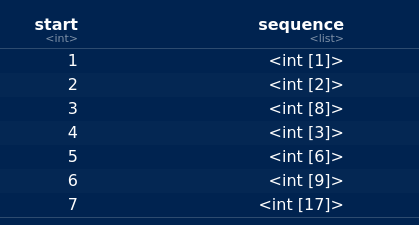
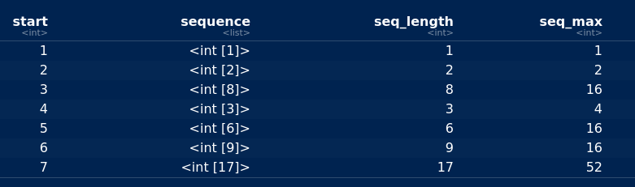

## Packages for this section

```{r, eval=F}
library(tidyverse)
library(broom)
```


## Don’t repeat yourself
- See this:
```{r}
a <- 50
b <- 11
d <- 3
as <- sqrt(a - 1)
as
bs <- sqrt(b - 1)
bs
ds <- sqrt(d - 1)
ds
```


## What's the problem?

- Same calculation done three different times, by copying, pasting and
editing.
- Dangerous: what if you forget to change something after you pasted?

- Programming principle: "don't repeat yourself".
- Hadley Wickham: don't copy-paste more than twice.
- Instead: *write a function*. 

## Anatomy of function
- Header line with function name and input value(s).
- Body with calculation of values to output/return.
- Return value: the output from function.
In our case:
```{r}
sqrt_minus_1 <- function(x) {
  ans <- sqrt(x - 1)
  return(ans)
}
```

or more simply

```{r}
sqrt_minus_1 <- function(x) {
  sqrt(x - 1)
}
```

If last line of function calculates value without saving it, that value is
returned.

## About the input; testing
- The input to a function can be called anything. Here we called it `x`.
This is the name used inside the function.
- The function is a “machine” for calculating square-root-minus-1. It
doesn’t do anything until you call it:
```{r}
sqrt_minus_1(50)
sqrt_minus_1(11)
sqrt_minus_1(3)
```

- It works!

## Vectorization 1/2 

- We conceived our function to work on numbers:
```{r}
sqrt_minus_1(3.25)
```

- but it actually works on vectors too, as a free bonus of R:
```{r}
sqrt_minus_1(c(50, 11, 3))
```

- or... (over)

## Vectorization 2/2 

- or even data frames:
```{r}
d <- tibble(x = 1:2, y = 3:4)
sqrt_minus_1(d)
```

## More than one input

- Allow the value to be subtracted, before taking square root, to be
input to function as well, thus:
```{r}
sqrt_minus_value <- function(x, d) {
  sqrt(x - d)
}
```

- Call the function with the x and d inputs in the right order:
```{r}
sqrt_minus_value(51, 2)
```

- or give the inputs names, in which case they can be in *any order*:
```{r}
sqrt_minus_value(d = 2, x = 51)
```

## Defaults 1/2
- Many R functions have values that you can change if you want to,
but usually you don’t want to, for example:
```{r}
x <- c(3, 4, 5, NA, 6, 7)
mean(x)
mean(x, na.rm = T)
```

- By default, the mean of data with a missing value is missing, but if
you specify `na.rm=T`, the missing values are removed before the mean
is calculated.

- That is, `na.rm` has a default value of `F`: that’s what it will be unless
you change it.

## Defaults 2/2
- In our function, set a default value for d like this:
```{r}
sqrt_minus_value <- function(x, d = 1) {
  sqrt(x - d)
}
```

- If you specify a value for d, it will be used. If you don't, 1 will be used instead: 

```{r}
sqrt_minus_value(51, 2)
sqrt_minus_value(51)
```

## Catching errors before they happen
- What happened here?

```{r, error=TRUE, warning=TRUE}
sqrt_minus_value(6, 8)
```

- Message not helpful. Actually, function tried to take square root of
negative number.
- In fact, not even error, just warning.
- Check that the square root will be OK first. Here’s how:

```{r}
sqrt_minus_value <- function(x, d = 1) {
  stopifnot(x - d >= 0)
  sqrt(x - d)
}
```

## What happens with `stopifnot`
- This should be good, and is:
```{r, error=TRUE}
sqrt_minus_value(8, 6)
```

- This should fail, and see how it does:
```{r, error=TRUE}
sqrt_minus_value(6, 8)
```

- Where the function fails, we get informative error, but if everything
good, the `stopifnot` does nothing.
- `stopifnot` contains one or more logical conditions, and all of them
have to be true for function to work. So put in everything that you
want to be true.

## Using R’s built-ins
- When you write a function, you can use anything built-in to R, or
even any functions that you defined before.
- For example, if you will be calculating a lot of regression-line slopes,
you don’t have to do this from scratch: you can use R’s regression
calculations, like this:

```{r}
xx <- 1:4
yy <- c(10, 11, 10, 14)
yy.1 <- lm(yy ~ xx)
coef(yy.1)
```

- These are the intercept and the slope, in that order.

## Is this the right thing?
Check by looking at the summary output from the regression:
```{r}
tidy(yy.1)
```

## Making this into a function
- First step: make sure you have it working without a function.
- We do: fit an `lm` and take the second thing out of `coef`.
- Two inputs, the `x` and the `y`, which I take in that order.
- Output: just the slope (we throw away intercept). Thus:
```{r}
slope <- function(x, y) {
  y.1 <- lm(y ~ x)
  ans <- coef(y.1)
  ans[2]
}
```

- Check using our data from before: correct:
```{r}
slope(xx, yy)
```

## Passing things on
- `lm` has a lot of options, with defaults, that we might want to change.
Instead of intercepting all the possibilities and passing them on, we
can do this:
```{r}
slope <- function(x, y, ...) {
  y.1 <- lm(y ~ x, ...)
  ans <- coef(y.1)
  ans[2]
}
```

- The `...` in the header line means “accept any other input”, and the
`...` in the lm line means “pass anything other than `x` and `y` straight
on to `lm`”.


## Using `...`
- One of the things `lm` will accept is a vector called `subset` containing
the list of observations to include in the regression.
- So we should be able to do this:

```{r}
xx
yy
slope(xx, yy, subset = 1:2)
```


- Just uses the first two observations in xx and yy, so the slope should
be $(11 − 10)/(2 − 1) = 1$ and is.

## Running a function for each of several inputs
- Suppose we have a data frame containing several different `x`’s to use
in regressions:

```{r}
(d <- tibble(x1 = 1:4, x2 = c(8, 7, 6, 5), x3 = c(2, 4, 6, 9)))
```

- Want to use these as different x’s for a regression with our yy as the
response, and collect together the three different slopes.
- Python-like way: a `for` loop.
- R-like way: `map_dbl`: less coding, but more thinking.

## The loop way
- “Pull out” column `i` of data frame `d` as `d %>% pull(i)`.
- Create empty vector slopes to store the slopes.
- Looping variable `i` goes from 1 to 3 (3 columns, thus 3 slopes):
```{r}
slopes <- numeric(3)
for (i in 1:3) {
  xx <- d %>% pull(i)
  slopes[i] <- slope(xx, yy)
}
slopes
```

- Check this by doing the three lm’s, one at a time.

## The `map_dbl` way
- “for each of these (columns of `d`), run function (`slope`) with inputs
it and `yy`), and collect together the answers”.
- Since slope returns a decimal number (a `dbl`), appropriate
function-running function is `map_dbl`:

```{r}
map_dbl(d, ~ slope(., yy))
```

- Same as loop, with a lot less coding.
- “Find the square roots of each of the numbers 1 through 10”:

```{r}
map_dbl(1:10, ~ sqrt(.))
```

## Summarizing all columns of a data frame, two ways

- use my `d` from above: 

```{r}
map_dbl(d, ~ mean(.))
d %>% summarize_all(~ mean(.))
```

The mean of each column, with the columns labelled. 

## What if summary returns more than one thing?
- For example, finding quartiles:
```{r}
quartiles <- function(x) {
  quantile(x, c(0.25, 0.75))
}
quartiles(1:5)
```

- When function returns more than one thing, `map` (or `map_df`) instead
of `map_dbl`.

## map results
- Try:
```{r}
map(d, ~ quartiles(.))
```

- A list. 

## Or

- Better: pretend output from quartiles is one-column data
frame: 

```{r}
map_df(d, ~ quartiles(.))
```

## Or even
```{r}
d %>% map_df(~ quartiles(.))
```

## Comments

- This works because the implicit first thing in map is (the columns of) the
data frame that came out of the previous step.
- These are 1st and 3rd quartiles of each column of `d`, according to R’s
default definition (see help for `quantile`).

## `Map` in data frames with `mutate`
- `map` can also be used within data frames to calculate new columns.
Let’s do the square roots of 1 through 10 again:
```{r}
d <- tibble(x = 1:10)
d %>% mutate(root = map_dbl(x, ~ sqrt(.)))
```

## Write a function first and then map it
- If the “for each” part is simple, go ahead and use `map_`-whatever.
- If not, write a function to do the complicated thing first.
- Example: “half or triple plus one”: if the input is an even number,
halve it; if it is an odd number, multiply it by three and add one.
- This is hard to do as a one-liner: first we have to figure out whether
the input is odd or even, and then we have to do the right thing with
it.
- Odd or even? Work out the remainder when dividing by 2:

```{r}
6 %% 2
5 %% 2
```

- 5 has remainder 1 so it is odd.

## Write the function
- First test for odd or even, and then do the appropriate calculation:

```{r, error=TRUE}
hotpo <- function(x) {
  stopifnot(round(x) == x)
  remainder <- x %% 2
  if (remainder == 1) {
    ans <- 3 * x + 1
  }
  else {
    ans <- x / 2
  }
  as.integer(ans)
}
```

## Test it 

```{r, error=T}
hotpo(3)
hotpo(12)
hotpo(4.5)
```


## One through ten
- Use a data frame of numbers 1 through 10 again:

```{r}
tibble(x = 1:10) %>% mutate(y = map_int(x, ~hotpo(.)))
```

## Until I get to 1 (if I ever do)
- If I start from a number, find `hotpo` of it, then find `hotpo` of that,
and keep going, what happens?
- If I get to 4, 2, 1, 4, 2, 1 I’ll repeat for ever, so let’s stop when we get
to 1:

```{r}
hotpo_seq <- function(x) {
  ans <- x
  while (x != 1) {
    x <- hotpo(x)
    ans <- c(ans, x)
  }
  ans
}
```

- Strategy: keep looping “while `x` is not 1”.
- Each new `x`: add to the end of `ans`. When I hit 1, I break
out of the `while` and return the whole `ans`. 

## Trying it 1/2
- Start at 6:

```{r}
hotpo_seq(6)
```

## Trying it 2/2 

- Start at 27:

\footnotesize
```{r}
hotpo_seq(27)
```
\normalsize

## Which starting points have the longest sequences?
- The `length` of the vector returned from `hotpo_seq` says how long it
took to get to 1.
- Out of the starting points 1 to 100, which one has the longest
sequence?

\small
```{r}
tibble(start = 1:100) %>%
  mutate(seq_length = map_int(start, ~ length(hotpo_seq(.)))) %>%
  arrange(desc(seq_length)) %>%
  slice(1:5)
```
\normalsize
## What happens if we save the entire sequence? 

```{r, results="hide"}
tibble(start = 1:7) %>%
  mutate(sequence = map(start, ~ hotpo_seq(.)))
```

{height=200px}


- Each entry in sequence is itself a vector. sequence is called a
“list-column”.

## Using the whole sequence to find its length and its max 

```{r, results="hide"}
tibble(start = 1:7) %>%
  mutate(sequence = map(start, ~ hotpo_seq(.))) %>%
  mutate(
    seq_length = map_int(sequence, ~ length(.)),
    seq_max = map_int(sequence, ~ max(.))
  )
```



## Final thoughts on this
- Called the **Collatz conjecture**.
- Nobody knows whether the sequence always gets to 1.
- Nobody has found an n for which it doesn’t.
- [A pretty tree (click):](https://en.wikipedia.org/wiki/Collatz_conjecture#/media/File:Collatz-graph-all-30-no27.svg) 
