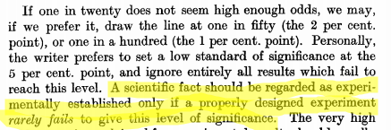

## Statistical Inference and Science

- Previously: descriptive statistics. “Here are data; what do they say?”.
- May need to take some action based on information in data.
- Or want to generalize beyond data (sample) to larger world
(population).
- Science: first guess about how world works.
- Then collect data, by sampling.
- Is guess correct (based on data) for whole world, or not?

## Sample data are imperfect
- Sample data never entirely represent what you’re observing.
- There is always random error present.
- Thus you can never be entirely certain about your conclusions.
- The Toronto Blue Jays’ average home attendance in part of 2015
season was 25,070 (up to May 27 2015, from
baseball-reference.com).
- Does that mean the attendance at every game was exactly 25,070?
Certainly not. Actual attendance depends on many things, eg.:
  - how well the Jays are playing
  - the opposition
  - day of week
  - weather
  - random chance
  
## Packages for this section

```{r, eval=F}
library(tidyverse)
# library(smmr)
# library(PMCMRplus)
```


## Reading the attendances
...as a `.csv` file:

```{r}
jays <- read_csv("jays15-home.csv")
```

## Taking a look (tiny)

\tiny
```{r}
jays
```
\normalsize

## Another way

\tiny

```{r, echo=FALSE}
options(width=100)
```


```{r}
glimpse(jays)
```
\normalsize

## Attendance histogram

```{r, fig.height=3.8}
ggplot(jays, aes(x = attendance)) + geom_histogram(bins = 6)
```


## Comments
- Attendances have substantial variability, ranging from just over
10,000 to around 50,000.
- Distribution somewhat skewed to right (but no outliers).
- These are a sample of “all possible games” (or maybe “all possible
games played in April and May”). What can we say about mean
attendance in all possible games based on this evidence?
- Think about:
  - Confidence interval
  - Hypothesis test.
  
## Getting CI for mean attendance 
- `t.test` function does CI and test. Look at CI first:

```{r}
t.test(jays$attendance)
```

- From 20,500 to 29,600.

## Or, 90% CI

- by including a value for conf.level:
```{r}
t.test(jays$attendance, conf.level = 0.90)
```

- From 21,300 to 28,800. (Shorter, as it should be.)


## Comments
- Need to say “column attendance within data frame `jays`” using $.
- 95% CI from about 20,000 to about 30,000.
- Not estimating mean attendance well at all!
- Generally want confidence interval to be shorter, which happens if:
  - SD smaller
  - sample size bigger
  - confidence level smaller
- Last one is a cheat, really, since reducing confidence level increases
chance that interval won’t contain pop. mean at all!

## Another way to access data frame columns

```{r}
with(jays, t.test(attendance))
```

## Hypothesis test
- CI answers question “what is the mean?”
- Might have a value $\mu$ in mind for the mean, and question “Is the
mean equal to $\mu$, or not?”
- For example, 2014 average attendance was 29,327.
- "Is the mean this?" answered by **hypothesis test**.
- Value being assessed goes in **null hypothesis**: here, $H_0 : \mu = 29327$.
- **Alternative hypothesis** says how null might be wrong, eg.
$H_a : \mu \ne 29327$.
- Assess evidence against null. If that evidence strong enough, *reject
null hypothesis;* if not, *fail to reject null hypothesis* (sometimes *retain null*).
- Note asymmetry between null and alternative, and utter absence of
word “accept”.

## $\alpha$ and errors
- Hypothesis test ends with decision:
  - reject null hypothesis
  - do not reject null hypothesis.
- but decision may be wrong:

\begin{center}
  
  
\begin{tabular}{|l|cc|}
\hline
  & \multicolumn{2}{c|}{Decision}\\
Truth & Do not reject & Reject null\\
\hline
Null true & Correct & Type I error\\
Null false & Type II error & Correct\\
\hline
\end{tabular}
\end{center}

- Either type of error is bad, but for now focus on controlling Type I
error: write $\alpha$ = P(type I error), and devise test so that $\alpha$ small,
typically 0.05.
- That is, **if null hypothesis true**, have only small chance to reject it
(which would be a mistake).
- Worry about type II errors later (when we consider power of test).

## Why 0.05? This man. 

\begin{columns}
  \begin{column}{0.3\textwidth}
      \includegraphics[width=\textwidth]{fisher}
  \end{column}
  \begin{column}{0.7\textwidth}
    Responsible for:
  
  \begin{itemize}
  \item analysis of variance
  \item Fisher information
  \item Linear discriminant analysis
  \item Fisher's $z$-transformation
  \item Fisher-Yates shuffle
  \item Behrens-Fisher problem
  \end{itemize}
  
   Sir Ronald A. Fisher, 1890--1962.

  \end{column}
\end{columns}


## Why 0.05? (2)
- From The Arrangement of Field Experiments (1926): 

{width=400px}

- and 

{width=400px}

## Three steps:

- from data to test statistic 
  - how far are data from null hypothesis
- from test statistic to P-value
  - how likely are you to see "data like this" **if the null hypothesis is true**
- from P-value to decision
  - reject null hypothesis if P-value small enough, fail to reject it otherwise
  
## Using `t.test`:

```{r}
t.test(jays$attendance, mu=29327)
```

- See test statistic $-1.93$, P-value 0.065.
- Do not reject null at $\alpha=0.05$: no evidence that mean attendance has changed.

## Assumptions

- Theory for $t$-test: assumes normally-distributed data.
- What actually matters is sampling distribution of sample mean: if this
is approximately normal, $t$-test is OK, even if data distribution is not
normal.
- Central limit theorem: if sample size large, sampling distribution
approx. normal even if data distribution somewhat non-normal.
- So look at shape of data distribution, and make a call about whether
it is normal enough, given the sample size.

## Blue Jays attendances again:

- You might say that this is not normal enough for a sample size of $n = 25$,
in which case you don’t trust the $t$-test result:

```{r, fig.height=3}
ggplot(jays, aes(x = attendance)) + geom_histogram(bins = 6)
```


## Another example: learning to read

- You devised new method for teaching children to read.
- Guess it will be more effective than current methods.
- To support this guess, collect data.
- Want to generalize to “all children in Canada”.
- So take random sample of all children in Canada.
- Or, argue that sample you actually have is “typical” of all children in
Canada.
- Randomization (1): whether or not a child in sample or not has
nothing to do with anything else about that child.
- Randomization (2): randomly choose whether each child gets new
reading method (t) or standard one (c).

## Reading in data 
- File at <http://www.utsc.utoronto.ca/~butler/c32/drp.txt>.
- Proper reading-in function is `read_delim` (check file to see)
- Read in thus:

```{r}
my_url <- "http://www.utsc.utoronto.ca/~butler/c32/drp.txt"
kids <- read_delim(my_url," ")
```

## The data (some) 

```{r}
kids
```

## Boxplots

```{r, fig.height=3.7}
ggplot(kids, aes(x = group, y = score)) + geom_boxplot()
```

## Two kinds of two-sample t-test

- Do the two groups have same spread (SD, variance)?
    - If yes (shaky assumption here), can use pooled t-test.
    - If not, use Welch-Satterthwaite t-test (safe).
- Pooled test derived in STAB57 (easier to derive).
- Welch-Satterthwaite is test used in STAB22 and is generally safe.
- Assess (approx) equality of spreads using boxplot.

## The (Welch-Satterthwaite) t-test
- `c` (control) before `t` (treatment) alphabetically, so proper alternative
is “less”.
- R does Welch-Satterthwaite test by default 
- Answer to "does the new reading program really help?"
- (in a moment) how to get R to do pooled test?

## Welch-Satterthwaite 

```{r}
t.test(score ~ group, data = kids, alternative = "less")
```

## The pooled t-test 

```{r}
t.test(score ~ group, data = kids, 
       alternative = "less", var.equal = T)
```

## Two-sided test; CI
- To do 2-sided test, leave out `alternative`:

```{r}
t.test(score ~ group, data = kids)
```


## Comments:

- P-values for pooled and Welch-Satterthwaite tests very similar (even though the pooled test seemed inferior): 0.013 vs.\ 0.014.
- Two-sided test also gives CI: new reading program increases average scores by
somewhere between about 1 and 19 points.
- Confidence intervals inherently two-sided, so do 2-sided test to get
them.


## Jargon for testing 

- Alternative hypothesis: what we are trying to prove (new reading program
is effective).
- Null hypothesis: “there is no difference” (new reading program no better
than current program). Must contain “equals”.
- One-sided alternative: trying to prove better (as with reading program).
- Two-sided alternative: trying to prove different.
- Test statistic: something expressing difference between data and null (eg.
difference in sample means, $t$ statistic).
- P-value: probability of observing test statistic value as extreme or
more extreme, if null is true.
- Decision: either reject null hypothesis or do not reject null
hypothesis. **Never “accept”**.

## Logic of testing 

- Work out what would happen if null hypothesis were true.
- Compare to what actually did happen.
- If these are too far apart, conclude that null hypothesis is not true
after all. (Be guided by P-value.)
- As applied to our reading programs:
  - If reading programs equally good, expect to see a difference in means
close to 0.
  - Mean reading score was 10 higher for new program.
  - Difference of 10 was unusually big (P-value small from t-test). So
conclude that new reading program is effective.
- Nothing here about what happens if null hypothesis is false. This is power
and type II error probability.

