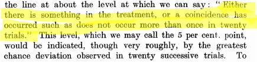
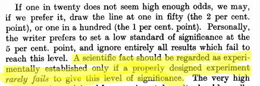

## Statistical Inference and Science

- Previously: descriptive statistics. “Here are data; what do they say?”.
- May need to take some action based on information in data.
- Or want to generalize beyond data (sample) to larger world
(population).
- Science: first guess about how world works.
- Then collect data, by sampling.
- Is guess correct (based on data) for whole world, or not?

## Sample data are imperfect
- Sample data never entirely represent what you’re observing.
- There is always random error present.
- Thus you can never be entirely certain about your conclusions.
- The Toronto Blue Jays’ average home attendance in part of 2015
season was 25,070 (up to May 27 2015, from
baseball-reference.com).
- Does that mean the attendance at every game was exactly 25,070?
Certainly not. Actual attendance depends on many things, eg.:
  - how well the Jays are playing
  - the opposition
  - day of week
  - weather
  - random chance
  
## Packages for this section

```{r, eval=F}
library(tidyverse)
library(smmr)
library(PMCMRplus)
```


## Reading the attendances
...as a `.csv` file:

```{r}
jays = read_csv("jays15-home.csv")
```

## Taking a look

\scriptsize
```{r}
jays
```
\normalsize

## Another way

\tiny
```{r}
glimpse(jays)
```
\normalsize

## Attendance histogram

```{r, fig.height=3.8}
ggplot(jays, aes(x = attendance)) + geom_histogram(bins = 10)
```


## Comments
- Attendances have substantial variability, ranging from just over
10,000 to around 50,000.
- Distribution somewhat skewed to right (but no outliers).
- These are a sample of “all possible games” (or maybe “all possible
games played in April and May”). What can we say about mean
attendance in all possible games based on this evidence?
- Think about:
  - Confidence interval
  - Hypothesis test.
  
## Getting CI for mean attendance 
- `t.test` function does CI and test. Look at CI first:

```{r}
t.test(jays$attendance)
```

- From 20,500 to 29,600.

## Or, 90% CI

- by including a value for conf.level:
```{r}
t.test(jays$attendance, conf.level = 0.90)
```

- From 21,300 to 28,800. (Shorter, as it should be.)


## Comments
- Need to say “column attendance within data frame `jays`” using $.
- 95% CI from about 20,000 to about 30,000.
- Not estimating mean attendance well at all!
- Generally want confidence interval to be shorter, which happens if:
  - SD smaller
  - sample size bigger
  - confidence level smaller
- Last one is a cheat, really, since reducing confidence level increases
chance that interval won’t contain pop. mean at all!

## Another way to access data frame columns

```{r}
with(jays, t.test(attendance))
```

## Hypothesis test
- CI answers question “what is the mean?”
- Might have a value $\mu$ in mind for the mean, and question “Is the
mean equal to $\mu$, or not?”
- For example, 2014 average attendance was 29,327.
- "Is the mean this?" answered by **hypothesis test**.
- Value being assessed goes in **null hypothesis**: here, $H_0 : \mu = 29327$.
- **Alternative hypothesis** says how null might be wrong, eg.
$H_a : \mu \ne 29327$.
- Assess evidence against null. If that evidence strong enough, *reject
null hypothesis;* if not, *fail to reject null hypothesis* (sometimes *retain null*).
- Note asymmetry between null and alternative, and utter absence of
word “accept”.

## $\alpha$ and errors
- Hypothesis test ends with decision:
  - reject null hypothesis
  - do not reject null hypothesis.
- but decision may be wrong:

\begin{center}
  
  
\begin{tabular}{|l|cc|}
\hline
  & \multicolumn{2}{c|}{Decision}\\
Truth & Do not reject & Reject null\\
\hline
Null true & Correct & Type I error\\
Null false & Type II error & Correct\\
\hline
\end{tabular}
\end{center}

- Either type of error is bad, but for now focus on controlling Type I
error: write $\alpha$ = P(type I error), and devise test so that $\alpha$ small,
typically 0.05.
- That is, **if null hypothesis true**, have only small chance to reject it
(which would be a mistake).
- Worry about type II errors later (when we consider power of test).

## Why 0.05? This man. 

\begin{columns}
  \begin{column}{0.3\textwidth}
      \includegraphics[width=\textwidth]{fisher}
  \end{column}
  \begin{column}{0.7\textwidth}
    Responsible for:
  
  \begin{itemize}
  \item analysis of variance
  \item Fisher information
  \item Linear discriminant analysis
  \item Fisher's $z$-transformation
  \item Fisher-Yates shuffle
  \item Behrens-Fisher problem
  \end{itemize}
  
   Sir Ronald A. Fisher, 1890--1962.

  \end{column}
\end{columns}


## Why 0.05? (2)
- From The Arrangement of Field Experiments (1926): 

{width=400px}

- and 

{width=400px}

## Three steps:

- from data to test statistic 
  - how far are data from null hypothesis
- from test statistic to P-value
  - how likely are you to see "data like this" **if the null hypothesis is true**
- from P-value to decision
  - reject null hypothesis if P-value small enough, fail to reject it otherwise
  
## Using `t.test`:

```{r}
t.test(jays$attendance, mu=29327)
```

- See test statistic $-1.93$, P-value 0.065.
- Do not reject null at $\alpha=0.05$: no evidence that mean attendance has changed.

## Assumptions

- Theory for $t$-test: assumes normally-distributed data.
- What actually matters is sampling distribution of sample mean: if this
is approximately normal, $t$-test is OK, even if data distribution is not
normal.
- Central limit theorem: if sample size large, sampling distribution
approx. normal even if data distribution somewhat non-normal.
- So look at shape of data distribution, and make a call about whether
it is normal enough, given the sample size.

## Blue Jays attendances again:

- You might say that this is not normal enough for a sample size of $n = 25$,
in which case you don’t trust the $t$-test result:

```{r, fig.height=3}
ggplot(jays, aes(x = attendance)) + geom_histogram(bins = 10)
```


## Another example: learning to read

- You devised new method for teaching children to read.
- Guess it will be more effective than current methods.
- To support this guess, collect data.
- Want to generalize to “all children in Canada”.
- So take random sample of all children in Canada.
- Or, argue that sample you actually have is “typical” of all children in
Canada.
- Randomization (1): whether or not a child in sample or not has
nothing to do with anything else about that child.
- Randomization (2): randomly choose whether each child gets new
reading method (t) or standard one (c).

## Reading in data 
- File at <http://www.utsc.utoronto.ca/~butler/c32/drp.txt>.
- Proper reading-in function is `read_delim` (check file to see)
- Read in thus:

```{r}
my_url="http://www.utsc.utoronto.ca/~butler/c32/drp.txt"
kids=read_delim(my_url," ")
```

## The data (some) 

```{r}
kids
```

## Boxplots

```{r, fig.height=3.7}
ggplot(kids, aes(x = group, y = score)) + geom_boxplot()
```

## Two kinds of two-sample t-test

- Do the two groups have same spread (SD, variance)?
- If yes (shaky assumption here), can use pooled t-test.
- If not, use Welch-Satterthwaite t-test (safe).
- Pooled test derived in STAB57 (easier to derive).
- Welch-Satterthwaite is test used in STAB22 and is generally safe.
- Assess (approx) equality of spreads using boxplot.

## The (Welch-Satterthwaite) t-test
- c (control) before t (treatment) alphabetically, so proper alternative
is “less”.
- R does Welch-Satterthwaite test by default 
- new reading program really helps?
- (in a moment) how to get R to do pooled test?

## Welch-Satterthwaite 

```{r}
t.test(score ~ group, data = kids, alternative = "less")
```

## The pooled t-test 

```{r}
t.test(score ~ group, data = kids, 
       alternative = "less", var.equal = T)
```

## Two-sided test; CI
- To do 2-sided test, leave out `alternative`:

```{r}
t.test(score ~ group, data = kids)
```


## Comments:

- P-values for pooled and Welch-Satterthwaite tests very similar (even though the pooled test seemed inferior): 0.013 vs.\ 0.014.
- Two-sided test also gives CI: new reading program increases average scores by
somewhere between about 1 and 19 points.
- Confidence intervals inherently two-sided, so do 2-sided test to get
them.


## Jargon for testing 

- Alternative hypothesis: what we are trying to prove (new reading program
is effective).
- Null hypothesis: “there is no difference” (new reading program no better
than current program). Must contain “equals”.
- One-sided alternative: trying to prove better (as with reading program).
- Two-sided alternative: trying to prove different.
- Test statistic: something expressing difference between data and null (eg.
difference in sample means, $t$ statistic).
- P-value: probability of observing test statistic value as extreme or
more extreme, if null is true.
- Decision: either reject null hypothesis or do not reject null
hypothesis. **Never “accept”**.

## Logic of testing 

- Work out what would happen if null hypothesis were true.
- Compare to what actually did happen.
- If these are too far apart, conclude that null hypothesis is not true
after all. (Be guided by P-value.)
- As applied to our reading programs:
  - If reading programs equally good, expect to see a difference in means
close to 0.
  - Mean reading score was 10 higher for new program.
  - Difference of 10 was unusually big (P-value small from t-test). So
conclude that new reading program is effective.
- Nothing here about what happens if null hypothesis is false. This is power
and type II error probability.

## Errors in testing

What can happen:

\begin{center}
\begin{tabular}{|l|cc|}
\hline
  & \multicolumn{2}{c|}{Decision}\\
Truth & Do not reject & Reject null\\
\hline
Null true & Correct & Type I error\\
Null false & Type II error & Correct\\
\hline
\end{tabular}  
\end{center}

Tension between truth and decision about truth (imperfect).

- Prob. of type I error denoted $\alpha$. Usually fix $\alpha$, eg. $\alpha = 0.05$.
- Prob. of type II error denoted $\beta$. Determined by the planned
experiment. Low $\beta$ good.
- Prob. of not making type II error called **power** (= $1 - \beta$). *High* power
good.

## Power 

- Suppose $H_0 : \theta = 10$, $H a : \theta \ne 10$ for some parameter $\theta$.
- Suppose $H_0$ wrong. What does that say about $\theta$?
- Not much. Could have $\theta = 11$ or $\theta = 8$ or $\theta = 496$. In each case, $H_0$
wrong.
- How likely a type II error is depends on what $\theta$ is:
  - If $\theta = 496$, should be able to reject $H_0 : \theta = 10$ even for small sample,
so $\beta$ should be small (power large).
  - If $\theta = 11$, might have hard time rejecting $H_0$ even with large sample, so
$\beta$ would be larger (power smaller).
- Power depends on true parameter value, and on sample size.
- So we play “what if”: “if $\theta$ were 11 (or 8 or 496), what would power
be?”.

## Figuring out power
- Time to figure out power is before you collect any data, as part of
planning process.
- Need to have idea of what kind of departure from null hypothesis of
interest to you, eg. average improvement of 5 points on reading test
scores. (Subject-matter decision, not statistical one.)
- Then, either:
  - “I have this big a sample and this big a departure I want to detect.
What is my power for detecting it?”
  - “I want to detect this big a departure with this much power. How big a
sample size do I need?”

## How to understand/estimate power?

- Suppose we test $H_0 : \mu = 10$ against $H_a : \mu \ne 10$, where $\mu$ is
population mean.
- Suppose in actual fact, $\mu = 8$, so $H_0$ is wrong. We want to reject it.
How likely is that to happen?
- Need population SD (take $\sigma = 4$) and sample size (take $n = 15$). In
practice, get $\sigma$ from pilot/previous study, and take the $n$ we plan to
use.
- Idea: draw a random sample from the true distribution, test whether
its mean is 10 or not.
- Repeat previous step “many” times.
- “Simulation”.

## Making it go
- Random sample of 15 normal observations with mean 8 and SD 4:

```{r, echo=F}
set.seed(457299)
```


```{r}
x = rnorm(15, 8, 4)
x
```

- Test whether `x` from population with mean 10 or not (over):


## ...continued


```{r}
t.test(x, mu = 10)
```


- Fail to reject the mean being 10 (a Type II error).

## or get just P-value 

```{r}
t.test(x, mu = 10)$p.value
```


## Run this lots of times
- Two steps:
  - Generate a bunch of random samples
  - extract the P-value for the t-test from each
- without a loop!
- Use `rerun` to generate the random samples
- Use `map` to run the test on each random sample
- Use `map_dbl` to pull out the P-value for each test
- Count up how many of the P-values are 0.05 or less.

## In code


```{r}
rerun(1000, rnorm(15, 8, 4)) %>%
  map( ~ t.test(., mu = 10)) %>%
  map_dbl("p.value") ->
  pvals
tibble(pvals) %>% count(pvals <= 0.05)
```

We correctly rejected 422 times out of 1000, so the estimated power is
0.422.

## Calculating power

- Simulation approach very flexible: will work for any test. But answer
different each time because of randomness.
- In some cases, for example 1-sample and 2-sample t-tests, power can
be calculated.
- `power.t.test`. delta difference between null and true mean: 

\small
```{r}
power.t.test(n = 15, delta = 10-8, sd = 4, type = "one.sample")
```
\normalsize

## Comparison of results

  \begin{center}
  \begin{tabular}{lr}
    Method & Power\\
    \hline
    Simulation & 0.422\\
    \texttt{power.t.test} & 0.4378\\
    \hline
  \end{tabular}
    
  \end{center}

- Simulation power is similar to calculated power; to get more accurate
value, repeat more times (eg. 10,000 instead of 1,000), which takes
longer.
- CI for power based on simulation approx. $0.42 \pm 0.03$.
- With this small a sample size, the power is not great. With a bigger
sample, the sample mean should be closer to 8 most of the time, so
would reject $H_0 : \mu = 10$ more often.

## Calculating required sample size 

- Often, when planning a study, we do not have a particular sample size
in mind. Rather, we want to know how big a sample to take. This
can be done by asking how big a sample is needed to achieve a
certain power.
- The simulation approach does not work naturally with this, since you
have to supply a sample size.
- For the power-calculation method, you supply a value for the power,
but leave the sample size missing.
- Re-use the same problem: $H_0 : \mu = 10$ against 2-sided alternative,
true $\mu = 8$, $\sigma = 4$, but now aim for power 0.80.

## Using power.t.test
- No `n=`, replaced by a `power=`:

```{r}
power.t.test(power=0.80, delta=10-8, sd=4, type="one.sample")
```

- Sample size must be a whole number, so round up to 34 (to get at
least as much power as you want).

## Power curves
- Rather than calculating power for one sample size, or sample size for
one power, might want a picture of relationship between sample size
and power.
- Or, likewise, picture of relationship between difference between true
and null-hypothesis means and power.
- Called power curve.
- Build and plot it yourself.

## Building it
- If you feed power.t.test a collection (“vector”) of values, it will do
calculation for each one.
- Do power for variety of sample sizes, from 10 to 100 in steps of 10:

```{r}
ns=seq(10,100,10)
```

- Calculate powers:
```{r}
ans=power.t.test(n=ns, delta=10-8, sd=4, type="one.sample")
ans$power
```

## Building a plot
- Make a data frame out of the values to plot:
```{r}
d=tibble(n=ns, power=ans$power)
```

- Plot these as points joined by lines, and add horizontal line at 1
(maximum power): 
```{r}
g = ggplot(d, aes(x = n, y = power)) + geom_point() + 
  geom_line() + 
  geom_hline(yintercept = 1, linetype = "dashed")
```

## The power curve
```{r, fig.height=3.8}
g
```

## Power curves for means

- Can also investigate power as it depends on what the true mean is
(the farther from null mean 10, the higher the power
will be).
- Investigate for two different sample sizes, 15 and 30.
- First make all combos of mean and sample size:

```{r}
means=seq(6,10,0.5)
means
ns=c(15,30)
ns
combos=crossing(mean=means, n=ns)
```

## The combos

```{r}
combos
```

## Calculate and plot

- Calculate the powers, carefully:
```{r}
ans=with(combos, power.t.test(n=n, delta=mean-10, sd=4, 
                              type="one.sample"))
```

- Make a data frame to plot, pulling things from the right places:
```{r}
d=tibble(n=factor(combos$n), mean=combos$mean, 
         power=ans$power)
```

- then make the plot:
```{r}
g = ggplot(d, aes(x = mean, y = power, colour = n)) +
  geom_point() + geom_line() +
  geom_hline(yintercept = 1, linetype = "dashed")
```

## The power curves

```{r, fig.height=3.8}
g
```

## Comments
- When `mean=10`, that is, the true mean equals the null mean, $H_0$ is
actually true, and the probability of rejecting it then is $\alpha = 0.05$.
- As the null gets more wrong (mean decreases), it becomes easier to
correctly reject it.
- The blue power curve is above the red one for any mean < 10, meaning
that no matter how wrong $H_0$ is, you always have a greater chance of
correctly rejecting it with a larger sample size.
- Previously, we had $H_0 : \mu = 10$ and a true $\mu = 8$, so a mean of 8
produces power 0.42 and 0.80 as shown on the graph.
- With $n = 30$, a true mean that is less than about 7
is almost certain to be correctly rejected. (With $n = 15$, the
true mean needs to be less than 6.)

## Power by sample size for means 7 and 8
Similar procedure to before:

```{r}
means=c(7, 8)
ns=seq(10, 40, 5)
combos=crossing(mean=means, n=ns)
ans=with(combos, power.t.test(n=n, delta=10-mean, sd=4, 
                              type="one.sample"))
d=tibble(mean=factor(combos$mean), n=combos$n, 
         power=ans$power)
g=ggplot(d, aes(x=n, y=power, colour=mean)) + 
  geom_point() + geom_line() +
  geom_hline(yintercept=1,linetype="dashed")  
```

## The power curves

```{r, fig.height=3.8}
g
```

## Two-sample power

- For kids learning to read, had sample sizes of 22 (approx) in each group
- and these group SDs:

```{r}
kids %>% group_by(group) %>% 
  summarize(n=n(), s=sd(score))
```

## Setting up

- suppose a 5-point improvement in reading score was considered important (on this scale)
- in a 2-sample test, null (difference of) mean is zero, so `delta` is true difference in means
- what is power for these sample sizes, and what sample size would be needed to get power up to 0.80?

## Calculating power for sample size 22 (per group) 

```{r pow1}
power.t.test(n=22, delta=5, sd=14, type="two.sample", 
             alternative="one.sided")
```

## sample size for power 0.8 

```{r pow2}
power.t.test(power=0.80, delta=5, sd=14, type="two.sample", 
             alternative="one.sided")
```

## Comments

- The power for the sample sizes we have is very small (to detect a 5-point increase).
- To get power 0.80, we need 98 kids in *each* group!

## Duality between confidence intervals and hypothesis tests 
- Tests and CIs really do the same thing, if you look at them the right
way. They are both telling you something about a parameter, and
they use same things about data.
- To illustrate, some data (two groups):
```{r}
my_url="http://www.utsc.utoronto.ca/~butler/c32/duality.txt"
twogroups=read_delim(my_url," ")
```


## The data

\footnotesize
```{r}
twogroups
```
\normalsize

## 95% CI (default)
```{r}
t.test(y ~ group, data = twogroups)
```

## 90% CI
```{r}
t.test(y ~ group, data = twogroups, conf.level = 0.90)
```

## Comparing results

Recall null here is $H_0 : \mu_1 - \mu_2 = 0$. P-value 0.0668. 

- 95% CI from $-5.6$ to 0.2, contains 0.
- 90% CI from $-5.0$ to $-0.3$, does not contain 0.
- At $\alpha = 0.05$, would not reject $H_0$ since P-value > 0.05.
- At $\alpha = 0.10$, would reject $H_0$ since P-value < 0.10.

Not just coincidence. Let $C = 100(1 - \alpha)$, so C% gives corresponding CI
to level-$\alpha$ test. Then following always true.
($\iff$ means ``if and only if''.)

\begin{tabular}{|rcl|}
  \hline
  Reject $H_0$ at level $\alpha$ & $\iff$ & $C\%$ CI does not contain $H_0$ value\\
  Do not reject $H_0$ at level $\alpha$ & $\iff$ & $C\%$ CI contains $H_0$ value\\
  \hline
\end{tabular}

Idea: "Plausible" parameter value inside CI, not rejected;
  "Implausible" parameter value outside CI, rejected. 
  
## The value of this
- If you have a test procedure but no corresponding CI:
- you make a CI by including all the parameter values that would not
be rejected by your test.
- Use:
  - $\alpha = 0.01$ for a 99% CI,
  - $\alpha = 0.05$ for a 95% CI,
  - $\alpha = 0.10$ for a 90% CI,
and so on.

## Testing for non-normal data
- The IRS (“Internal Revenue Service”) is the US authority that deals
with taxes (like Revenue Canada).
- One of their forms is supposed to take no more than 160 minutes to
complete. A citizen’s organization claims that it takes people longer
than that on average.
- Sample of 30 people; time to complete form recorded.
- Read in data, and do $t$-test of $H_0 : \mu = 160$ vs. $H_a : \mu > 160$.
- For reading in, there is only one column, so can pretend it is delimited
by anything.
  
## Read in data 
```{r}
my_url="http://www.utsc.utoronto.ca/~butler/c32/irs.txt"
irs = read_csv(my_url)
irs %>% glimpse()
```

## Test whether mean is 160 or greater
```{r}
t.test(irs$Time, mu = 160, alternative = "greater")
```

Reject null; mean greater than 160.

## But, look at a graph
```{r, fig.height=3.5}
ggplot(irs, aes(x = Time)) + geom_histogram(bins = 10)
```

## Comments

- Skewed to right. 
- Should look at *median*, not mean.

## The sign test
- But how to test whether the median is greater than 160?
- Idea: if the median really is 160 ($H_0$ true), the sampled values from
the population are equally likely to be above or below 160.
- If the population median is greater than 160, there will be a lot of
sample values greater than 160, not so many less. Idea: test statistic
is number of sample values greater than hypothesized median.
- How to decide whether “unusually many” sample values are greater
than 160? Need a sampling distribution.
- If $H_0$ true, pop. median is 160, then each sample value independently
equally likely to be above or below 160.
- So number of observed values above 160 has binomial distribution
with $n = 30$ (number of data values) and $p = 0.5$ (160 is
hypothesized to be *median*).

## Obtaining P-value for sign test 1/2

- Count values above/below 160:
```{r}
irs %>% count(Time > 160)
```

- 17 above, 13 below. How unusual is that? Need a *binomial table*.

## Obtaining P-value for sign test 2/2
- R function `dbinom` gives the probability of eg. exactly 17 successes in
a binomial with $n = 30$ and $p = 0.5$:
```{r}
dbinom(17, 30, 0.5)
```

- but we want probability of 17 *or more*, so get all of those, find probability of each,  and add them up: 
```{r}
tibble(x=17:30) %>% 
  mutate(prob=dbinom(x, 30, 0.5)) %>% 
  summarize(total=sum(prob))
```


## Using my package `smmr`
- I wrote a package `smmr` to do the sign test (and some other things).
Installation is a bit fiddly:
  - Install devtools with `install.packages("devtools")`
  - then install smmr: 
```{r, eval=F}
library(devtools)
install_github("nxskok/smmr")
```
- Then load it:
```{r, eval=F}
library(smmr)
```

## `smmr` for sign test
- `smmr`’s function `sign_test` needs three inputs: a data frame, a
column and a null median:
```{r}
sign_test(irs, Time, 160)
```

## Comments (1/3)

- Testing whether population median *greater than* 160, so want
*upper-tail* P-value 0.2923. Same as before.
- Also get table of values above and below; this too as we got.

## Comments (2/3)
- P-values are:
    \begin{center}
    \begin{tabular}{lr}
      Test & P-value\\
      \hline
      $t$ & 0.0392\\
      Sign & 0.2923\\
      \hline
    \end{tabular}
      
    \end{center}
- These are very different: we reject a mean of 160 (in favour of the
mean being bigger), but clearly *fail* to reject a median of 160 in
favour of a bigger one.
- Why is that? Obtain mean and median: 
```{r}
irs %>% summarize(mean = mean(Time), median = median(Time))
```

## Comments (3/3)
- The mean is pulled a long way up by the right skew, and is a fair bit
bigger than 160.
- The median is quite close to 160.
- We ought to be trusting the sign test and not the t-test here (median
and not mean), and therefore there is no evidence that the “typical”
time to complete the form is longer than 160 minutes.
- Having said that, there are clearly some people who take a lot longer
than 160 minutes to complete the form, and the IRS could focus on
simplifying its form for these people.
- In this example, looking at any kind of average is not really helpful; a
better question might be “do an unacceptably large fraction of people
take longer than (say) 300 minutes to complete the form?”: that is,
thinking about worst-case rather than average-case.

## Confidence interval for the median
- The sign test does not naturally come with a confidence interval for
the median.
- So we use the “duality” between test and confidence interval to say:
the (95%) confidence interval for the median contains exactly those
values of the null median that would not be rejected by the two-sided
sign test (at $\alpha = 0.05$).

## For our data
- The procedure is to try some values for the null median and see which
ones are inside and which outside our CI.
- smmr has pval_sign that gets just the 2-sided P-value:
```{r}
pval_sign(160, irs, Time)
```

- Try a couple of null medians:
```{r}
pval_sign(200, irs, Time)
pval_sign(300, irs, Time)
```

- So 200 inside the 95% CI and 300 outside.

## Doing a whole bunch
- Choose our null medians first:

\small
```{r}
(d=tibble(null_median=seq(100,300,20)))
```
\normalsize

## ... and then

“for
each null median, run the function `pval_sign` for that null median
and get the P-value”: 

```{r}
d %>% mutate(p_value = map_dbl(null_median, 
                               ~ pval_sign(., irs, Time)))
```

## Make it easier for ourselves 

```{r}
d %>% 
  mutate(p_value = map_dbl(null_median, 
                           ~ pval_sign(., irs, Time))) %>%
  mutate(in_out = ifelse(p_value > 0.05, "inside", "outside"))
```


## confidence interval for median?

- 95% CI to this accuracy from 120 to 200.
- Can get it more accurately by looking more closely in intervals from
100 to 120, and from 200 to 220.

## A more efficient way: bisection
- Know that top end of CI between 200 and 220:
```{r}
lo=200 
hi=220
```

- Try the value halfway between: is it inside or outside?
```{r}
(try = (lo + hi) / 2)
pval_sign(try,irs,Time)
```

- Inside, so upper end is between 210 and 220. Repeat (over):

## ... bisection continued 

```{r}
lo = try
(try = (lo + hi) / 2)
pval_sign(try, irs, Time)
```

- 215 is inside too, so upper end between 215 and 220. 
- Continue until have as accurate a result as you want.

## Bisection automatically

- A loop, but not a `for` since we don’t know how many times we’re
going around. Keep going while a condition is true:
```{r, eval=F}
lo = 200
hi = 220
while (hi - lo > 1) {
  try = (hi + lo) / 2
  ptry = pval_sign(try, irs, Time)
  print(c(try, ptry))
  if (ptry <= 0.05)
    hi = try
  else
    lo = try
}
```

## The output from this loop

```{r, echo=F}
lo = 200
hi = 220
while (hi - lo > 1) {
  try = (hi + lo) / 2
  ptry = pval_sign(try, irs, Time)
  print(c(try, ptry))
  if (ptry <= 0.05)
    hi = try
  else
    lo = try
}
```

- 215 inside, 215.625 outside. Upper end of interval to this accuracy is 215.

## Using smmr
- `smmr` has function `ci_median` that does this (by default 95% CI):
```{r}
ci_median(irs,Time)
```

- Uses a more accurate bisection than we did.
- Or get, say, 90% CI for median:
```{r}
ci_median(irs,Time,conf.level=0.90)
```

- 90% CI is shorter, as it should be.

## Matched pairs

Some data: 

\centering{
  \includegraphics[height=0.7\textheight]{Screenshot_2019-04-26_13-41-29}
}


## Matched pairs data
- Data are comparison of 2 drugs for effectiveness at reducing pain.
- 12 subjects (cases) were arthritis sufferers
- Response is #hours of pain relief from each drug.
- In reading example, each child tried only one reading method.
- But here, each subject tried out both drugs, giving us two
measurements.
- Possible because, if you wait long enough, one drug has no influence
over effect of other.
- Advantage: focused comparison of drugs. Compare one drug with
another on same person, removes a lot of variability due to differences between people. 
- Matched pairs, requires different analysis. 
- Design: randomly choose 6 of 12 subjects to get drug A first, other 6
get drug B first.

## Paired t test: reading the data
Values aligned in columns:  

```{r}
my_url="http://www.utsc.utoronto.ca/~butler/c32/analgesic.txt"
pain=read_table(my_url)
```

## The data

```{r}
pain
```

## Paired *t*-test 

```{r}
with(pain, t.test(druga, drugb, paired = T))
```

P-value is 0.053. Likewise, you can calculate the differences yourself and
do a 1-sample t-test on them, over:

## t-testing the differences
- First calculate a column of differences (in data frame):
```{r}
(pain %>% mutate(diff=druga-drugb) -> pain)
```

## t-test on the differences
- then throw them into t.test, testing that the mean is zero, with
same result as before:
```{r}
with(pain,t.test(diff,mu=0))
```

## Assessing normality 
- 1-sample and 2-sample t-tests assume (each) group normally
distributed.
- Matched pairs analyses assume (theoretically) that differences
normally distributed.
- Though we know that t-tests generally behave well even without
normality.
- How to assess normality? A normal quantile plot.
  - Idea: scatter of points should follow the straight line, without curving.
  - Outliers show up at bottom left or top right of plot as points off the
line.

## The normal quantile plot

- of differences from matched pairs data

```{r, fig.height=3.3}
ggplot(pain,aes(sample=diff))+stat_qq()+stat_qq_line()
```

- Points should follow the straight line. Bottom left one way off, so
normality questionable here: outlier.

## More normal quantile plots
- How straight does a normal quantile plot have to be?
- There is randomness in real data, so even a normal quantile plot from
normal data won’t look perfectly straight.
- With a small sample, can look not very straight even from normal
data.
- Looking for systematic departure from a straight line; random wiggles
ought not to concern us.
- Look at some examples where we know the answer, so that we can
see what to expect.

## Normal data, large sample

```{r set-seed, echo=F}
set.seed(457299)
```


```{r, fig.height=3.5}
d=tibble(x=rnorm(200))
ggplot(d,aes(x=x))+geom_histogram(bins=10)
```

## The normal quantile plot

```{r, fig.height=3.8}
ggplot(d,aes(sample=x))+stat_qq()+stat_qq_line()
```

## Normal data, small sample

```{r, echo=F}
set.seed(457299)
```

- Not so convincingly normal, but not obviously skewed:


```{r normal-small, fig.height=3.1}
d=tibble(x=rnorm(20))
ggplot(d,aes(x=x))+geom_histogram(bins=5)
```


## The normal quantile plot

Good, apart from the highest and lowest points being slightly off. I’d call
this good:


```{r, fig.height=3.1}
ggplot(d,aes(sample=x))+stat_qq()+stat_qq_line()
```

## Chi-squared data, *df* = 10

Somewhat skewed to right:

```{r, fig.height=3.1}
d=tibble(x=rchisq(100,10))
ggplot(d,aes(x=x))+geom_histogram(bins=10)
```


## The normal quantile plot

Somewhat opening-up curve:

```{r, fig.height=3.3}
ggplot(d,aes(sample=x))+stat_qq()+stat_qq_line()
```


## Chi-squared data, df = 3

Definitely skewed to right:

```{r chisq-small-df, fig.height=3.1}
d=tibble(x=rchisq(100,3))
ggplot(d,aes(x=x))+geom_histogram(bins=10)
```


## The normal quantile plot

Clear upward-opening curve:

```{r, fig.height=3.4}
ggplot(d,aes(sample=x))+stat_qq()+stat_qq_line()
```


## t-distributed data, df = 3

Long tails (or a very sharp peak):

```{r t-small, fig.height=3.2}
d=tibble(x=rt(300,3))
ggplot(d,aes(x=x))+geom_histogram(bins=10)
```


## The normal quantile plot

Low values too low and high values too high for normal.

```{r, fig.height=3.4}
ggplot(d,aes(sample=x))+stat_qq()+stat_qq_line()
```


## Our pain-relief data

```{r pain-relief-qq, fig.height=3.8}
ggplot(pain,aes(sample=diff))+stat_qq()+stat_qq_line()
```

## Comments

- Definitely not normal. What to do?
- Sign test on differences, null median 0.

## Sign test
- Most easily: calculate differences in data frame, then use `smmr`.
- Null median difference is 0:

```{r}
pain %>% mutate(mydiff=druga-drugb) %>%
sign_test(mydiff,0)
```


## Comments 

- P-value 0.1460. No evidence that the drugs are different.
- Since we are working in a pipeline, input data frame to `sign_test` is
“whatever came out of previous step”.


## (Some of) the kids’ reading data, again

```{r}
kids %>% sample_n(12)
```

## Where we are at 

- 21 kids in “treatment”, new reading method; 23 in “control”,
standard reading method.

- Assessing assumptions:
  - We did two-sample t-test (Satterthwaite-Welch) before.
  - Assumes approx. normal data within each group.
  - Does not assume equal spread.
  - (Pooled t-test *does* assume equal spread).
  - Assess each group separately. 

## Boxplots for reading data

```{r, fig.height=3.7}
ggplot(kids,aes(x=group,y=score))+geom_boxplot()
```

## Facetted normal quantile plots
Done this way:

```{r, fig.height=3.2}
ggplot(kids,aes(sample=score))+stat_qq()+stat_qq_line()+
facet_wrap(~group)
```

## Comments
- These plots show no problems with normality. Both groups are more
or less symmetric/normal and there are no outliers.
- Equal spreads questionable, but we don’t need that.
- Assess equal spreads by looking at *slopes* of normal quantile plots.
- We ought be happy with the (Welch) two-sample t-test (over)


## Welch two-sample test

```{r}
t.test(score~group,data=kids,alternative="less")
```

from which we concluded that the new reading method really does
help.

## What to do if normality fails
- (On the previous page, the only indication of non-normality is the
highest score in the control group, which is a little too high for
normality.)
- If normality fails (for one or both of the groups), what do we do then?
- Again, can compare medians: use the thought process of the sign test,
which does not depend on normality and is not damaged by outliers.
- A suitable test called Mood’s median test.
- Before we get to that, a diversion.

## The chi-squared test for independence

Suppose we want to know whether people are in favour of having
daylight savings time all year round. We ask 20 males and 20 females
whether they each agree with having DST all year round (“yes”) or
not (“no”). Some of the data: 

```{r, message=F}
my_url="http://www.utsc.utoronto.ca/~butler/c32/dst.txt"
dst=read_delim(my_url," ")
dst %>% sample_n(5) # randomly sample 5 rows
```

## ... continued

Count up individuals in each category combination, and arrange in
contingency table:
```{r}
tab=with(dst,table(gender,agree))
tab
```

- Most of the males say “yes”, but the females are about evenly split.
- Looks like males more likely to say “yes”, ie. an association between
gender and agreement.
- Test an $H_0$ of “no association” (“independence”) vs. alternative that
there is really some association. 
- Done with `chisq.test`.

## ...And finally

```{r}
chisq.test(tab,correct=F)
```

- Reject null hypothesis of no association
- therefore there is a difference in rates of agreement between (all)
males and females (or that gender and agreement are associated).
- Without `correct=F` uses “Yates correction”; this way, should give
same answers as calculated by hand (if you know how).

## Mood’s median test
- Before our diversion, we wanted to compare medians of two groups.
- Recall sign test: count number of values above and below something
(there, hypothesized median).
- Idea of Mood’s median test:
  - Work out the median of all the data, regardless of group (“grand
median”).
  - Count how many data values in each group are above/below this grand
median.
  - Make contingency table of group vs. above/below.
  - Test for association.
- If group medians equal, each group should have about half its
observations above/below grand median. If not, one group will be
mostly above grand median and other below.

## Mood’s median test for reading data
- Find overall median score: 
```{r}
(kids %>% summarize(med=median(score)) %>% pull(med) -> m)
```

- Make table of above/below vs. group:
```{r}
tab=with(kids,table(group,score>m))
tab
```


- Treatment group scores mostly above median, control group scores
mostly below, as expected.

## The test
- Do chi-squared test:
```{r}
chisq.test(tab,correct=F)
```


- This test actually two-sided (tests for any association). 
- Here want to test that new reading method *better* (one-sided).
- Most of treatment children above overall median, so
do 1-sided test by halving P-value to get 0.017. 
- This way too, children do better at learning to read using the new
method.

## Or by smmr
- `median_test` does the whole thing:

```{r}
median_test(kids,score,group)
```

- P-value again two-sided.

## Comments
- P-value 0.013 for (1-sided) t-test, 0.017 for (1-sided) Mood median
test.
- Like the sign test, Mood’s median test doesn’t use the data very
efficiently (only, is each value above or below grand median).
- Thus, if we can justify doing *t*-test, we should do it. This is the case
here.
- The *t*-test will usually give smaller P-value because it uses the data
more efficiently.
- The time to use Mood’s median test is if we are definitely unhappy
with the normality assumption (and thus the t-test P-value is not to
be trusted).

## Jumping rats
- Link between exercise and healthy bones (many studies).
- Exercise stresses bones and causes them to get stronger.
- Study (Purdue): effect of jumping on bone density of growing rats.
- 30 rats, randomly assigned to 1 of 3 treatments:
  - No jumping (control)
  - Low-jump treatment (30 cm)
  - High-jump treatment (60 cm)
- 8 weeks, 10 jumps/day, 5 days/week.
- Bone density of rats (mg/cm 3 ) measured at end.
- See whether larger amount of exercise (jumping) went with higher
bone density.
- Random assignment: rats in each group similar in all important ways.
- So entitled to draw conclusions about cause and effect.

## Reading the data
Values separated by spaces:
```{r}
my_url="http://www.utsc.utoronto.ca/~butler/c32/jumping.txt"
rats=read_delim(my_url," ")
```

## The data (some random rows) 

\small
```{r}
rats %>% sample_n(12)
```
\normalsize

## Boxplots

```{r, fig.height=3.7}
ggplot(rats,aes(y=density,x=group))+geom_boxplot()
```

## Or, arranging groups in data (logical) order

```{r, fig.height=3.5}
ggplot(rats,aes(y=density,x=fct_inorder(group)))+
geom_boxplot()
```

## Analysis of Variance
- Comparing > 2 groups of independent observations (each rat only
does one amount of jumping).
- Standard procedure: analysis of variance (ANOVA).
- Null hypothesis: all groups have same mean.
- Alternative: “not all means the same”, at least one is different from
others.

## Testing: ANOVA in R

```{r}
rats.aov=aov(density~group,data=rats)
summary(rats.aov)
```

- Usual ANOVA table, small P-value: significant result.
- Conclude that the mean bone densities are not all equal.
- Reject null, but not very useful finding.

## Which groups are different from which?
- ANOVA really only answers half our questions: it says “there are
differences”, but doesn’t tell us which groups different.
- One possibility (not the best): compare all possible pairs of groups,
via two-sample t.
- First pick out each group:

```{r}
rats %>% filter(group=="Control") -> controls
rats %>% filter(group=="Lowjump") -> lows
rats %>% filter(group=="Highjump") -> highs
```

## Control vs. low

```{r}
t.test(controls$density,lows$density)
```

No sig. difference here.

## Control vs. high

```{r}
t.test(controls$density,highs$density)
```

These are different.

## Low vs. high

```{r}
t.test(lows$density,highs$density)
```

These are different too.

## But...
- We just did 3 tests instead of 1.
- So we have given ourselves 3 chances to reject $H_0:$ all means equal,
instead of 1.
- Thus $\alpha$ for this combined test is not 0.05.

## John W. Tukey 

  \begin{columns}
    \begin{column}{0.4\textwidth}
      \includegraphics[width=\textwidth]{John_Tukey}
    \end{column}
    \begin{column}{0.6\textwidth}
      \begin{itemize}
      \item American statistician, 1915--2000
      \item Big fan of exploratory data analysis
      \item Invented boxplot
      \item Invented "honestly significant differences"
      \item Invented jackknife estimation
      \item Coined computing term "bit"
      \item Co-inventor of Fast Fourier Transform
      \end{itemize}
    \end{column}
  \end{columns}
  

## Honestly Significant Differences
- Compare several groups with one test, telling you which groups differ
from which.
- Idea: if all population means equal, find distribution of highest sample
mean minus lowest sample mean.
- Any means unusually different compared to that declared significantly
different.

## Tukey on rat data

```{r, echo=F}
width=getOption("width")
options(width=60)
```


\small
```{r}
rats.aov=aov(density~group,data=rats)
TukeyHSD(rats.aov)
```
\normalsize

```{r, echo=F}
options(width=width)
```

- Again conclude that bone density for highjump group significantly higher
than for other two groups.

## Why Tukey’s procedure better than all t-tests 
Look at P-values for the two tests:

```
Comparison        Tukey    t-tests
----------------------------------
Highjump-Control 0.0016     0.0021
Lowjump-Control  0.4744     0.2977
Lowjump-Highjump 0.0298     0.0045
```

  
- Tukey P-values (mostly) higher.
- Proper adjustment for doing three t-tests at once, not just one in
isolation.
- `lowjump-highjump` comparison would no longer be significant at
$\alpha = 0.01$.

## Checking assumptions

```{r, fig.height=3.5}
ggplot(rats,aes(y=density,x=fct_inorder(group)))+
geom_boxplot()
```

Assumptions:
- Normally distributed data within each group
- with equal group SDs.

## Normal quantile plots by group

```{r, fig.height=3.5}
ggplot(rats, aes(sample = density)) + stat_qq() + 
  stat_qq_line() + facet_wrap( ~ group)
```

## The assumptions
- Normally-distributed data within each group
- Equal group SDs.
These are shaky here because:
- control group has outliers
- highjump group appears to have less spread than others.
Possible remedies (in general):
- Transformation of response (usually works best when SD increases
with mean)
- If normality OK but equal spreads not, can use Welch ANOVA.
(Regular ANOVA like pooled t-test; Welch ANOVA like
Welch-Satterthwaite t-test.)
- Can also use Mood’s Median Test (see over). This works for any
number of groups.

## Mood’s median test 1/4
- Find median of all bone densities, regardless of group:

\small
```{r}
(rats %>% summarize(med = median(density)) %>% pull(med) -> m)
```
\normalsize

- Count up how many observations in each group above or below
overall median:

```{r}
tab = with(rats, table(group, density > m))
tab
```


## Mood’s median test 2/4 

```{r}
tab
```


- All Highjump obs above overall median.
- Most Control obs below overall
median.
- Suggests medians differ by group.

## Mood’s median test 3/4 
- Test whether association between group and being above/below
overall median significant using chi-squared test for association:

```{r}
chisq.test(tab,correct=F)
```

- Very small P-value says that being above/below overall median
depends on group.
- That is, groups do not all have same median.

## Mood’s median test 4/4 
Or with `median_test` from `smmr`, same as before. 

```{r}
median_test(rats,density,group)
```


## Comments
- No doubt that medians differ between groups (not all same). 
- This test is equivalent of $F$-test, not of Tukey. 
- To determine which groups differ from which, can compare all possible
pairs of groups via (2-sample) Mood’s median tests, then adjust
P-values by multiplying by number of 2-sample Mood tests done (Bonferroni):

```{r}
pairwise_median_test(rats,density,group)
```

- Now, lowjump-highjump difference no longer significant. 

## Welch ANOVA
- For these data, Mood’s median test probably best because we doubt
both normality and equal spreads.
- When normality OK but spreads differ, Welch ANOVA way to go.
- Welch ANOVA done by `oneway.test` as shown (for illustration):

```{r}
oneway.test(density~group,data=rats)
```

- P-value very similar, as expected.
- Appropriate Tukey-equivalent here called Games-Howell.

## Games-Howell

- Lives in package `PMCMRplus` (also `userfriendlyscience`). Install
first.

```{r, eval=F}
library(PMCMRplus)
```


```{r games-howell, warning=F}
gamesHowellTest(density~factor(group),data=rats)
```


