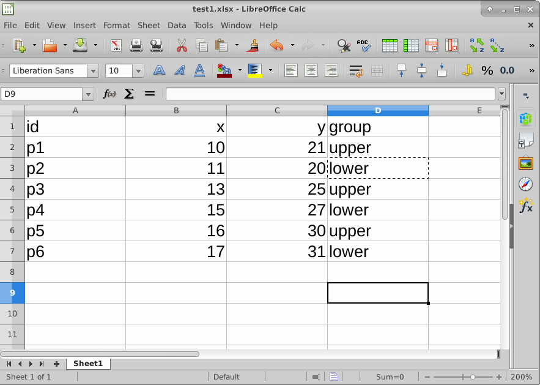
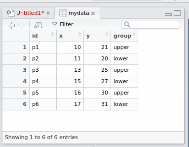
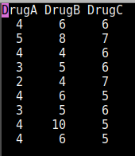
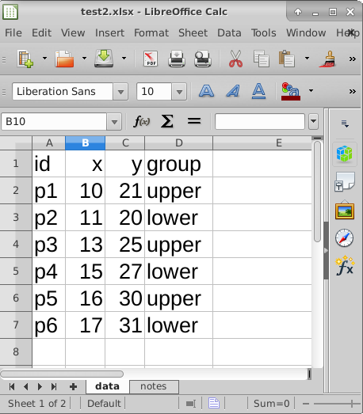

## Introduction

- First thing we need to do is to read in data, so that we can use our
software to analyze.
- Consider these:
  - Spreadsheet data saved as `.csv` file.
  - “Delimited” data such as values separated by spaces.
  - Actual Excel spreadsheets.
  
## Packages for this section

```{r, eval=F}
library(tidyverse)
```


## A spreadsheet



## Save as `.csv`

- `.csv` or “comma-separated values” is a way of turning spreadsheet
values into plain text.
- Easy to read into R (or SAS, later)
- but does not preserve formulas. (This is a reason for doing all your
calculations in your statistical software, and only having data in your
spreadsheet.)
- File, Save As Text CSV (or similar). 
- used name `test1.csv`.


## The `.csv` file

```
id,x,y,group
p1,10,21,upper
p2,11,20,lower
p3,13,25,upper
p4,15,27,lower
p5,16,30,upper
p6,17,31,lower
```


To read this in:

- Fire up rstudio.cloud.
- Upload this .csv file. (Bottom right, next to New Folder, Upload.)
Click Choose File, find the file, click Open. Click OK. See the file
appear bottom right.

## Make a new notebook


- ...and get rid of the template document (leaving the first four lines).
- Make a code chunk and in it put this. Run it.

```{r, eval=F}
library(tidyverse)
```

## Reading in the file

- Use `read_csv` with the name of the file, in quotes. Save the read-in
file in something, here called `mydata`. Make a new code chunk for
this:

```{r}
mydata <- read_csv("test1.csv")
```

## More on the above

- read_csv guesses what kind of thing is in each column. Here it
correctly guesses that:
- id and group are text (categorical variables). id is actually “identifier
variable”: identifies individuals.
- x and y are "double": numbers that might have a decimal point in them.

## R Studio on your own computer

- Put the .csv file in the same folder as your project. Then read it in
as above like `read_csv("test1.csv")`.
- Or, use
`f=file.choose()`
which brings up a file selector (as if you were going to find a file to
load or save it). Find your `.csv` file, the address of which will be
saved in `f`, and then:
```
mydata=read_csv(f)
```

- When you have selected the file, comment out the `file.choose` line
by putting a # on the front of it. That will save you having to find
the file again by mistake. (Keyboard shortcut: go to the line, type
control-shift-C or Mac equivalent with Cmd.)

## Looking at what we read in
- Again, type the name of the thing to display it:

\scriptsize
```{r}
mydata
```
\normalsize

- This is a “tibble” or data frame, the standard way of storing a data
set in R.
- Tibbles print as much as will display on the screen. If there are more
rows or columns, it will say so.
- You will see navigation keys to display more rows or columns (if there are more).

## `View`-ing your data frame

- Another way to examine your data frame is to View it, like this:

```{r, eval=F}
View(mydata)
```

...or find your data frame in the Global Environment top right and
click it.
- This pops up a “data frame viewer” top left:

{height=180px}

## This View

- Read-only: cannot edit data
- Can display data satisfying conditions: click on Filter, then:
  - for a categorical variable, type name of category you want
  - for a quantitative variable, use slider to describe values you want.
- Can sort a column into ascending or descending order (click little
arrows next to column name).
- Clicking the symbol with arrow on it left of Filter “pops out” View
into separate (bigger) window.

## Summarizing what we read in

- It is always a good idea to look at your data after you have read it in,
to make sure you have believable numbers (and the right number of
individuals and variables).
- Quick check for errors: these often show up as values too high or too
low, so the min and/or max will be unreasonable.
- Five-number summary:

```{r}
summary(mydata)
```

- Quantitative, five-number summary plus mean.
- Categorical, how many rows.

## Reading from a URL
- Any data file on the Web can be read directly.
- [Example data link:](http://www.utsc.utoronto.ca/~butler/c32/global.csv)
- Use URL instead of filename.
- I like to save the URL in a variable first (because URLs tend to be
long), and then put that variable in the `read_` function:

\small
```{r}
my_url <- "http://www.utsc.utoronto.ca/~butler/c32/global.csv"
global <- read_csv(my_url)
```
\normalsize

## The data

```{r}
global
```

## Space-delimited files

- Another common format for data is a text file with the values
separated by spaces. Top of some other data:

```
cup tempdiff      	    
Starbucks 13   	  	    
Starbucks 7    	   
Starbucks 7    	   
Starbucks 17.5 	   
Starbucks 10   	   
Starbucks 15.5 	   
Starbucks 6    	   
Starbucks 6    	   
SIGG 12	       	   
SIGG 16	       	   
SIGG 9	       	   
SIGG 23	       	   
SIGG 11	       	   
SIGG 20.5      	   
SIGG 12.5      
SIGG 20.5      
SIGG 24.5      
CUPPS 6    
CUPPS 6    
CUPPS 18.5 
CUPPS 10   
```


## Reading the coffee data

- This file was on my computer so I uploaded it to <http://rstudio.cloud>
first.
- This time, `read_delim`, and we also have to say what the thing is
separating the values:

```{r}
coffee <- read_delim("coffee.txt", " ")
```

- Name of the cup, text, and tempdiff, a decimal number.

## Looking at the values (some)

```{r}
coffee
```

These were four brands of travel mug (in cup), and for each, how much
the temperature of the coffee in the mug decreased over 30 minutes.

## Reading from the Web; the soap data
- Use the URL in place of the filename.
- Save the URL in a variable first:

```{r}
url <- "http://www.utsc.utoronto.ca/~butler/c32/soap.txt"
soap <- read_delim(url, " ")
```

## The soap data (some)

```{r}
soap
```

## Data aligned in columns
- Sometimes you see data aligned in columns, thus:

{height=180px}

- `read_delim` will not work: values separated by more than one space.
- The number of spaces between values is not constant, because there
is one fewer space before the 10.
- `read_table` works for this.

## Reading in column-aligned data

```{r}
drugs <- read_table("migraine.txt")
```

## The data

```{r}
drugs
```


## Reading an Excel sheet directly

- Here is my spreadsheet from before, but tarted up a bit:

{height=180px}

- It is now a workbook with a second sheet called “notes” (that we
don’t want).
- Install package `readxl` first.

## Reading it in

- Read into R, saying that we only want the sheet “data”. Upload
spreadsheet first.
- Excel spreadsheets must be “local”:
cannot read one in from a URL.

```{r, warning=F}
library(readxl)
mydata2 <- read_excel("test2.xlsx", sheet = "data")
mydata2
```

