## Running R online

Go to [rstudio.cloud](https://rstudio.cloud).

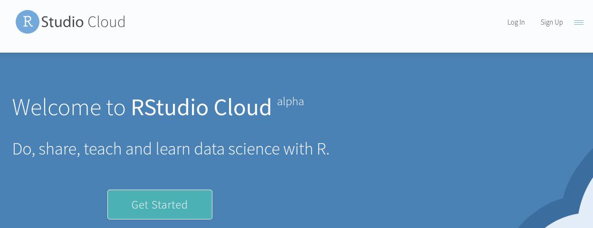

- Click Get Started (or Sign Up top right).
 
## Signing up
  

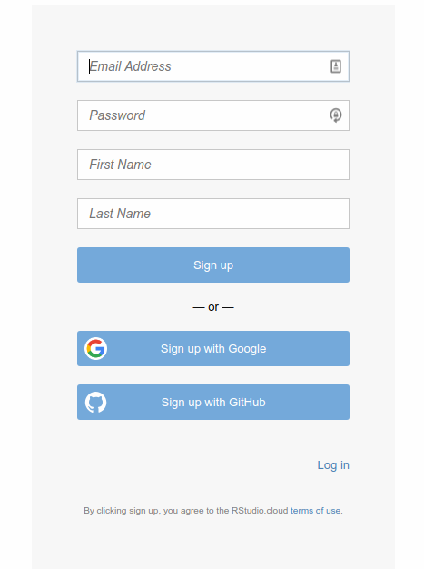{height=200px}


-  Fill out the top 4 boxes and click Sign Up. Or, log in with your
  Google or Github accounts, if you have either of those. (If you have
  GMail, that's a Google account.)


## Logging in

- After you have signed up, you will be logged in.
- If you close the rstudio.cloud browser tab and open it up again,
you will probably get automatically logged in.
- If not, you can click Log In on the opening screen, or click Get
Started and pretend to sign up again, and you’ll get logged in.
- You can explicitly log out, in which case you’ll need to log in again.
- Use one of these ways to get back into R Studio Cloud next time.


## R Studio Cloud

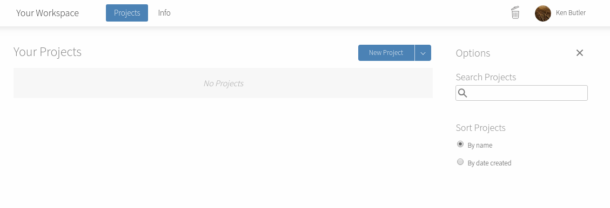{height=200px}

- Each user has a “workspace”, which is a place where all your work is
stored.
- Within that workspace, you can have as many Projects as you like.
- To create a new Project, click on the blue New Project button.

## In a new project
  
-   R Studio starts a new (untitled) project:
    
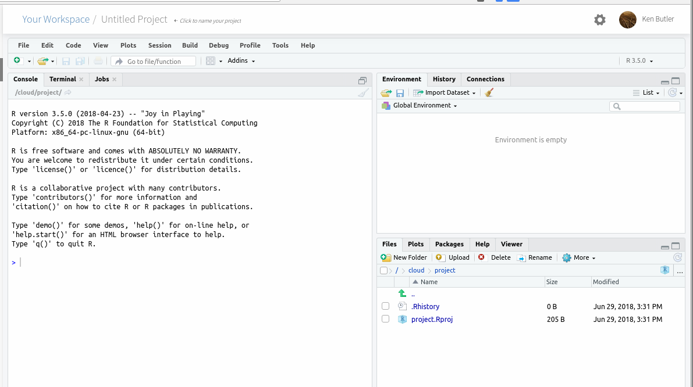{height=180px}     

  - In left-hand Console can type stuff and see output.
  - Click on Console, type \texttt{install.packages("tidyverse")}
    and let it do what it will. (This takes a few minutes.)


## R Notebooks

- At left of previous view is Console, where you can enter R commands
and see output.
- A better way to work is via “R Notebooks”. These allow you to
combine narrative, code and output in one document.
- Data analysis is always a story: not only what you did, but why you
did it, with the “why” being more important.
- To create a new notebook, select File, New File, R Notebook. This
brings up an example notebook as over.
- The first time, you will probably be asked to “install some packages”.
Click Yes to let it do that.

## The template R Notebook
  
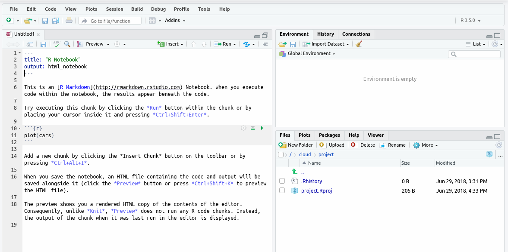

## About this notebook

- The notebook begins with a title (that you can change).
- Most of this notebook is text (narrative). The stuff with
`*asterisks*` around it will come out in italics in the final document.
- Pieces beginning with ````{r}`, in grey, are called code chunks. They
contain R code. ````` marks the end of a code chunk.
- Run code chunks by clicking on the green “play button” at the top
right of the chunk. This one makes a scatterplot. If you click the play
button, the plot is made and placed under the code, as over.

## After running the code chunk
  
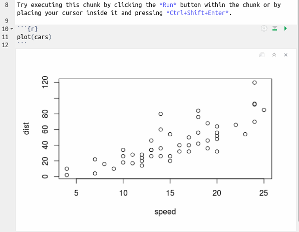  
  
## Making our own notebook

- Create another new notebook. Delete the template text and change
the title to “Some random normal data”.
- Type `## Packages` and go down a couple of lines.
- Make a new code chunk by clicking Insert (at the top of the notebook
window) and selecting R. Inside that chunk, type
`library(tidyverse)`.
- Below that, type `## Random normal data`.
- Make another new code chunk below that, and insert two lines of
code: `z=rnorm(100)` and then `z`.
- Below that, type text `## A histogram` and a code chunk containing
`ggplot(tibble(z),aes(x=z))+geom_histogram(bins=10)`.

## My R notebook

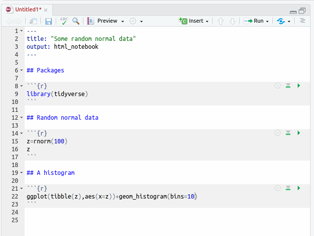
  
## Run the chunks

- Now run each of the three chunks in order. You’ll see output below
each one, including a histogram below the last one.
- When it works, add some narrative text before the code chunks
explaining what is going to be done, and some text after describing
what you see.
- Save the notebook (File, Save As). You don’t need a file extension.
- Click Preview. This makes an HTML-formatted report. (The first
may be gibberish: ignore that). Note what happened to the text.
- If you want to edit anything, go back to the R Notebook, change it,
save it, and run Preview again.

## The end of my report

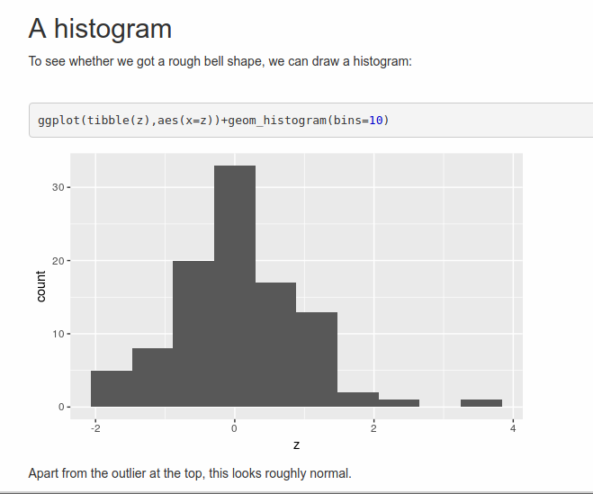

## Installing R on your own computer

- Free, open-source. Download and run on own computer.
- Two things: R itself (install first) and R Studio (front end).
- Go to <https://www.r-project.org/>:

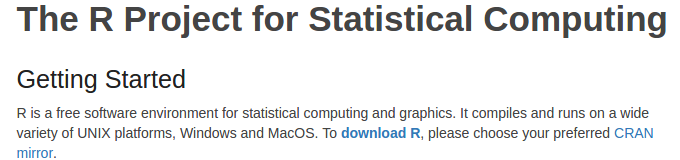

## Click on Download

- R is stored on numerous “mirrors”, sites around the world. The top
one, “0-Cloud”, picks one for you. Or you can choose one close to
you (might be faster), eg. U of T:

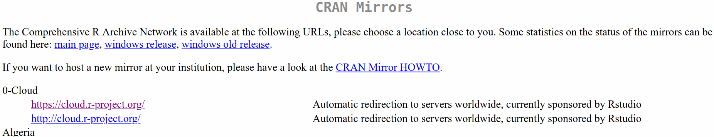

...

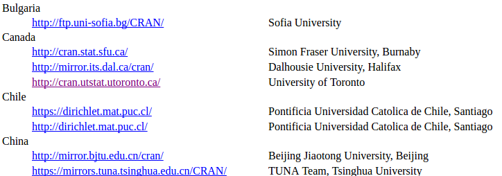

## Click your mirror

- Click 0-Cloud or U of T (or other mirror), get:

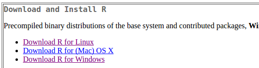

- Click on your operating system, eg. Windows.

## Click on Base

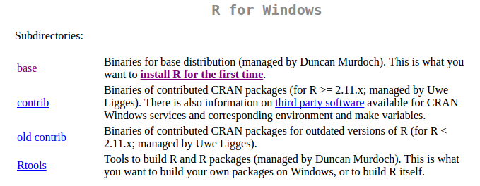

- Click on “base” here.

## The actual download

- Click the top link below:

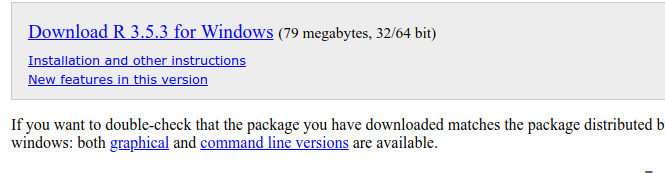

- Then install usual way.
- Or, for Mac, download and install `R-3-5-1.pkg`.
- Or, for Linux, click your distribution (eg. Ubuntu), then one of the
cran35 links according to your version, then probably
`r-base-core_3.5.1-1bionic_amd64.deb`.

## Now, R Studio

- Go [here](https://www.rstudio.com/).
- Find this, and click Download:

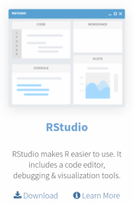{height=200px}


## Scroll down...

- to this:


- Click left-side Download.

## Find the one for you

- Scroll down, and click the installer for your machine
    (Windows, Mac, several flavours of Linux). Install as usual.
    
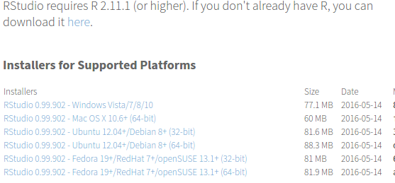


## Running R

- All of above only done once.
- To run R, run R Studio, which itself runs R.


## How R Studio looks when you run it

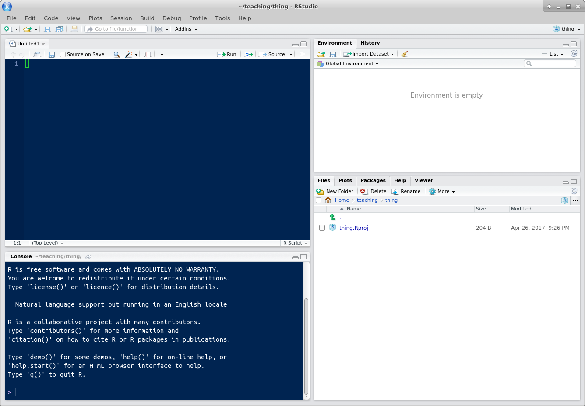{height=200px}

- First time you run R Studio, click on Console window, and, next to the
`>`, type `install.packages("tidyverse")`. Let it do
what it needs to.

## Projects

- A project is a “container” for code and data that belong together.
- Goes with a folder on some computer.
- File, New Project. You have option to create the new project in a
new folder, or in a folder that already exists.
- Use a project for a collection of work that belongs together, eg. data
files and notebooks for assignments. Putting everything in a project
folder makes it easier to find.
- Example: use a project for (all) assignments, a different notebook
within that project for each one.

