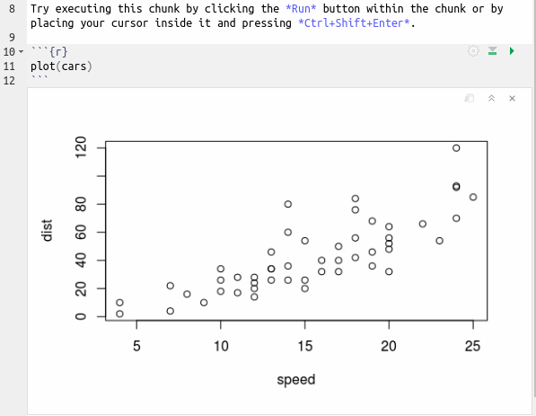
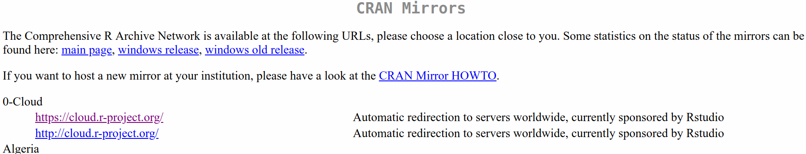
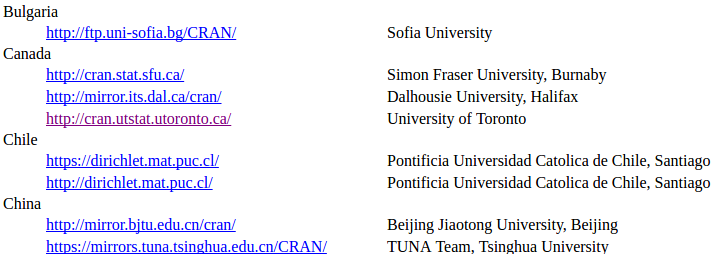
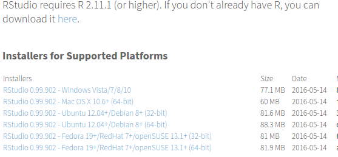
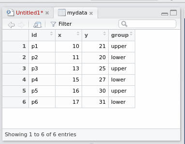
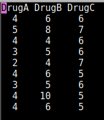
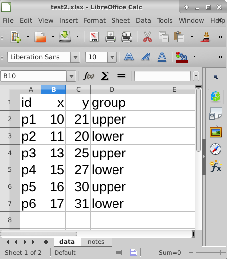
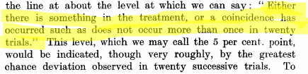
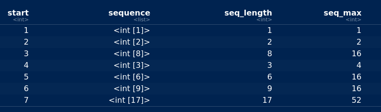

# Course outline 


## In this course
- Data analysis: use mostly known (to you) statistical methods to gain
insight about data.
- Use two software packages, SAS and R — I assume you know nothing
about these.
- Look at lots of examples.
- “Get your hands dirty”.
- Writing reports.
- Other tasks in R and SAS.

## Prerequisites

- You *need* a second Statistics course that covers statistical inference from a mathematical viewpoint,
one of these:
  - STAB57
  - STA 248
  - STA 261
- I check prerequisites.
- You need STAB57 for the Statistics Minor/Major/Specialist programs.

## The instructor
- Ken Butler, office IC 471, e-mail:
mailto:butler@utsc.utoronto.ca
- Lectures xxx check: both of
  - Tuesday xxx 12:00-14:00 in SW 309 
  - Thursday 14:00-15:00 in SW 128. 
- Tutorial: one of 
  - Monday 11:00-12:00,
  - Monday 12:00-13:00,  in BV 498.
- Office hours: Tuesday 14:00-15:30, Thursday 15:00-16:00. Or by appointment (e-mail me, address
above, to set one up).
- course website [**here**](http://ritsokiguess.site/STAC33). 
- This course is on Quercus. Go [**here**](http://q.utoronto.ca), log in, and find
this course among your courses. Assignment hand-in, grading and
marks will be done through Quercus.
- E-mail: Use only UTSC/UToronto e-mail address. I aim to respond
within two working days. Non-simple questions: office hours/tutorial.

## Text(s)

  \begin{columns}
    \begin{column}{0.7\textwidth}
Recommended:
  \begin{itemize}
\item ``SAS Essentials: Mastering SAS for data analytics'' by Alan C.\
  Elliott and Wayne A.\ Woodward, publ.\ Wiley. ISBN 978-1-119-04216-7.
\item ``R for Data Science'' by Hadley Wickham and Garrett Grolemund,
  publ.\ O'Reilly, ISBN 978-1-491-91039-9. Also available (free)
  online at \url{http://r4ds.had.co.nz/}.
  \item ``Problems and Solutions in Applied Statistics'' by your instructor, free online at \url{ritsokiguess.site/pasias}
\end{itemize}
    \end{column}
    \begin{column}{0.3\textwidth}
      \includegraphics[width=1in]{Screenshot_2018-08-17_12-24-26.png}

      \includegraphics[width=1in]{r4ds}
    \end{column}
  \end{columns}


## Structure of course
- 3 hours/week of class time.
- Of these, 1 hour in computer lab (“tutorial”):
  - practice what you learned from lecture
  - you can work on your assignment or on the additional problems listed there.
  - Get help if needed (instructor/TA available)


## Course material (C33)

\begin{columns}
  \begin{column}{0.6\textwidth}
    R:
    \begin{itemize}
\item Installation / connection
\item Reading data files (of different sorts)
\item Making graphs
\item Numerical summaries
\item Statistical inference
\item Reports
\item Tidying and organizing data
\item Case studies
\item Functions
\item Dates and times
\item Miscellaneous tasks
\item Bootstrap
\item Bayesian inference with \texttt{rstan}

    \end{itemize}
  \end{column}
  
  \begin{column}{0.4\textwidth}
  SAS:
  \begin{itemize}
  \item Connection 
\item Reading in data
\item Graphics
\item Basic inference
\item ANOVA
\item Regression 
  
  \end{itemize}
  \end{column}
\end{columns}


## Laptop use
- If you have a laptop, you may find it useful for following along with
the use of the software or for taking notes.
- Checking social media or other non-course-specific activity during
class distracts from your learning. If you are going to get the most
from this course, you need to pay full attention in class. Multi-tasking
will not help you.
- Using your laptop for non-course activity will also distract those
around you and creates a worse learning experience for everybody. If
somebody’s inappropriate laptop use is distracting you, let me know. I
will create laptop-free zones in class if necessary.

## Assessment


 \begin{tabular}{p{3.5in}r}
    \hline
    Item & Weight\\
    \hline
    Assignments (most weeks after first). Can study with classmates, but what you hand in must
    be \textbf{entirely your own work}. Due Thursdays at 11:59pm. & 15\\
    \hline
    Midterm exam, 2 hours, open book (see over) & 30\\
    \hline
    Group data analysis report (1--5 people/group). Data analysis on data set of your choosing,
    using R/SAS/both, report written as described in class.
    Due last
    day of classes at 11:59pm. & 10 \\
    \hline
    Final exam, 3 hours, open book (see over). \textbf{You must pass
    the final exam to guarantee passing the course.} & 45\\
    \hline
    Total & 100\\
    \hline
  \end{tabular}

## Open book, defined
“Open book” means these are permissible, written/printed versions only: 

- the SAS text
- the R text
- my lecture notes
- assignments, yours (graded) and mine (with solutions)
- any other notes that you have made in this course.

Old exams are not permitted.

## Missed work and documentation
- No make-up assignments or tests in this course.
- Work handed in late may or may not be accepted (instructor’s
discretion; instructor’s decision is final).
- If you miss assessed work due to illness/injury, complete form 
[**here**](http://www.illnessverification.utoronto.ca/)
and submit to instructor within 10 working days of due date.
- Weight of missed work with appropriate documentation transferred to
other assessments of same type.

## Academic integrity
- Read and understand [**this**](http://www.utoronto.ca/academicintegrity/).
- Academic dishonesty devalues your degree and those of all other
students.
- Cheating and plagiarism taken very seriously.
- Examples of academic offences:
- Using someone else’s words/ideas without acknowledgement.
- Obtaining or providing unauthorized assistance on an assignment.
- On test/exam, looking at someone else’s answers or allowing someone
else to look at yours.
- Pretending to be someone else.
- Falsifying or altering required documentation (eg. doctor’s notes).

## Penalties
- Penalties include (depending on seriousness of offence) a mark of zero
for the work concerned, a mark of zero for the entire course, or
suspension/expulsion from the University.
- Penalties are (much) more severe for those caught a second (or third)
time.
- “Students who cheat and are not caught will be haunted by the
memory of their misdeeds for the rest of their miserable lives.” (From 
[here](https://philosophy.osu.edu/sites/philosophy.osu.edu/files/1100%20Brown_2.pdf).)

## Accessibility statement

> Students with diverse learning styles and needs are welcome in this
> course. In particular, if you have a disability/health consideration
> that may require accommodations, please feel free to approach
> me and/or the AccessAbility Services Office as soon as possible.
> I will work with you and AccessAbility Services to ensure you can
> achieve your learning goals in this course. Enquiries are confiden-
> tial. The UTSC AccessAbility Services staff (located in S302) are
> available by appointment to assess specific needs, provide referrals
> and arrange appropriate accommodations: (416) 287-7560 or by
> e-mail at `ability@utsc.utoronto.ca`.


# Running R


## Running R online

Go to [rstudio.cloud](https://rstudio.cloud).


- Click Get Started (or Sign Up top right).
 
## Signing up
  

{height=200px}


-  Fill out the top 4 boxes and click Sign Up. Or, log in with your
  Google or Github accounts, if you have either of those. (If you have
  GMail, that's a Google account.)


## Logging in

- After you have signed up, you will be logged in.
- If you close the rstudio.cloud browser tab and open it up again,
you will probably get automatically logged in.
- If not, you can click Log In on the opening screen, or click Get
Started and pretend to sign up again, and you’ll get logged in.
- You can explicitly log out, in which case you’ll need to log in again.
- Use one of these ways to get back into R Studio Cloud next time.


## R Studio Cloud

{height=200px}

- Each user has a “workspace”, which is a place where all your work is
stored.
- Within that workspace, you can have as many Projects as you like.
- To create a new Project, click on the blue New Project button.

## In a new project
  
-   R Studio starts a new (untitled) project:
    
{height=180px}     

  - In left-hand Console can type stuff and see output.
  - Click on Console, type \texttt{install.packages("tidyverse")}
    and let it do what it will. (This takes a few minutes.)


## R Notebooks

- At left of previous view is Console, where you can enter R commands
and see output.
- A better way to work is via “R Notebooks”. These allow you to
combine narrative, code and output in one document.
- Data analysis is always a story: not only what you did, but why you
did it, with the “why” being more important.
- To create a new notebook, select File, New File, R Notebook. This
brings up an example notebook as over.
- The first time, you will probably be asked to “install some packages”.
Click Yes to let it do that.

## The template R Notebook
  


## About this notebook

- The notebook begins with a title (that you can change).
- Most of this notebook is text (narrative). The stuff with
`*asterisks*` around it will come out in italics in the final document.
- Pieces beginning with ````{r}`, in grey, are called code chunks. They
contain R code. ````` marks the end of a code chunk.
- Run code chunks by clicking on the green “play button” at the top
right of the chunk. This one makes a scatterplot. If you click the play
button, the plot is made and placed under the code, as over.

## After running the code chunk
  
  
  
## Making our own notebook

- Create another new notebook. Delete the template text and change
the title to “Some random normal data”.
- Type `## Packages` and go down a couple of lines.
- Make a new code chunk by clicking Insert (at the top of the notebook
window) and selecting R. Inside that chunk, type
`library(tidyverse)`.
- Below that, type `## Random normal data`.
- Make another new code chunk below that, and insert two lines of
code: `z=rnorm(100)` and then `z`.
- Below that, type text `## A histogram` and a code chunk containing
`ggplot(tibble(z),aes(x=z))+geom_histogram(bins=10)`.

## My R notebook


  
## Run the chunks

- Now run each of the three chunks in order. You’ll see output below
each one, including a histogram below the last one.
- When it works, add some narrative text before the code chunks
explaining what is going to be done, and some text after describing
what you see.
- Save the notebook (File, Save As). You don’t need a file extension.
- Click Preview. This makes an HTML-formatted report. (The first
may be gibberish: ignore that). Note what happened to the text.
- If you want to edit anything, go back to the R Notebook, change it,
save it, and run Preview again.

## The end of my report


## Installing R on your own computer

- Free, open-source. Download and run on own computer.
- Two things: R itself (install first) and R Studio (front end).
- Go to <https://www.r-project.org/>:


## Click on Download

- R is stored on numerous “mirrors”, sites around the world. The top
one, “0-Cloud”, picks one for you. Or you can choose one close to
you (might be faster), eg. U of T:



...



## Click your mirror

- Click 0-Cloud or U of T (or other mirror), get:


- Click on your operating system, eg. Windows.

## Click on Base


- Click on “base” here.

## The actual download

- Click the top link below:


- Then install usual way.
- Or, for Mac, download and install `R-3-5-1.pkg`.
- Or, for Linux, click your distribution (eg. Ubuntu), then one of the
cran35 links according to your version, then probably
`r-base-core_3.5.1-1bionic_amd64.deb`.

## Now, R Studio

- Go [here](https://www.rstudio.com/).
- Find this, and click Download:

{height=200px}


## Scroll down...

- to this:


- Click left-side Download.

## Find the one for you

- Scroll down, and click the installer for your machine
    (Windows, Mac, 5 flavours of Linux). Install as usual.
    



## Running R

- All of above only done once.
- To run R, run R Studio, which itself runs R.


## How R Studio looks when you run it

{height=200px}

- First time you run R Studio, click on Console window, and, next to the
`>`, type `install.packages("tidyverse")`. Let it do
what it needs to.

## Projects

- A project is a “container” for code and data that belong together.
- Goes with a folder on some computer.
- File, New Project. You have option to create the new project in a
new folder, or in a folder that already exists.
- Use a project for a collection of work that belongs together, eg. data
files and notebooks for assignments. Putting everything in a project
folder makes it easier to find.
- Example: use a project for (all) assignments, a different notebook
within that project for each one.


# Reading in data


## Introduction

- First thing we need to do is to read in data, so that we can use our
software to analyze.
- Consider these:
  - Spreadsheet data saved as `.csv` file.
  - “Delimited” data such as values separated by spaces.
  - Actual Excel spreadsheets.
  
## Packages for this section


```r
library(tidyverse)
```


## A spreadsheet


## Save as `.csv`

- `.csv` or “comma-separated values” is a way of turning spreadsheet
values into plain text.
- Easy to read into R (or SAS, later)
- but does not preserve formulas. (This is a reason for doing all your
calculations in your statistical software, and only having data in your
spreadsheet.)
- File, Save As Text CSV (or similar). 
- used name `test1.csv`.


## The `.csv` file

```
id,x,y,group
p1,10,21,upper
p2,11,20,lower
p3,13,25,upper
p4,15,27,lower
p5,16,30,upper
p6,17,31,lower
```


To read this in:

- Fire up rstudio.cloud.
- Upload this .csv file. (Bottom right, next to New Folder, Upload.)
Click Choose File, find the file, click Open. Click OK. See the file
appear bottom right.

## Make a new notebook


- ...and get rid of the template document (leaving the first four lines).
- Make a code chunk and in it put this. Run it.


```r
library(tidyverse)
```

## Reading in the file

- Use `read_csv` with the name of the file, in quotes. Save the read-in
file in something, here called `mydata`. Make a new code chunk for
this:


```r
mydata <- read_csv("test1.csv")
```

```
## Error: 'test1.csv' does not exist in current working directory ('/home/ken/teaching/c33/notes').
```

## More on the above

- read_csv guesses what kind of thing is in each column. Here it
correctly guesses that:
- id and group are text (categorical variables). id is actually “identifier
variable”: identifies individuals.
- x and y are integers (quantitative variables that here have no decimal
point). Decimal numbers would be labelled num or double.

## R Studio on your own computer

- Put the .csv file in the same folder as your project. Then read it in
as above like `read_csv("test1.csv")`.
- Or, use
`f=file.choose()`
which brings up a file selector (as if you were going to find a file to
load or save it). Find your `.csv` file, the address of which will be
saved in `f`, and then:
```
mydata=read_csv(f)
```

- When you have selected the file, comment out the `file.choose` line
by putting a # on the front of it. That will save you having to find
the file again by mistake. (Keyboard shortcut: go to the line, type
control-shift-C or Mac equivalent with Cmd.)

## Looking at what we read in
- Again, type the name of the thing to display it:


```r
mydata
```

```
## Error in eval(expr, envir, enclos): object 'mydata' not found
```

- This is a “tibble” or data frame, the standard way of storing a data
set in R.
- Tibbles print as much as will display on the screen. If there are more
rows or columns, it will say so.
- You will see navigation keys to display more rows or columns (if there are more).

## `View`-ing your data frame

- Another way to examine your data frame is to View it, like this:


```r
View(mydata)
```

...or find your data frame in the Global Environment top right and
click it.
- This pops up a “data frame viewer” top left:

{height=180px}

## This View

- Read-only: cannot edit data
- Can display data satisfying conditions: click on Filter, then:
- for a categorical variable, type name of category you want
- for a quantitative variable, use slider to describe values you want.
- Can sort a column into ascending or descending order (click little
arrows next to column name).
- Clicking the symbol with arrow on it left of Filter “pops out” View
into separate (bigger) window.

## Summarizing what we read in

- It is always a good idea to look at your data after you have read it in,
to make sure you have believable numbers (and the right number of
individuals and variables).
- Quick check for errors: these often show up as values too high or too
low, so the min and/or max will be unreasonable.
- Five-number summary:


```r
summary(mydata)
```

```
## Error in summary(mydata): object 'mydata' not found
```

- Quantitative, five-number summary plus mean.
- Categorical, how many rows.

## Reading from a URL
- Any data file on the Web can be read directly.
- [Example data:](http://www.utsc.utoronto.ca/~butler/c32/global.csv).
- Use URL instead of filename.
- I like to save the URL in a variable first (because URLs tend to be
long), and then put that variable in the `read_` function:


```r
my_url <- "http://www.utsc.utoronto.ca/~butler/c32/global.csv"
global <- read_csv(my_url)
```

```
## Parsed with column specification:
## cols(
##   warehouse = col_character(),
##   size = col_double(),
##   cost = col_double()
## )
```

## The data


```r
global
```

```
## # A tibble: 10 x 3
##    warehouse  size  cost
##    <chr>     <dbl> <dbl>
##  1 A           225 12.0 
##  2 B           350 14.1 
##  3 A           150  8.93
##  4 A           200 11.0 
##  5 A           175 10.0 
##  6 A           180 10.1 
##  7 B           325 13.8 
##  8 B           290 13.3 
##  9 B           400 15   
## 10 A           125  7.97
```

## Space-delimited files

- Another common format for data is a text file with the values
separated by spaces. Top of some other data:

```
cup tempdiff      	    
Starbucks 13   	  	    
Starbucks 7    	   
Starbucks 7    	   
Starbucks 17.5 	   
Starbucks 10   	   
Starbucks 15.5 	   
Starbucks 6    	   
Starbucks 6    	   
SIGG 12	       	   
SIGG 16	       	   
SIGG 9	       	   
SIGG 23	       	   
SIGG 11	       	   
SIGG 20.5      	   
SIGG 12.5      
SIGG 20.5      
SIGG 24.5      
CUPPS 6    
CUPPS 6    
CUPPS 18.5 
CUPPS 10   
```


## Reading the coffee data

- This file was on my computer so I uploaded it to <http://rstudio.cloud>
first.
- This time, `read_delim`, and we also have to say what the thing is
separating the values:


```r
coffee <- read_delim("coffee.txt", " ")
```

```
## Error: 'coffee.txt' does not exist in current working directory ('/home/ken/teaching/c33/notes').
```

- Name of the cup, text, and tempdiff, a decimal number.

## Looking at the values (some)


```r
coffee
```

```
## Error in eval(expr, envir, enclos): object 'coffee' not found
```

These were four brands of travel mug (in cup), and for each, how much
the temperature of the coffee in the mug decreased over 30 minutes.

## Reading from the Web; the soap data
- Use the URL in place of the filename.
- Save the URL in a variable first:


```r
url <- "http://www.utsc.utoronto.ca/~butler/c32/soap.txt"
soap <- read_delim(url, " ")
```

```
## Parsed with column specification:
## cols(
##   case = col_double(),
##   scrap = col_double(),
##   speed = col_double(),
##   line = col_character()
## )
```

## The soap data (some)


```r
soap
```

```
## # A tibble: 27 x 4
##     case scrap speed line 
##    <dbl> <dbl> <dbl> <chr>
##  1     1   218   100 a    
##  2     2   248   125 a    
##  3     3   360   220 a    
##  4     4   351   205 a    
##  5     5   470   300 a    
##  6     6   394   255 a    
##  7     7   332   225 a    
##  8     8   321   175 a    
##  9     9   410   270 a    
## 10    10   260   170 a    
## # … with 17 more rows
```

## Data aligned in columns
- Sometimes you see data aligned in columns, thus:

{height=180px}

- `read_delim` will not work: values separated by more than one space.
- The number of spaces between values is not constant, because there
is one fewer space before the 10.
- `read_table` works for this.

## Reading in column-aligned data


```r
drugs <- read_table("migraine.txt")
```

```
## Error: 'migraine.txt' does not exist in current working directory ('/home/ken/teaching/c33/notes').
```

## The data


```r
drugs
```

```
## Error in eval(expr, envir, enclos): object 'drugs' not found
```


## Reading an Excel sheet directly

- Here is my spreadsheet from before, but tarted up a bit:

{height=180px}

- It is now a workbook with a second sheet called “notes” (that we
don’t want).
- Install package `readxl` first.

## Reading it in

- Read into R, saying that we only want the sheet “data”. Upload
spreadsheet first.
- Excel spreadsheets must be “local”:
cannot read one in from a URL.


```r
library(readxl)
```

```
## Warning: `quo_expr()` is deprecated as of rlang 0.2.0.
## Please use `quo_squash()` instead.
## This warning is displayed once per session.
```

```r
mydata2 <- read_excel("test2.xlsx", sheet = "data")
```

```
## Error: `path` does not exist: 'test2.xlsx'
```

```r
mydata2
```

```
## Error in eval(expr, envir, enclos): object 'mydata2' not found
```


# Making graphs


## Our data
- To illustrate making graphs, we need some data.
- Data on 202 male and female athletes at the Australian Institute of
Sport.
- Variables:
  - categorical: Sex of athlete, sport they play
  - quantitative: height (cm), weight (kg), lean body mass, red and white
  blood cell counts, haematocrit and haemoglobin (blood), ferritin
  concentration, body mass index, percent body fat.
- Values separated by tabs (which impacts reading in).

## Packages for this section


```r
library(tidyverse)
```


## Reading data into R
- Use `read_tsv` (“tab-separated values”), like `read_csv`.
- Data in `ais.txt`:


```r
my_url <- "http://www.utsc.utoronto.ca/~butler/c32/ais.txt"
athletes <- read_tsv(my_url)
```

```
## Parsed with column specification:
## cols(
##   Sex = col_character(),
##   Sport = col_character(),
##   RCC = col_double(),
##   WCC = col_double(),
##   Hc = col_double(),
##   Hg = col_double(),
##   Ferr = col_double(),
##   BMI = col_double(),
##   SSF = col_double(),
##   `%Bfat` = col_double(),
##   LBM = col_double(),
##   Ht = col_double(),
##   Wt = col_double()
## )
```

## The data (some)


```r
athletes
```

```
## # A tibble: 202 x 13
##    Sex    Sport    RCC   WCC    Hc    Hg  Ferr   BMI
##    <chr>  <chr>  <dbl> <dbl> <dbl> <dbl> <dbl> <dbl>
##  1 female Netba…  4.56  13.3  42.2  13.6    20  19.2
##  2 female Netba…  4.15   6    38    12.7    59  21.2
##  3 female Netba…  4.16   7.6  37.5  12.3    22  21.4
##  4 female Netba…  4.32   6.4  37.7  12.3    30  21.0
##  5 female Netba…  4.06   5.8  38.7  12.8    78  21.8
##  6 female Netba…  4.12   6.1  36.6  11.8    21  21.4
##  7 female Netba…  4.17   5    37.4  12.7   109  21.5
##  8 female Netba…  3.8    6.6  36.5  12.4   102  24.4
##  9 female Netba…  3.96   5.5  36.3  12.4    71  22.6
## 10 female Netba…  4.44   9.7  41.4  14.1    64  22.8
## # … with 192 more rows, and 5 more variables:
## #   SSF <dbl>, `%Bfat` <dbl>, LBM <dbl>, Ht <dbl>,
## #   Wt <dbl>
```

## Types of graph

Depends on number and type of variables:

  \begin{tabular}{ccp{0.5\textwidth}}
    Categorical & Quantitative & Graph\\
    \hline
    1 & 0 & bar chart\\
    0 & 1 & histogram\\
    2 & 0 & grouped bar charts\\
    1 & 1 & side-by-side boxplots\\
    0 & 2 & scatterplot\\
    2 & 1 & grouped boxplots\\
    1 & 2 & scatterplot with points identified by group (eg.\ by colour)\\
    \hline
  \end{tabular}

With more variables, might want *separate plots by groups*. This is called
`facetting` in R.


## `ggplot`

- R has a standard graphing procedure ggplot, that we use for all our
graphs.
- Use in different ways to get precise graph we want.
- Let’s start with bar chart of the sports played by the athletes.

## Bar chart


```r
ggplot(athletes, aes(x = Sport)) + geom_bar()
```


## Histogram of body mass index


```r
ggplot(athletes, aes(x = BMI)) + geom_histogram(bins = 10)
```


## Which sports are played by males and females?

Grouped bar chart:


```r
ggplot(athletes, aes(x = Sport, fill = Sex)) +
  geom_bar(position = "dodge")
```


## BMI by gender


```r
ggplot(athletes, aes(x = Sex, y = BMI)) + geom_boxplot()
```


## Height vs. weight

Scatterplot:


```r
ggplot(athletes, aes(x = Ht, y = Wt)) + geom_point()
```


## With regression line


```r
ggplot(athletes, aes(x = Ht, y = Wt)) +
  geom_point() + geom_smooth(method = "lm")
```


## BMI by sport and gender


```r
ggplot(athletes, aes(x = Sport, y = BMI, colour = Sex)) +
  geom_boxplot()
```


## Height and weight by gender


```r
ggplot(athletes, aes(x = Ht, y = Wt, colour = Sex)) +
  geom_point()
```


## Height by weight for each sport, with facets


```r
ggplot(athletes, aes(x = Ht, y = Wt, colour = Sex)) +
  geom_point() + facet_wrap(~Sport)
```


## Filling each facet

Default uses same scale for each facet. To use different scales for each
facet, this:


```r
ggplot(athletes, aes(x = Ht, y = Wt, colour = Sex)) +
  geom_point() + facet_wrap(~Sport, scales = "free")
```


# Numerical summaries: more detailed


## Summarizing data in R
- Have seen `summary` (5-number summary of each column). But what
if we want:
  - a summary or two of just one column
  - a count of observations in each category of a categorical variable
  - summaries by group
  - a different summary of all columns (eg. SD)
- To do this, meet pipe operator `%>%`. This takes input data frame,
does something to it, and outputs result. (Learn: `Ctrl-Shift-M`.) 
- Output from a pipe can be used as input to something else, so can
have a sequence of pipes.
- Summaries include: mean, median, min, max, sd, IQR, quantile (for
obtaining quartiles or any percentile), n (for counting observations).
- Use our Australian athletes data again.

## Packages for this section


```r
library(tidyverse)
```


## Summarizing one column
- Mean height: 


```r
athletes %>% summarize(m=mean(Ht))
```

```
## # A tibble: 1 x 1
##       m
##   <dbl>
## 1  180.
```

or to get mean and SD of BMI:


```r
athletes %>% summarize(m=mean(BMI),s=sd(BMI))
```

```
## # A tibble: 1 x 2
##       m     s
##   <dbl> <dbl>
## 1  23.0  2.86
```

## Quartiles

- `quantile` calculates percentiles ("fractiles"), so we want the 25th and 75th
percentiles:


```r
athletes %>% summarize( Q1=quantile(Wt, 0.25),
                        Q3=quantile(Wt, 0.75))
```

```
## # A tibble: 1 x 2
##      Q1    Q3
##   <dbl> <dbl>
## 1  66.5  84.1
```

## Creating new columns

- These weights are in kilograms. Maybe we want to summarize the
weights in pounds.
- Convert kg to lb by multiplying by 2.2.
- Create new column and summarize that: 


```r
athletes %>% mutate(wt_lb=Wt*2.2) %>%
  summarize(Q1_lb=quantile(wt_lb, 0.25),
            Q3_lb=quantile(wt_lb, 0.75))
```

```
## # A tibble: 1 x 2
##   Q1_lb Q3_lb
##   <dbl> <dbl>
## 1  146.  185.
```

## Counting how many
for example, number of athletes in
each sport: 


```r
athletes %>% count(Sport)
```

```
## # A tibble: 10 x 2
##    Sport       n
##    <chr>   <int>
##  1 BBall      25
##  2 Field      19
##  3 Gym         4
##  4 Netball    23
##  5 Row        37
##  6 Swim       22
##  7 T400m      29
##  8 Tennis     11
##  9 TSprnt     15
## 10 WPolo      17
```

## Counting how many, variation 2:

Another way (which will make sense
in a moment):


```r
athletes %>% group_by(Sport) %>%
  summarize(count=n())
```

```
## # A tibble: 10 x 2
##    Sport   count
##    <chr>   <int>
##  1 BBall      25
##  2 Field      19
##  3 Gym         4
##  4 Netball    23
##  5 Row        37
##  6 Swim       22
##  7 T400m      29
##  8 Tennis     11
##  9 TSprnt     15
## 10 WPolo      17
```

## Summaries by group
- Might want separate summaries for each “group”, eg. mean and SD
of height for males and females. Strategy is `group_by` (to define the
groups) and then `summarize`: 


```r
athletes %>% group_by(Sex) %>% 
  summarize(m=mean(Ht), s=sd(Ht))
```

```
## # A tibble: 2 x 3
##   Sex        m     s
##   <chr>  <dbl> <dbl>
## 1 female  175.  8.24
## 2 male    186.  7.90
```

- This explains second variation on counting within group: “within each
sport, how many athletes were there?”

## Summarizing several columns

- Standard deviation of each (numeric) column: 


```r
athletes %>% summarize_if(is.numeric, sd)
```

```
## # A tibble: 1 x 11
##     RCC   WCC    Hc    Hg  Ferr   BMI   SSF `%Bfat`
##   <dbl> <dbl> <dbl> <dbl> <dbl> <dbl> <dbl>   <dbl>
## 1 0.458  1.80  3.66  1.36  47.5  2.86  32.6    6.19
## # … with 3 more variables: LBM <dbl>, Ht <dbl>,
## #   Wt <dbl>
```

- Median and IQR of all columns whose name starts with H: 

```r
athletes %>% summarize_at(vars(starts_with("H")),
                          list(med=median, iqr=IQR))
```

```
## # A tibble: 1 x 6
##   Hc_med Hg_med Ht_med Hc_iqr Hg_iqr Ht_iqr
##    <dbl>  <dbl>  <dbl>  <dbl>  <dbl>  <dbl>
## 1   43.5   14.7   180.   4.98   2.07   12.2
```


# Statistical Inference


## Statistical Inference and Science

- Previously: descriptive statistics. “Here are data; what do they say?”.
- May need to take some action based on information in data.
- Or want to generalize beyond data (sample) to larger world
(population).
- Science: first guess about how world works.
- Then collect data, by sampling.
- Is guess correct (based on data) for whole world, or not?

## Sample data are imperfect
- Sample data never entirely represent what you’re observing.
- There is always random error present.
- Thus you can never be entirely certain about your conclusions.
- The Toronto Blue Jays’ average home attendance in part of 2015
season was 25,070 (up to May 27 2015, from
baseball-reference.com).
- Does that mean the attendance at every game was exactly 25,070?
Certainly not. Actual attendance depends on many things, eg.:
  - how well the Jays are playing
  - the opposition
  - day of week
  - weather
  - random chance
  
## Packages for this section


```r
library(tidyverse)
library(smmr)
library(PMCMRplus)
```


## Reading the attendances
...as a `.csv` file:


```r
jays = read_csv("jays15-home.csv")
```

```
## Error: 'jays15-home.csv' does not exist in current working directory ('/home/ken/teaching/c33/notes').
```

## Taking a look


```r
jays
```

```
## Error in eval(expr, envir, enclos): object 'jays' not found
```

## Another way


```r
glimpse(jays)
```

```
## Error in glimpse(jays): object 'jays' not found
```

## Attendance histogram


```r
ggplot(jays, aes(x = attendance)) + geom_histogram(bins = 10)
```

```
## Error in ggplot(jays, aes(x = attendance)): object 'jays' not found
```


## Comments
- Attendances have substantial variability, ranging from just over
10,000 to around 50,000.
- Distribution somewhat skewed to right (but no outliers).
- These are a sample of “all possible games” (or maybe “all possible
games played in April and May”). What can we say about mean
attendance in all possible games based on this evidence?
- Think about:
  - Confidence interval
  - Hypothesis test.
  
## Getting CI for mean attendance 
- `t.test` function does CI and test. Look at CI first:


```r
t.test(jays$attendance)
```

```
## Error in t.test(jays$attendance): object 'jays' not found
```

- From 20,500 to 29,600.

## Or, 90% CI

- by including a value for conf.level:

```r
t.test(jays$attendance, conf.level = 0.90)
```

```
## Error in t.test(jays$attendance, conf.level = 0.9): object 'jays' not found
```

- From 21,300 to 28,800. (Shorter, as it should be.)


## Comments
- Need to say “column attendance within data frame jays” using $.
- 95% CI from about 20,000 to about 30,000.
- Not estimating mean attendance well at all!
- Generally want confidence interval to be shorter, which happens if:
  - SD smaller
  - sample size bigger
  - confidence level smaller
- Last one is a cheat, really, since reducing confidence level increases
chance that interval won’t contain pop. mean at all!

## Another way to access data frame columns


```r
with(jays, t.test(attendance))
```

```
## Error in with(jays, t.test(attendance)): object 'jays' not found
```

## Hypothesis test
- CI answers question “what is the mean?”
- Might have a value $\mu$ in mind for the mean, and question “Is the
mean equal to $\mu$, or not?”
- For example, 2014 average attendance was 29,327.
- "Is the mean this?" answered by **hypothesis test**.
- Value being assessed goes in **null hypothesis**: here, $H_0 : \mu = 29327$.
- **Alternative hypothesis** says how null might be wrong, eg.
$H_a : \mu \ne 29327$.
- Assess evidence against null. If that evidence strong enough, *reject
null hypothesis;* if not, *fail to reject null hypothesis* (sometimes *retain null*).
- Note asymmetry between null and alternative, and utter absence of
word “accept”.

## $\alpha$ and errors
- Hypothesis test ends with decision:
  - reject null hypothesis
  - do not reject null hypothesis.
- but decision may be wrong:

\begin{center}
  
  
\begin{tabular}{|l|cc|}
\hline
  & \multicolumn{2}{c|}{Decision}\\
Truth & Do not reject & Reject null\\
\hline
Null true & Correct & Type I error\\
Null false & Type II error & Correct\\
\hline
\end{tabular}
\end{center}

- Either type of error is bad, but for now focus on controlling Type I
error: write $\alpha$ = P(type I error), and devise test so that $\alpha$ small,
typically 0.05.
- That is, **if null hypothesis true**, have only small chance to reject it
(which would be a mistake).
- Worry about type II errors later (when we consider power of test).

## Why 0.05? This man. 

\begin{columns}
  \begin{column}{0.3\textwidth}
      \includegraphics[width=\textwidth]{fisher}
  \end{column}
  \begin{column}{0.7\textwidth}
    Responsible for:
  
  \begin{itemize}
  \item analysis of variance
  \item Fisher information
  \item Linear discriminant analysis
  \item Fisher's $z$-transformation
  \item Fisher-Yates shuffle
  \item Behrens-Fisher problem
  \end{itemize}
  
   Sir Ronald A. Fisher, 1890--1962.

  \end{column}
\end{columns}


## Why 0.05? (2)
- From The Arrangement of Field Experiments (1926): 

{width=400px}

- and 

{width=400px}

## Three steps:

- from data to test statistic 
  - how far are data from null hypothesis
- from test statistic to P-value
  - how likely are you to see "data like this" **if the null hypothesis is true**
- from P-value to decision
  - reject null hypothesis if P-value small enough, fail to reject it otherwise
  
## Using `t.test`:


```r
t.test(jays$attendance, mu=29327)
```

```
## Error in t.test(jays$attendance, mu = 29327): object 'jays' not found
```

- See test statistic $-1.93$, P-value 0.065.
- Do not reject null at $\alpha=0.05$: no evidence that mean attendance has changed.

## Assumptions

- Theory for $t$-test: assumes normally-distributed data.
- What actually matters is sampling distribution of sample mean: if this
is approximately normal, $t$-test is OK, even if data distribution is not
normal.
- Central limit theorem: if sample size large, sampling distribution
approx. normal even if data distribution somewhat non-normal.
- So look at shape of data distribution, and make a call about whether
it is normal enough, given the sample size.

## Blue Jays attendances


```r
ggplot(jays, aes(x = attendance)) + geom_histogram(bins = 10)
```

```
## Error in ggplot(jays, aes(x = attendance)): object 'jays' not found
```

- You might say that this is not normal enough for a sample size of $n = 25$,
in which case you don’t trust the $t$-test result.

## Another example: learning to read

- You devised new method for teaching children to read.
- Guess it will be more effective than current methods.
- To support this guess, collect data.
- Want to generalize to “all children in Canada”.
- So take random sample of all children in Canada.
- Or, argue that sample you actually have is “typical” of all children in
Canada.
- Randomization (1): whether or not a child in sample or not has
nothing to do with anything else about that child.
- Randomization (2): randomly choose whether each child gets new
reading method (t) or standard one (c).

## Reading in data 
- File at <http://www.utsc.utoronto.ca/~butler/c32/drp.txt>.
- Proper reading-in function is `read_delim` (check file to see)
- Read in thus:


```r
my_url="http://www.utsc.utoronto.ca/~butler/c32/drp.txt"
kids=read_delim(my_url," ")
```

```
## Parsed with column specification:
## cols(
##   group = col_character(),
##   score = col_double()
## )
```

## The data (some) 


```r
kids
```

```
## # A tibble: 44 x 2
##    group score
##    <chr> <dbl>
##  1 t        24
##  2 t        61
##  3 t        59
##  4 t        46
##  5 t        43
##  6 t        44
##  7 t        52
##  8 t        43
##  9 t        58
## 10 t        67
## # … with 34 more rows
```

## Boxplots


```r
ggplot(kids, aes(x = group, y = score)) + geom_boxplot()
```


## Two kinds of two-sample t-test

- Do the two groups have same spread (SD, variance)?
- If yes (shaky assumption here), can use pooled t-test.
- If not, use Welch-Satterthwaite t-test (safe).
- Pooled test derived in STAB57 (easier to derive).
- Welch-Satterthwaite is test used in STAB22 and is generally safe.
- Assess (approx) equality of spreads using boxplot.

## The (Welch-Satterthwaite) t-test
- c (control) before t (treatment) alphabetically, so proper alternative
is “less”.
- R does Welch-Satterthwaite test by default 
- new reading program really helps?
- (in a moment) how to get R to do pooled test?

## Welch-Satterthwaite 


```r
t.test(score ~ group, data = kids, alternative = "less")
```

```
## 
## 	Welch Two Sample t-test
## 
## data:  score by group
## t = -2.3109, df = 37.855, p-value = 0.01319
## alternative hypothesis: true difference in means is less than 0
## 95 percent confidence interval:
##       -Inf -2.691293
## sample estimates:
## mean in group c mean in group t 
##        41.52174        51.47619
```

## The pooled t-test 


```r
t.test(score ~ group, data = kids, 
       alternative = "less", var.equal = T)
```

```
## 
## 	Two Sample t-test
## 
## data:  score by group
## t = -2.2666, df = 42, p-value = 0.01431
## alternative hypothesis: true difference in means is less than 0
## 95 percent confidence interval:
##       -Inf -2.567497
## sample estimates:
## mean in group c mean in group t 
##        41.52174        51.47619
```

## Two-sided test; CI
- To do 2-sided test, leave out `alternative`:


```r
t.test(score ~ group, data = kids)
```

```
## 
## 	Welch Two Sample t-test
## 
## data:  score by group
## t = -2.3109, df = 37.855, p-value = 0.02638
## alternative hypothesis: true difference in means is not equal to 0
## 95 percent confidence interval:
##  -18.67588  -1.23302
## sample estimates:
## mean in group c mean in group t 
##        41.52174        51.47619
```


## Comments:

- P-values for pooled and Welch-Satterthwaite tests very similar (even though the pooled test seemed inferior): 0.013 vs.\ 0.014.
- Two-sided test also gives CI: new reading program increases average scores by
somewhere between about 1 and 19 points.
- Confidence intervals inherently two-sided, so do 2-sided test to get
them.


## Jargon for testing 

- Alternative hypothesis: what we are trying to prove (new reading program
is effective).
- Null hypothesis: “there is no difference” (new reading program no better
than current program). Must contain “equals”.
- One-sided alternative: trying to prove better (as with reading program).
- Two-sided alternative: trying to prove different.
- Test statistic: something expressing difference between data and null (eg.
difference in sample means, $t$ statistic).
- P-value: probability of observing test statistic value as extreme or
more extreme, if null is true.
- Decision: either reject null hypothesis or do not reject null
hypothesis. **Never “accept”**.

## Logic of testing 

- Work out what would happen if null hypothesis were true.
- Compare to what actually did happen.
- If these are too far apart, conclude that null hypothesis is not true
after all. (Be guided by P-value.)
- As applied to our reading programs:
  - If reading programs equally good, expect to see a difference in means
close to 0.
  - Mean reading score was 10 higher for new program.
  - Difference of 10 was unusually big (P-value small from t-test). So
conclude that new reading program is effective.
- Nothing here about what happens if null hypothesis is false. This is power
and type II error probability.

## Errors in testing

What can happen:

\begin{center}
\begin{tabular}{|l|cc|}
\hline
  & \multicolumn{2}{c|}{Decision}\\
Truth & Do not reject & Reject null\\
\hline
Null true & Correct & Type I error\\
Null false & Type II error & Correct\\
\hline
\end{tabular}  
\end{center}

Tension between truth and decision about truth (imperfect).

- Prob. of type I error denoted $\alpha$. Usually fix $\alpha$, eg. $\alpha = 0.05$.
- Prob. of type II error denoted $\beta$. Determined by the planned
experiment. Low $\beta$ good.
- Prob. of not making type II error called **power** (= $1 - \beta$). *High* power
good.

## Power

- Suppose $H_0 : \theta = 10$, $H a : \theta \ne 10$ for some parameter $\theta$.
- Suppose $H_0$ wrong. What does that say about $\theta$?
- Not much. Could have $\theta = 11$ or $\theta = 8$ or $\theta = 496$. In each case, $H_0$
wrong.
- How likely a type II error is depends on what $\theta$ is:
  - If $\theta = 496$, should be able to reject $H_0 : \theta = 10$ even for small sample,
so $\beta$ should be small (power large).
  - If $\theta = 11$, might have hard time rejecting $H_0$ even with large sample, so
$\beta$ would be larger (power smaller).
- Power depends on true parameter value, and on sample size.
- So we play “what if”: “if $\theta$ were 11 (or 8 or 496), what would power
be?”.

## Figuring out power
- Time to figure out power is before you collect any data, as part of
planning process.
- Need to have idea of what kind of departure from null hypothesis of
interest to you, eg. average improvement of 5 points on reading test
scores. (Subject-matter decision, not statistical one.)
- Then, either:
  - “I have this big a sample and this big a departure I want to detect.
What is my power for detecting it?”
  - “I want to detect this big a departure with this much power. How big a
sample size do I need?”

## How to understand/estimate power?

- Suppose we test $H_0 : \mu = 10$ against $H_a : \mu \ne 10$, where $\mu$ is
population mean.
- Suppose in actual fact, $\mu = 8$, so $H_0$ is wrong. We want to reject it.
How likely is that to happen?
- Need population SD (take $\sigma = 4$) and sample size (take $n = 15$). In
practice, get $\sigma$ from pilot/previous study, and take the $n$ we plan to
use.
- Idea: draw a random sample from the true distribution, test whether
its mean is 10 or not.
- Repeat previous step “many” times.
- “Simulation”.

## Making it go
- Random sample of 15 normal observations with mean 8 and SD 4:


```r
x = rnorm(15, 8, 4)
x
```

```
##  [1] 14.487469  5.014611  6.924277  5.201860
##  [5]  8.852952 10.835874  3.686684 11.165242
##  [9]  8.016188 12.383518  1.378099  3.172503
## [13] 13.074996 11.353573  5.015575
```


## ...continued 

- Test whether `x` from population with mean 10 or not (over):


```r
t.test(x, mu = 10)
```

```
## 
## 	One Sample t-test
## 
## data:  x
## t = -1.8767, df = 14, p-value = 0.08157
## alternative hypothesis: true mean is not equal to 10
## 95 percent confidence interval:
##   5.794735 10.280387
## sample estimates:
## mean of x 
##  8.037561
```


- Fail to reject the mean being 10 (a Type II error).

## or get just P-value 


```r
t.test(x, mu = 10)$p.value
```

```
## [1] 0.0815652
```


## Run this lots of times
- Two steps:
  - Generate a bunch of random samples
  - extract the P-value for the t-test from each
- without a loop!
- Use `rerun` to generate the random samples
- Use `map` to run the test on each random sample
- Use `map_dbl` to pull out the P-value for each test
- Count up how many of the P-values are 0.05 or less.

## In code


```r
rerun(1000, rnorm(15, 8, 4)) %>%
  map( ~ t.test(., mu = 10)) %>%
  map_dbl("p.value") ->
  pvals
tibble(pvals) %>% count(pvals <= 0.05)
```

```
## # A tibble: 2 x 2
##   `pvals <= 0.05`     n
##   <lgl>           <int>
## 1 FALSE             578
## 2 TRUE              422
```

We correctly rejected 422 times out of 1000, so the estimated power is
0.422.

## Calculating power

- Simulation approach very flexible: will work for any test. But answer
different each time because of randomness.
- In some cases, for example 1-sample and 2-sample t-tests, power can
be calculated.
- `power.t.test`. delta difference between null and true mean: 


```r
power.t.test(n = 15, delta = 10-8, sd = 4, type = "one.sample")
```

```
## 
##      One-sample t test power calculation 
## 
##               n = 15
##           delta = 2
##              sd = 4
##       sig.level = 0.05
##           power = 0.4378466
##     alternative = two.sided
```

## Comparison of results

  \begin{center}
  \begin{tabular}{lr}
    Method & Power\\
    \hline
    Simulation & 0.422\\
    \texttt{power.t.test} & 0.4378\\
    \hline
  \end{tabular}
    
  \end{center}

- Simulation power is similar to calculated power; to get more accurate
value, repeat more times (eg. 10,000 instead of 1,000), which takes
longer.
- CI for power based on simulation approx. $0.42 \pm 0.03$.
- With this small a sample size, the power is not great. With a bigger
sample, the sample mean should be closer to 8 most of the time, so
would reject $H_0 : \mu = 10$ more often.

## Calculating required sample size 

- Often, when planning a study, we do not have a particular sample size
in mind. Rather, we want to know how big a sample to take. This
can be done by asking how big a sample is needed to achieve a
certain power.
- The simulation approach does not work naturally with this, since you
have to supply a sample size.
- For the power-calculation method, you supply a value for the power,
but leave the sample size missing.
- Re-use the same problem: $H_0 : \mu = 10$ against 2-sided alternative,
true $\mu = 8$, $\sigma = 4$, but now aim for power 0.80.

## Using power.t.test
- No `n=`, replaced by a `power=`:


```r
power.t.test(power=0.80, delta=10-8, sd=4, type="one.sample")
```

```
## 
##      One-sample t test power calculation 
## 
##               n = 33.3672
##           delta = 2
##              sd = 4
##       sig.level = 0.05
##           power = 0.8
##     alternative = two.sided
```

- Sample size must be a whole number, so round up to 34 (to get at
least as much power as you want).

## Power curves
- Rather than calculating power for one sample size, or sample size for
one power, might want a picture of relationship between sample size
and power.
- Or, likewise, picture of relationship between difference between true
and null-hypothesis means and power.
- Called power curve.
- Build and plot it yourself.

## Building it
- If you feed power.t.test a collection (“vector”) of values, it will do
calculation for each one.
- Do power for variety of sample sizes, from 10 to 100 in steps of 10:


```r
ns=seq(10,100,10)
```

- Calculate powers:

```r
ans=power.t.test(n=ns, delta=10-8, sd=4, type="one.sample")
ans$power
```

```
##  [1] 0.2928286 0.5644829 0.7539627 0.8693979
##  [5] 0.9338976 0.9677886 0.9847848 0.9929987
##  [9] 0.9968496 0.9986097
```

## Building a plot
- Make a data frame out of the values to plot:

```r
d=tibble(n=ns, power=ans$power)
```

- Plot these as points joined by lines, and add horizontal line at 1
(maximum power): 

```r
g = ggplot(d, aes(x = n, y = power)) + geom_point() + 
  geom_line() + 
  geom_hline(yintercept = 1, linetype = "dashed")
```

## The power curve

```r
g
```


## Power curves for means

- Can also investigate power as it depends on what the true mean is
(the farther from null mean 10, the higher the power
will be).
- Investigate for two different sample sizes, 15 and 30.
- First make all combos of mean and sample size:


```r
means=seq(6,10,0.5)
means
```

```
## [1]  6.0  6.5  7.0  7.5  8.0  8.5  9.0  9.5 10.0
```

```r
ns=c(15,30)
ns
```

```
## [1] 15 30
```

```r
combos=crossing(mean=means, n=ns)
```

## The combos


```r
combos
```

```
## # A tibble: 18 x 2
##     mean     n
##    <dbl> <dbl>
##  1   6      15
##  2   6      30
##  3   6.5    15
##  4   6.5    30
##  5   7      15
##  6   7      30
##  7   7.5    15
##  8   7.5    30
##  9   8      15
## 10   8      30
## 11   8.5    15
## 12   8.5    30
## 13   9      15
## 14   9      30
## 15   9.5    15
## 16   9.5    30
## 17  10      15
## 18  10      30
```

## Calculate and plot

- Calculate the powers, carefully:

```r
ans=with(combos, power.t.test(n=n, delta=mean-10, sd=4, type="one.sample"))
```

- Make a data frame to plot, pulling things from the right places:

```r
d=tibble(n=factor(combos$n), mean=combos$mean, power=ans$power)
```

- then make the plot:

```r
g = ggplot(d, aes(x = mean, y = power, colour = n)) +
  geom_point() + geom_line() +
  geom_hline(yintercept = 1, linetype = "dashed")
```

## The power curves


```r
g
```


## Comments
- When `mean=10`, that is, the true mean equals the null mean, $H_0$ is
actually true, and the probability of rejecting it then is $\alpha = 0.05$.
- As the null gets more wrong (mean decreases), it becomes easier to
correctly reject it.
- The blue power curve is above the red one for any mean > 10, meaning
that no matter how wrong $H_0$ is, you always have a greater chance of
correctly rejecting it with a larger sample size.
- Previously, we had $H_0 : \mu = 10$ and a true $\mu = 8$, so a mean of 8
produces power 0.42 and 0.80 as shown on the graph.
- With $n = 34$, a true mean that is less than about 7
is almost certain to be correctly rejected. (With $n = 15$, the
difference needs to be less than 6.)

## Power by sample size for means 7 and 8
Similar procedure to before:


```r
means=c(7, 8)
ns=seq(10, 40, 5)
combos=crossing(mean=means, n=ns)
ans=with(combos, power.t.test(n=n, delta=10-mean, sd=4, type="one.sample"))
d=tibble(mean=factor(combos$mean), n=combos$n, power=ans$power)
g=ggplot(d, aes(x=n, y=power, colour=mean)) + geom_point() + geom_line() +
  geom_hline(yintercept=1,linetype="dashed")  
```

## The power curves


```r
g
```


## Two-sample power

- For kids learning to read, had sample sizes of 22 (approx) in each group
- and these group SDs:


```r
kids %>% group_by(group) %>% 
  summarize(n=n(), s=sd(score))
```

```
## # A tibble: 2 x 3
##   group     n     s
##   <chr> <int> <dbl>
## 1 c        23  17.1
## 2 t        21  11.0
```

- suppose a 5-point improvement in reading score was considered important (on this scale)
- in a 2-sample test, null (difference of) mean is zero, so `delta` is true difference in means
- what is power for these sample sizes, and what sample size would be needed to get power up to 0.80?

## calculating power for sample size 22 (per group) 


```r
power.t.test(n=22, delta=5, sd=14, type="two.sample", 
             alternative="one.sided")
```

```
## 
##      Two-sample t test power calculation 
## 
##               n = 22
##           delta = 5
##              sd = 14
##       sig.level = 0.05
##           power = 0.3158199
##     alternative = one.sided
## 
## NOTE: n is number in *each* group
```

## sample size for power 0.8 


```r
power.t.test(power=0.80, delta=5, sd=14, type="two.sample", 
             alternative="one.sided")
```

```
## 
##      Two-sample t test power calculation 
## 
##               n = 97.62598
##           delta = 5
##              sd = 14
##       sig.level = 0.05
##           power = 0.8
##     alternative = one.sided
## 
## NOTE: n is number in *each* group
```

## comments

- The power for the sample sizes we have is very small (to detect a 5-point increase).
- To get power 0.80, we need 98 kids in *each* group!

## Duality between confidence intervals and hypothesis tests 
- Tests and CIs really do the same thing, if you look at them the right
way. They are both telling you something about a parameter, and
they use same things about data.
- To illustrate, some data (two groups):

```r
my_url="http://www.utsc.utoronto.ca/~butler/c32/duality.txt"
twogroups=read_delim(my_url," ")
```

```
## Parsed with column specification:
## cols(
##   y = col_double(),
##   group = col_double()
## )
```


## The data (some) 


```r
twogroups
```

```
## # A tibble: 15 x 2
##        y group
##    <dbl> <dbl>
##  1    10     1
##  2    11     1
##  3    11     1
##  4    13     1
##  5    13     1
##  6    14     1
##  7    14     1
##  8    15     1
##  9    16     1
## 10    13     2
## 11    13     2
## 12    14     2
## 13    17     2
## 14    18     2
## 15    19     2
```

## 95% CI (default)

```r
t.test(y ~ group, data = twogroups)
```

```
## 
## 	Welch Two Sample t-test
## 
## data:  y by group
## t = -2.0937, df = 8.7104, p-value = 0.0668
## alternative hypothesis: true difference in means is not equal to 0
## 95 percent confidence interval:
##  -5.5625675  0.2292342
## sample estimates:
## mean in group 1 mean in group 2 
##        13.00000        15.66667
```

## 90% CI

```r
t.test(y ~ group, data = twogroups, conf.level = 0.90)
```

```
## 
## 	Welch Two Sample t-test
## 
## data:  y by group
## t = -2.0937, df = 8.7104, p-value = 0.0668
## alternative hypothesis: true difference in means is not equal to 0
## 90 percent confidence interval:
##  -5.010308 -0.323025
## sample estimates:
## mean in group 1 mean in group 2 
##        13.00000        15.66667
```

## Comparing results

Recall null here is $H_0 : \mu_1 - \mu_2 = 0$. P-value 0.0668. 

- 95% CI from $-5.6$ to 0.2, contains 0.
- 90% CI from $-5.0$ to $-0.3$, does not contain 0.
- At $\alpha = 0.05$, would not reject $H_0$ since P-value > 0.05.
- At $\alpha = 0.10$, would reject $H_0$ since P-value < 0.10.

Not just coincidence. Let $C = 100(1 - \alpha)$, so C% gives corresponding CI
to level-$\alpha$ test. Then following always true.
($\iff$ means ``if and only if''.)

\begin{tabular}{|rcl|}
  \hline
  Reject $H_0$ at level $\alpha$ & $\iff$ & $C\%$ CI does not contain $H_0$ value\\
  Do not reject $H_0$ at level $\alpha$ & $\iff$ & $C\%$ CI contains $H_0$ value\\
  \hline
\end{tabular}

Idea: "Plausible" parameter value inside CI, not rejected;
  "Implausible" parameter value outside CI, rejected. 
  
## The value of this
- If you have a test procedure but no corresponding CI:
- you make a CI by including all the parameter values that would not
be rejected by your test.
- Use:
  - $\alpha = 0.01$ for a 99% CI,
  - $\alpha = 0.05$ for a 95% CI,
  - $\alpha = 0.10$ for a 90% CI,
and so on.

## Testing for non-normal data
- The IRS (“Internal Revenue Service”) is the US authority that deals
with taxes (like Revenue Canada).
- One of their forms is supposed to take no more than 160 minutes to
complete. A citizen’s organization claims that it takes people longer
than that on average.
- Sample of 30 people; time to complete form recorded.
- Read in data, and do $t$-test of $H_0 : \mu = 160$ vs. $H_a : \mu > 160$.
- For reading in, there is only one column, so can pretend it is delimited
by anything.
  
## Read in data 

```r
my_url="http://www.utsc.utoronto.ca/~butler/c32/irs.txt"
irs = read_csv(my_url)
```

```
## Parsed with column specification:
## cols(
##   Time = col_double()
## )
```

```r
irs %>% glimpse()
```

```
## Observations: 30
## Variables: 1
## $ Time <dbl> 91, 64, 243, 167, 123, 65, 71, 204, …
```

## Test whether mean is 160 or greater

```r
t.test(irs$Time, mu = 160, alternative = "greater")
```

```
## 
## 	One Sample t-test
## 
## data:  irs$Time
## t = 1.8244, df = 29, p-value = 0.03921
## alternative hypothesis: true mean is greater than 160
## 95 percent confidence interval:
##  162.8305      Inf
## sample estimates:
## mean of x 
##  201.2333
```

Reject null; mean greater than 160.

## But, look at a graph

```r
ggplot(irs, aes(x = Time)) + geom_histogram(bins = 10)
```


Skewed to right. Should look at median.

## The sign test
- But how to test whether the median is greater than 160?
- Idea: if the median really is 160 ($H_0$ true), the sampled values from
the population are equally likely to be above or below 160.
- If the population median is greater than 160, there will be a lot of
sample values greater than 160, not so many less. Idea: test statistic
is number of sample values greater than hypothesized median.
- How to decide whether “unusually many” sample values are greater
than 160? Need a sampling distribution.
- If $H_0$ true, pop. median is 160, then each sample value independently
equally likely to be above or below 160.
- So number of observed values above 160 has binomial distribution
with $n = 30$ (number of data values) and $p = 0.5$ (160 is
hypothesized to be *median*).

## Obtaining P-value for sign test 1/2

- Count values above/below 160:

```r
irs %>% count(Time > 160)
```

```
## # A tibble: 2 x 2
##   `Time > 160`     n
##   <lgl>        <int>
## 1 FALSE           13
## 2 TRUE            17
```

- 17 above, 13 below. How unusual is that? Need a *binomial table*.

## Obtaining P-value for sign test 2/2
- R function `dbinom` gives the probability of eg. exactly 17 successes in
a binomial with $n = 30$ and $p = 0.5$:

```r
dbinom(17, 30, 0.5)
```

```
## [1] 0.1115351
```

- but we want probability of 17 *or more*, so get all of those, find probability of each,  and add them up: 

```r
tibble(x=17:30) %>% 
  mutate(prob=dbinom(x, 30, 0.5)) %>% 
  summarize(total=sum(prob))
```

```
## # A tibble: 1 x 1
##   total
##   <dbl>
## 1 0.292
```


## Using my package `smmr`
- I wrote a package `smmr` to do the sign test (and some other things).
Installation is a bit fiddly:
  - Install devtools with `install.packages("devtools")`
  - then install smmr: 

```r
library(devtools)
install_github("nxskok/smmr")
```
- Then load it:
```{r, eval=F
library(smmr)
```

## `smmr` for sign test
- `smmr`’s function `sign_test` needs three inputs: a data frame, a
column and a null median:

```r
sign_test(irs, Time, 160)
```

```
## $above_below
## below above 
##    13    17 
## 
## $p_values
##   alternative   p_value
## 1       lower 0.8192027
## 2       upper 0.2923324
## 3   two-sided 0.5846647
```

## Comments (1/3)

- Testing whether population median *greater than* 160, so want
*upper-tail* P-value 0.2923. Same as before.
- Also get table of values above and below; this too as we got.

## Comments (2/3)
- P-values are:
    \begin{center}
    \begin{tabular}{lr}
      Test & P-value\\
      \hline
      $t$ & 0.0392\\
      Sign & 0.2923\\
      \hline
    \end{tabular}
      
    \end{center}
- These are very different: we reject a mean of 160 (in favour of the
mean being bigger), but clearly *fail* to reject a median of 160 in
favour of a bigger one.
- Why is that? Obtain mean and median: 

```r
irs %>% summarize(mean = mean(Time), median = median(Time))
```

```
## # A tibble: 1 x 2
##    mean median
##   <dbl>  <dbl>
## 1  201.   172.
```

## Comments (3/3)
- The mean is pulled a long way up by the right skew, and is a fair bit
bigger than 160.
- The median is quite close to 160.
- We ought to be trusting the sign test and not the t-test here (median
and not mean), and therefore there is no evidence that the “typical”
time to complete the form is longer than 160 minutes.
- Having said that, there are clearly some people who take a lot longer
than 160 minutes to complete the form, and the IRS could focus on
simplifying its form for these people.
- In this example, looking at any kind of average is not really helpful; a
better question might be “do an unacceptably large fraction of people
take longer than (say) 300 minutes to complete the form?”: that is,
thinking about worst-case rather than average-case.

## Confidence interval for the median
- The sign test does not naturally come with a confidence interval for
the median.
- So we use the “duality” between test and confidence interval to say:
the (95%) confidence interval for the median contains exactly those
values of the null median that would not be rejected by the two-sided
sign test (at $\alpha = 0.05$).

## For our data
- The procedure is to try some values for the null median and see which
ones are inside and which outside our CI.
- smmr has pval_sign that gets just the 2-sided P-value:

```r
pval_sign(160, irs, Time)
```

```
## [1] 0.5846647
```

- Try a couple of null medians:

```r
pval_sign(200, irs, Time)
```

```
## [1] 0.3615946
```

```r
pval_sign(300, irs, Time)
```

```
## [1] 0.001430906
```

- So 200 inside the 95% CI and 300 outside.

## Doing a whole bunch
- Choose our null medians first:

```r
(d=tibble(null_median=seq(100,300,20)))
```

```
## # A tibble: 11 x 1
##    null_median
##          <dbl>
##  1         100
##  2         120
##  3         140
##  4         160
##  5         180
##  6         200
##  7         220
##  8         240
##  9         260
## 10         280
## 11         300
```

## ... and then

“for
each null median, run the function `pval_sign` for that null median
and get the P-value”: 


```r
d %>% mutate(p_value = map_dbl(null_median, 
                               ~ pval_sign(., irs, Time)))
```

```
## # A tibble: 11 x 2
##    null_median  p_value
##          <dbl>    <dbl>
##  1         100 0.000325
##  2         120 0.0987  
##  3         140 0.200   
##  4         160 0.585   
##  5         180 0.856   
##  6         200 0.362   
##  7         220 0.0428  
##  8         240 0.0161  
##  9         260 0.00522 
## 10         280 0.00143 
## 11         300 0.00143
```

## Make it easier for ourselves 


```r
d %>% 
  mutate(p_value = map_dbl(null_median, 
                           ~ pval_sign(., irs, Time))) %>%
  mutate(in_out = ifelse(p_value > 0.05, "inside", "outside"))
```

```
## # A tibble: 11 x 3
##    null_median  p_value in_out 
##          <dbl>    <dbl> <chr>  
##  1         100 0.000325 outside
##  2         120 0.0987   inside 
##  3         140 0.200    inside 
##  4         160 0.585    inside 
##  5         180 0.856    inside 
##  6         200 0.362    inside 
##  7         220 0.0428   outside
##  8         240 0.0161   outside
##  9         260 0.00522  outside
## 10         280 0.00143  outside
## 11         300 0.00143  outside
```


## confidence interval for median?

- 95% CI to this accuracy from 120 to 200.
- Can get it more accurately by looking more closely in intervals from
100 to 120, and from 200 to 220.

## A more efficient way: bisection
- Know that top end of CI between 200 and 220:

```r
lo=200 
hi=220
```

- Try the value halfway between: is it inside or outside?

```r
(try = (lo + hi) / 2)
```

```
## [1] 210
```

```r
pval_sign(try,irs,Time)
```

```
## [1] 0.09873715
```

- Inside, so upper end is between 210 and 220. Repeat (over):

## ... bisection continued 


```r
lo = try
(try = (lo + hi) / 2)
```

```
## [1] 215
```

```r
pval_sign(try, irs, Time)
```

```
## [1] 0.06142835
```

- 215 is inside too, so upper end between 215 and 220. 
- Continue until have as accurate a result as you want.

## Bisection automatically

- A loop, but not a `for` since we don’t know how many times we’re
going around. Keep going while a condition is true:

```r
lo = 200
hi = 220
while (hi - lo > 1) {
  try = (hi + lo) / 2
  ptry = pval_sign(try, irs, Time)
  print(c(try, ptry))
  if (ptry <= 0.05)
    hi = try
  else
    lo = try
}
```

## The output from this loop


```
## [1] 210.00000000   0.09873715
## [1] 215.00000000   0.06142835
## [1] 217.50000000   0.04277395
## [1] 216.25000000   0.04277395
## [1] 215.62500000   0.04277395
```

- 215 inside, 215.625 outside. Upper end of interval to this accuracy is 215.

## Using smmr
- `smmr` has function `ci_median` that does this (by default 95% CI):

```r
ci_median(irs,Time)
```

```
## [1] 119.0065 214.9955
```

- Uses a more accurate bisection than we did.
- Or get, say, 90% CI for median:

```r
ci_median(irs,Time,conf.level=0.90)
```

```
## [1] 123.0031 208.9960
```

- 90% CI is shorter, as it should be.

## Matched pairs

Some data: 

\centering{
  \includegraphics[height=0.7\textheight]{Screenshot_2019-04-26_13-41-29}
}


## Matched pairs data
- Data are comparison of 2 drugs for effectiveness at reducing pain.
- 12 subjects (cases) were arthritis sufferers
- Response is #hours of pain relief from each drug.
- In reading example, each child tried only one reading method.
- But here, each subject tried out both drugs, giving us two
measurements.
- Possible because, if you wait long enough, one drug has no influence
over effect of other.
- Advantage: focused comparison of drugs. Compare one drug with
another on same person, removes a lot of variability due to differences between people. 
- Matched pairs, requires different analysis. 
- Design: randomly choose 6 of 12 subjects to get drug A first, other 6
get drug B first.

## Paired t test: reading the data
Values aligned in columns:  


```r
my_url="http://www.utsc.utoronto.ca/~butler/c32/analgesic.txt"
pain=read_table(my_url)
```

```
## Parsed with column specification:
## cols(
##   subject = col_double(),
##   druga = col_double(),
##   drugb = col_double()
## )
```

## The data


```r
pain
```

```
## # A tibble: 12 x 3
##    subject druga drugb
##      <dbl> <dbl> <dbl>
##  1       1   2     3.5
##  2       2   3.6   5.7
##  3       3   2.6   2.9
##  4       4   2.6   2.4
##  5       5   7.3   9.9
##  6       6   3.4   3.3
##  7       7  14.9  16.7
##  8       8   6.6   6  
##  9       9   2.3   3.8
## 10      10   2     4  
## 11      11   6.8   9.1
## 12      12   8.5  20.9
```

## Paired *t*-test 


```r
with(pain, t.test(druga, drugb, paired = T))
```

```
## 
## 	Paired t-test
## 
## data:  druga and drugb
## t = -2.1677, df = 11, p-value = 0.05299
## alternative hypothesis: true difference in means is not equal to 0
## 95 percent confidence interval:
##  -4.29941513  0.03274847
## sample estimates:
## mean of the differences 
##               -2.133333
```

P-value is 0.053. Likewise, you can calculate the differences yourself and
do a 1-sample t-test on them, over:

## t-testing the differences
- First calculate a column of differences (in data frame):

```r
(pain %>% mutate(diff=druga-drugb) -> pain)
```

```
## # A tibble: 12 x 4
##    subject druga drugb    diff
##      <dbl> <dbl> <dbl>   <dbl>
##  1       1   2     3.5  -1.5  
##  2       2   3.6   5.7  -2.1  
##  3       3   2.6   2.9  -0.300
##  4       4   2.6   2.4   0.2  
##  5       5   7.3   9.9  -2.6  
##  6       6   3.4   3.3   0.1  
##  7       7  14.9  16.7  -1.80 
##  8       8   6.6   6     0.600
##  9       9   2.3   3.8  -1.5  
## 10      10   2     4    -2    
## 11      11   6.8   9.1  -2.3  
## 12      12   8.5  20.9 -12.4
```

## t-test on the differences
- then throw them into t.test, testing that the mean is zero, with
same result as before:

```r
with(pain,t.test(diff,mu=0))
```

```
## 
## 	One Sample t-test
## 
## data:  diff
## t = -2.1677, df = 11, p-value = 0.05299
## alternative hypothesis: true mean is not equal to 0
## 95 percent confidence interval:
##  -4.29941513  0.03274847
## sample estimates:
## mean of x 
## -2.133333
```

## Assessing normality 
- 1-sample and 2-sample t-tests assume (each) group normally
distributed.
- Matched pairs analyses assume (theoretically) that differences
normally distributed.
- Though we know that t-tests generally behave well even without
normality.
- How to assess normality? A normal quantile plot.
  - Idea: scatter of points should follow the straight line, without curving.
  - Outliers show up at bottom left or top right of plot as points off the
line.

## The normal quantile plot

- of differences from matched pairs data


```r
ggplot(pain,aes(sample=diff))+stat_qq()+stat_qq_line()
```


- Points should follow the straight line. Bottom left one way off, so
normality questionable here: outlier.

## More normal quantile plots
- How straight does a normal quantile plot have to be?
- There is randomness in real data, so even a normal quantile plot from
normal data won’t look perfectly straight.
- With a small sample, can look not very straight even from normal
data.
- Looking for systematic departure from a straight line; random wiggles
ought not to concern us.
- Look at some examples where we know the answer, so that we can
see what to expect.

## Normal data, large sample check randomness from here


```r
d=tibble(x=rnorm(200))
ggplot(d,aes(x=x))+geom_histogram(bins=10)
```


As normal as you could wish for.

## The normal quantile plot


```r
ggplot(d,aes(sample=x))+stat_qq()+stat_qq_line()
```


## Normal data, small sample 


```r
d=tibble(x=rnorm(20))
ggplot(d,aes(x=x))+geom_histogram(bins=10)
```


- Not so convincingly normal, but not obviously skewed.

## The normal quantile plot


```r
ggplot(d,aes(sample=x))+stat_qq()+stat_qq_line()
```


Good, apart from the highest and lowest points being slightly off. I’d call
this good.

## Chi-squared data, *df* = 10


```r
d=tibble(x=rchisq(100,10))
ggplot(d,aes(x=x))+geom_histogram(bins=10)
```


Somewhat skewed to right.

## The normal quantile plot


```r
ggplot(d,aes(sample=x))+stat_qq()+stat_qq_line()
```


Somewhat opening-up curve.

## Chi-squared data, df = 3 


```r
d=tibble(x=rchisq(100,3))
ggplot(d,aes(x=x))+geom_histogram(bins=10)
```


Definitely skewed to right.

## The normal quantile plot


```r
ggplot(d,aes(sample=x))+stat_qq()+stat_qq_line()
```


Clear upward-opening curve.

## t-distributed data, df = 3 

```r
d=tibble(x=rt(300,3))
ggplot(d,aes(x=x))+geom_histogram(bins=10)
```


Long tails (or a very sharp peak).

## The normal quantile plot


```r
ggplot(d,aes(sample=x))+stat_qq()+stat_qq_line()
```


Low values too low and high values too high for normal.

## Our pain-relief data 


```r
ggplot(pain,aes(sample=diff))+stat_qq()+stat_qq_line()
```


- Definitely not normal. What to do?
- Sign test on differences, null median 0.

## Sign test
- Most easily: calculate differences in data frame, then use `smmr`.
- Null median difference is 0:


```r
pain %>% mutate(mydiff=druga-drugb) %>%
sign_test(mydiff,0)
```

```
## $above_below
## below above 
##     9     3 
## 
## $p_values
##   alternative    p_value
## 1       lower 0.07299805
## 2       upper 0.98071289
## 3   two-sided 0.14599609
```


## Comments 

- P-value 0.1460. No evidence that the drugs are different.
- Since we are working in a pipeline, input data frame to `sign_test` is
“whatever came out of previous step”.


## (Some of) the kids’ reading data, again


```r
kids %>% sample_n(12)
```

```
## # A tibble: 12 x 2
##    group score
##    <chr> <dbl>
##  1 c        33
##  2 t        61
##  3 t        43
##  4 t        58
##  5 t        57
##  6 t        53
##  7 c        10
##  8 c        60
##  9 c        54
## 10 c        37
## 11 t        52
## 12 t        49
```

## Where we are at 

- 21 kids in “treatment”, new reading method; 23 in “control”,
standard reading method.

- Assessing assumptions:
  - We did two-sample t-test (Satterthwaite-Welch) before.
  - Assumes approx. normal data within each group.
  - Does not assume equal spread.
  - (Pooled t-test *does* assume equal spread).
  - Assess each group separately. 

## Boxplots for reading data


```r
ggplot(kids,aes(x=group,y=score))+geom_boxplot()
```


## Facetted normal quantile plots
Done this way:


```r
ggplot(kids,aes(sample=score))+stat_qq()+stat_qq_line()+
facet_wrap(~group)
```


## Comments
- These plots show no problems with normality. Both groups are more
or less symmetric/normal and there are no outliers.
- Equal spreads questionable, but we don’t need that.
- Assess equal spreads by looking at *slopes* of normal quantile plots.
- We ought be happy with the (Welch) two-sample t-test (over)


## Welch two-sample test


```r
t.test(score~group,data=kids,alternative="less")
```

```
## 
## 	Welch Two Sample t-test
## 
## data:  score by group
## t = -2.3109, df = 37.855, p-value = 0.01319
## alternative hypothesis: true difference in means is less than 0
## 95 percent confidence interval:
##       -Inf -2.691293
## sample estimates:
## mean in group c mean in group t 
##        41.52174        51.47619
```

from which we concluded that the new reading method really does
help.

## What to do if normality fails
- (On the previous page, the only indication of non-normality is the
highest score in the control group, which is a little too high for
normality.)
- If normality fails (for one or both of the groups), what do we do then?
- Again, can compare medians: use the thought process of the sign test,
which does not depend on normality and is not damaged by outliers.
- A suitable test called Mood’s median test.
- Before we get to that, a diversion.

## The chi-squared test for independence

Suppose we want to know whether people are in favour of having
daylight savings time all year round. We ask 20 males and 20 females
whether they each agree with having DST all year round (“yes”) or
not (“no”). Some of the data: 


```r
my_url="http://www.utsc.utoronto.ca/~butler/c32/dst.txt"
dst=read_delim(my_url," ")
dst %>% sample_n(5) # randomly sample 5 rows
```

```
## # A tibble: 5 x 2
##   gender agree
##   <chr>  <chr>
## 1 male   yes  
## 2 male   yes  
## 3 male   no   
## 4 male   no   
## 5 female no
```

## ... continued

Count up individuals in each category combination, and arrange in
contingency table:

```r
tab=with(dst,table(gender,agree))
tab
```

```
##         agree
## gender   no yes
##   female 11   9
##   male    3  17
```

- Most of the males say “yes”, but the females are about evenly split.
- Looks like males more likely to say “yes”, ie. an association between
gender and agreement.
- Test an $H_0$ of “no association” (“independence”) vs. alternative that
there is really some association. 
- Done with `chisq.test`.

## ...And finally


```r
chisq.test(tab,correct=F)
```

```
## 
## 	Pearson's Chi-squared test
## 
## data:  tab
## X-squared = 7.033, df = 1, p-value = 0.008002
```

- Reject null hypothesis of no association
- therefore there is a difference in rates of agreement between (all)
males and females (or that gender and agreement are associated).
- Without `correct=F` uses “Yates correction”; this way, should give
same answers as calculated by hand (if you know how).

## Mood’s median test
- Before our diversion, we wanted to compare medians of two groups.
- Recall sign test: count number of values above and below something
(there, hypothesized median).
- Idea of Mood’s median test:
  - Work out the median of all the data, regardless of group (“grand
median”).
  - Count how many data values in each group are above/below this grand
median.
  - Make contingency table of group vs. above/below.
  - Test for association.
- If group medians equal, each group should have about half its
observations above/below grand median. If not, one group will be
mostly above grand median and other below.

## Mood’s median test for reading data
- Find overall median score: 

```r
(kids %>% summarize(med=median(score)) %>% pull(med) -> m)
```

```
## [1] 47
```

- Make table of above/below vs. group:

```r
tab=with(kids,table(group,score>m))
tab
```

```
##      
## group FALSE TRUE
##     c    15    8
##     t     7   14
```


- Treatment group scores mostly above median, control group scores
mostly below, as expected.

## The test
- Do chi-squared test:

```r
chisq.test(tab,correct=F)
```

```
## 
## 	Pearson's Chi-squared test
## 
## data:  tab
## X-squared = 4.4638, df = 1, p-value = 0.03462
```


- This test actually two-sided (tests for any association). 
- Here want to test that new reading method *better* (one-sided).
- Most of treatment children above overall median, so
do 1-sided test by halving P-value to get 0.017. 
- This way too, children do better at learning to read using the new
method.

## Or by smmr
- `median_test` does the whole thing:


```r
median_test(kids,score,group)
```

```
## $table
##      above
## group above below
##     c     8    15
##     t    14     7
## 
## $test
##        what      value
## 1 statistic 4.46376812
## 2        df 1.00000000
## 3   P-value 0.03462105
```

- P-value again two-sided.

## Comments
- P-value 0.013 for (1-sided) t-test, 0.017 for (1-sided) Mood median
test.
- Like the sign test, Mood’s median test doesn’t use the data very
efficiently (only, is each value above or below grand median).
- Thus, if we can justify doing *t*-test, we should do it. This is the case
here.
- The *t*-test will usually give smaller P-value because it uses the data
more efficiently.
- The time to use Mood’s median test is if we are definitely unhappy
with the normality assumption (and thus the t-test P-value is not to
be trusted).

## Jumping rats
- Link between exercise and healthy bones (many studies).
- Exercise stresses bones and causes them to get stronger.
- Study (Purdue): effect of jumping on bone density of growing rats.
- 30 rats, randomly assigned to 1 of 3 treatments:
  - No jumping (control)
  - Low-jump treatment (30 cm)
  - High-jump treatment (60 cm)
- 8 weeks, 10 jumps/day, 5 days/week.
- Bone density of rats (mg/cm 3 ) measured at end.
- See whether larger amount of exercise (jumping) went with higher
bone density.
- Random assignment: rats in each group similar in all important ways.
- So entitled to draw conclusions about cause and effect.

## Reading the data
Values separated by spaces:

```r
my_url="http://www.utsc.utoronto.ca/~butler/c32/jumping.txt"
rats=read_delim(my_url," ")
```

```
## Parsed with column specification:
## cols(
##   group = col_character(),
##   density = col_double()
## )
```

## The data (some random rows) 


```r
rats %>% sample_n(12)
```

```
## # A tibble: 12 x 2
##    group    density
##    <chr>      <dbl>
##  1 Highjump     650
##  2 Control      554
##  3 Control      614
##  4 Control      621
##  5 Highjump     643
##  6 Lowjump      594
##  7 Control      600
##  8 Lowjump      596
##  9 Control      593
## 10 Lowjump      638
## 11 Lowjump      588
## 12 Highjump     626
```

## Boxplots


```r
ggplot(rats,aes(y=density,x=group))+geom_boxplot()
```


## Or, arranging groups in data (logical) order

```r
ggplot(rats,aes(y=density,x=fct_inorder(group)))+
geom_boxplot()
```


## Analysis of Variance
- Comparing > 2 groups of independent observations (each rat only
does one amount of jumping).
- Standard procedure: analysis of variance (ANOVA).
- Null hypothesis: all groups have same mean.
- Alternative: “not all means the same”, at least one is different from
others.

## Testing: ANOVA in R


```r
rats.aov=aov(density~group,data=rats)
summary(rats.aov)
```

```
##             Df Sum Sq Mean Sq F value Pr(>F)   
## group        2   7434    3717   7.978 0.0019 **
## Residuals   27  12579     466                  
## ---
## Signif. codes:  
## 0 '***' 0.001 '**' 0.01 '*' 0.05 '.' 0.1 ' ' 1
```

- Usual ANOVA table, small P-value: significant result.
- Conclude that the mean bone densities are not all equal.
- Reject null, but not very useful finding.

## Which groups are different from which?
- ANOVA really only answers half our questions: it says “there are
differences”, but doesn’t tell us which groups different.
- One possibility (not the best): compare all possible pairs of groups,
via two-sample t.
- First pick out each group:


```r
rats %>% filter(group=="Control") -> controls
rats %>% filter(group=="Lowjump") -> lows
rats %>% filter(group=="Highjump") -> highs
```

## Control vs. low


```r
t.test(controls$density,lows$density)
```

```
## 
## 	Welch Two Sample t-test
## 
## data:  controls$density and lows$density
## t = -1.0761, df = 16.191, p-value = 0.2977
## alternative hypothesis: true difference in means is not equal to 0
## 95 percent confidence interval:
##  -33.83725  11.03725
## sample estimates:
## mean of x mean of y 
##     601.1     612.5
```

No sig. difference here.

## Control vs. high


```r
t.test(controls$density,highs$density)
```

```
## 
## 	Welch Two Sample t-test
## 
## data:  controls$density and highs$density
## t = -3.7155, df = 14.831, p-value = 0.002109
## alternative hypothesis: true difference in means is not equal to 0
## 95 percent confidence interval:
##  -59.19139 -16.00861
## sample estimates:
## mean of x mean of y 
##     601.1     638.7
```

These are different.

## Low vs. high


```r
t.test(lows$density,highs$density)
```

```
## 
## 	Welch Two Sample t-test
## 
## data:  lows$density and highs$density
## t = -3.2523, df = 17.597, p-value = 0.004525
## alternative hypothesis: true difference in means is not equal to 0
## 95 percent confidence interval:
##  -43.15242  -9.24758
## sample estimates:
## mean of x mean of y 
##     612.5     638.7
```

These are different too.

## But...
- We just did 3 tests instead of 1.
- So we have given ourselves 3 chances to reject $H_0:$ all means equal,
instead of 1.
- Thus $\alpha$ for this combined test is not 0.05.

## John W. Tukey 

  \begin{columns}
    \begin{column}{0.4\textwidth}
      \includegraphics[width=\textwidth]{John_Tukey}
    \end{column}
    \begin{column}{0.6\textwidth}
      \begin{itemize}
      \item American statistician, 1915--2000
      \item Big fan of exploratory data analysis
      \item Invented boxplot
      \item Invented "honestly significant differences"
      \item Invented jackknife estimation
      \item Coined computing term "bit"
      \item Co-inventor of Fast Fourier Transform
      \end{itemize}
    \end{column}
  \end{columns}
  

## Honestly Significant Differences
- Compare several groups with one test, telling you which groups differ
from which.
- Idea: if all population means equal, find distribution of highest sample
mean minus lowest sample mean.
- Any means unusually different compared to that declared significantly
different.

## Tukey on rat data


```r
rats.aov=aov(density~group,data=rats)
TukeyHSD(rats.aov)
```

```
##   Tukey multiple comparisons of means
##     95% family-wise confidence level
## 
## Fit: aov(formula = density ~ group, data = rats)
## 
## $group
##                   diff       lwr       upr
## Highjump-Control  37.6  13.66604 61.533957
## Lowjump-Control   11.4 -12.53396 35.333957
## Lowjump-Highjump -26.2 -50.13396 -2.266043
##                      p adj
## Highjump-Control 0.0016388
## Lowjump-Control  0.4744032
## Lowjump-Highjump 0.0297843
```


Again conclude that bone density for highjump group significantly higher
than for other two groups.

## Why Tukey’s procedure better than all t-tests 
Look at P-values for the two tests:

```
Comparison        Tukey    t-tests
----------------------------------
Highjump-Control 0.0016     0.0021
Lowjump-Control  0.4744     0.2977
Lowjump-Highjump 0.0298     0.0045
```

  
- Tukey P-values (mostly) higher.
- Proper adjustment for doing three t-tests at once, not just one in
isolation.
- `lowjump-highjump` comparison would no longer be significant at
$\alpha = 0.01$.

## Checking assumptions


```r
ggplot(rats,aes(y=density,x=fct_inorder(group)))+
geom_boxplot()
```


Assumptions:
- Normally distributed data within each group
- with equal group SDs.

## Normal quantile plots by group


```r
ggplot(rats, aes(sample = density)) + stat_qq() + stat_qq_line() +
  facet_wrap( ~ group)
```


## The assumptions
- Normally-distributed data within each group
- Equal group SDs.
These are shaky here because:
- control group has outliers
- highjump group appears to have less spread than others.
Possible remedies (in general):
- Transformation of response (usually works best when SD increases
with mean)
- If normality OK but equal spreads not, can use Welch ANOVA.
(Regular ANOVA like pooled t-test; Welch ANOVA like
Welch-Satterthwaite t-test.)
- Can also use Mood’s Median Test (see over). This works for any
number of groups.

## Mood’s median test 1/3
- Find median of all bone densities, regardless of group:


```r
(rats %>% summarize(med = median(density)) %>% pull(med) -> m)
```

```
## [1] 621.5
```

- Count up how many observations in each group above or below
overall median:


```r
tab = with(rats, table(group, density > m))
tab
```

```
##           
## group      FALSE TRUE
##   Control      9    1
##   Highjump     0   10
##   Lowjump      6    4
```


## Mood’s median test 2/4 


```r
tab
```

```
##           
## group      FALSE TRUE
##   Control      9    1
##   Highjump     0   10
##   Lowjump      6    4
```


- All Highjump obs above overall median.
- Most Control obs below overall
median.
- Suggests medians differ by group.

## Mood’s median test 3/4 
- Test whether association between group and being above/below
overall median significant using chi-squared test for association:


```r
chisq.test(tab,correct=F)
```

```
## 
## 	Pearson's Chi-squared test
## 
## data:  tab
## X-squared = 16.8, df = 2, p-value = 0.0002249
```

- Very small P-value says that being above/below overall median
depends on group.
- That is, groups do not all have same median.

## Mood’s median test 4/4 
Or with `median_test` from `smmr`, same as before. 


```r
median_test(rats,density,group)
```

```
## $table
##           above
## group      above below
##   Control      1     9
##   Highjump    10     0
##   Lowjump      4     6
## 
## $test
##        what        value
## 1 statistic 1.680000e+01
## 2        df 2.000000e+00
## 3   P-value 2.248673e-04
```


## Comments
- No doubt that medians differ between groups (not all same). 
- This test is equivalent of $F$-test, not of Tukey. 
- To determine which groups differ from which, can compare all possible
pairs of groups via (2-sample) Mood’s median tests, then adjust
P-values by multiplying by number of 2-sample Mood tests done (Bonferroni):


```r
pairwise_median_test(rats,density,group)
```

```
## # A tibble: 3 x 4
##   g1       g2        p_value adj_p_value
##   <chr>    <chr>       <dbl>       <dbl>
## 1 Control  Highjump 0.000148    0.000443
## 2 Control  Lowjump  0.371       1       
## 3 Highjump Lowjump  0.371       1
```

- Now, lowjump-highjump difference no longer significant. 

## Welch ANOVA
- For these data, Mood’s median test probably best because we doubt
both normality and equal spreads.
- When normality OK but spreads differ, Welch ANOVA way to go.
- Welch ANOVA done by `oneway.test` as shown (for illustration):


```r
oneway.test(density~group,data=rats)
```

```
## 
## 	One-way analysis of means (not assuming
## 	equal variances)
## 
## data:  density and group
## F = 8.8164, num df = 2.000, denom df =
## 17.405, p-value = 0.002268
```

- P-value very similar, as expected.
- Appropriate Tukey-equivalent here called Games-Howell.

## Games-Howell

- Lives in package `PMCMRplus` (also `userfriendlyscience`). Install
first.


```r
library(PMCMRplus)
```


```r
gamesHowellTest(density~factor(group),data=rats)
```

```
## 
## 	Pairwise comparisons using Games-Howell test
```

```
## data: density by factor(group)
```

```
##          Control Highjump
## Highjump 0.0056  -       
## Lowjump  0.5417  0.0120
```

```
## 
## P value adjustment method: none
```

```
## alternative hypothesis: two.sided
```


# Writing reports


## Communicating your results

Being a statistician means being able to do several things:

1. Obtain and process the data for analysis
2. Do a suitable analysis
3. Check that the analysis was reasonable
4. Communicate your findings to the world

The last part is perhaps the most important, because analyses do not exist
in isolation; you do an analysis to answer a question, and the answer to
the question is the most important thing.

This is true whether you are in the corporate world, answering to a boss,
or in graduate school, where you will eventually have to convince your
thesis committee (and, by extension, the academic world) that what you
have done is interesting, statistically sound and important.

## Reports
- Final step of your process is to write a report. This is a sales job,
because you have to convince your readers that what you have done
is worth their time reading.
- Writing a report requires good language skills. You cannot become a
good statistician without that.
- This is why so many of my questions end “explain briefly”. You need
to learn to provide a complete and concise explanation of what your
results tell you and why.
- Reports are usually structured in a similar way, as shown on next page.

## Report structure
*Introduction*: tell your readers about your problem and what you hope to
find out. You need to provide enough explanation for the
reader to know what you’re trying to achieve. You might
also want to refer to what other people have done.

*Methods*: Where the data came from, and how it was collected
(describing the technology that was used, if any). Scientific
people call this section “Methods”. If you needed to do any
work to get the data into the right form, this is also the
place to describe that.

*Analysis and results*: It is not enough to give the analysis; you have to
explain what you are doing and what made you do it. The
results should be described in a matter-of-fact way (the
opinions come in the next section).

*Conclusions*: What does the analysis tell you about your problem? Place
the results in context. Offer (supported) opinions about
what the results mean, to you and the world.

## A typical journal article

http://jap.physiology.org/content/100/3/839

\includegraphics[width=\textwidth]{titlebar}  

Title and authors, with journal and page numbers, so that you have
everything you need to refer to it.

## Abstract
Journal articles typically begin with Abstract that summarizes question
and gives highlights of results and conclusion, and tells you whether paper is worth your while to read. 

\includegraphics[width=0.7\textwidth]{abstract}  


## Introduction

\includegraphics[width=\textwidth]{intro}

Introduction begins with plain-English first sentence. The numbers in
brackets are references to what other people have said.

## Materials and methods

\includegraphics[width=0.75\textwidth]{matmeth} 

The subjects. Experiments on humans require “ethical approval”. 

## Taking measurements

\includegraphics[width=0.9\textwidth]{measurements}

...

\includegraphics[width=0.9\textwidth]{measurementb}  

## Results (a)

  \includegraphics[width=\textwidth]{resultsa}  

...noting that the two groups were not significantly different before the
study, but changed in important respects over time.
Results also shown in table.

## Results (b)

 \includegraphics[width=0.7\textwidth]{resultsb}  

Graph showing that bone mass density has changed greatly as a result of
the jumping. (Graphs are always good.)

## Conclusions (selected) 1/2 

 \includegraphics[width=0.9\textwidth]{conc1}  
 
...

\includegraphics[width=0.9\textwidth]{conc2} 

## Conclusions 2/2

 \includegraphics[width=0.9\textwidth]{conc3}  
 
Note use of (relatively) plain English, description of most important
findings, comparisons to other work, and admission of limitations.

## References to other work (some)

 \includegraphics[width=0.9\textwidth]{refs}  
 
## Reproducibility
- The paper we just looked at contained a lot of information.
- Partly, this was to show that the researchers followed proper
procedure (important with human subjects).
- Also allows anyone to do analysis on same data and get same results
(reproducible).
- Allows anyone to follow same procedure on own data and see if
results same (replication).
- As statisticians, we need our own reports to be reproducible, and to
be able to replicate them on different data.
- Strategy for this: write reports so that they include the code and a
way of running it.
- This can be done in R (R Markdown in R Notebook).

## Why this is better than copy-and-paste

- This seems like more trouble than copying-and-pasting the code and
output into a Word document. Why should I do it?
- You are guaranteed to get code and output that matches up. If you
copy-and-paste, how do you know you remembered to copy the most
recent run of your code? (When you change your code, you have to
remember to run it again, and to re-copy the output.)
- Anyone else, or you yourself later, can make the document again from
the R Markdown file (and the data files), or run the same code on a
new data file. This makes the analysis reproducible. Any procedure
that depends on copy-pasting the right thing is not reproducible.
- Bosses have a habit of asking for small changes to a document. You
make those small changes in the R Markdown file, knit again, and you
have your results with minimal fuss.

## Other output formats
- The basic (and fastest) form of output is HTML. This is best for
while you’re writing the report, or if you want to put it on a web site.
- Word .doc output: when you think you’ve finished writing (slow). If
you want to make changes, edit the R Markdown, close the Word doc
and re-knit.
- PDF, via a LaTeX installation (R Studio Cloud has this).
- Presentations of various flavours (makes suitable HTML/PDF out of the R
Markdown).

## Writing your own report

- A complete report of an analysis has (at least) three parts:
  - **Introduction**, where you talk about the context of your data, where it came from, and what you are hoping to learn
    - you might also have a Literature Review where you talk about work that other people have done
  - **Analysis**, where you describe the steps you took to get the data into shape for your analysis, what analysis you did *and why*, and your assessment of the assumptions for your analysis.
  - **Conclusions**, where you summarize what you learned about your data, and the implications for the world outside your data set.
    - if you have a Literature Review, you probably also want to discuss how your results are consistent (or inconsistent) with the literature.
  
- Only a small part of this is actually doing Statistics. More of it is explanation, using your language skills. Much of the rest is typically getting the data into shape to do your chosen analysis.  


# Tidying and organizing data


## Tidying data
- Data rarely come to us as we want to use them.
- Before we can do analysis, typically have organizing to do.
- This is typical of ANOVA-type data, “wide format”: 

```
pig feed1 feed2 feed3 feed4
  1  60.8  68.7  92.6  87.9
  2  57.0  67.7  92.1  84.2
  3  65.0  74.0  90.2  83.1
  4  58.6  66.3  96.5  85.7
  5  61.7  69.8  99.1  90.3
```

- 20 pigs are randomly allocated to one of four feeds. At the end of the
study, the weight of each pig is recorded, and we want to know
whether there are any differences in mean weights among the feeds.
- Problem: want the weights all in one column, with 2nd column
labelling which feed each weight was from. Untidy!


## Tidy and untidy data (Wickham) 
- Data set easier to deal with if:
  - each observation is one row
  - each variable is one column
  - each type of observation unit is one table
- Data arranged this way called “tidy”; otherwise called “untidy”.
- For the pig data:
  - response variable is weight, but scattered over 4
columns, which are levels of a factor `feed`.
  - Want all the weights in one column, with a second column `feed`
saying which feed that weight goes with.
  - Then we can run `aov`.
  
## Packages for this section


```r
library(tidyverse)
library(readxl)
```

  
## Reading in the pig data


```r
my_url <- "http://www.utsc.utoronto.ca/~butler/c32/pigs1.txt"
pigs1 <- read_delim(my_url, " ")
pigs1
```

```
## # A tibble: 5 x 4
##   feed1 feed2 feed3 feed4
##   <dbl> <dbl> <dbl> <dbl>
## 1  60.8  68.7  92.6  87.9
## 2  57    67.7  92.1  84.2
## 3  65    74    90.2  83.1
## 4  58.6  66.3  96.5  85.7
## 5  61.7  69.8  99.1  90.3
```

## Gathering up the columns
- This is a very common reorganization, and the magic “verb” is
`gather`:

```r
pigs1 %>% gather(feed, weight, feed1:feed4) -> pigs2
```

- `pigs2` is now in “long” format, ready for analysis. See next page.
- Anatomy of `gather`: what makes the columns different (different
feeds), what makes them the same (all weights), which columns to
combine.

## Long format pigs


```r
pigs2
```

```
## # A tibble: 20 x 2
##    feed  weight
##    <chr>  <dbl>
##  1 feed1   60.8
##  2 feed1   57  
##  3 feed1   65  
##  4 feed1   58.6
##  5 feed1   61.7
##  6 feed2   68.7
##  7 feed2   67.7
##  8 feed2   74  
##  9 feed2   66.3
## 10 feed2   69.8
## 11 feed3   92.6
## 12 feed3   92.1
## 13 feed3   90.2
## 14 feed3   96.5
## 15 feed3   99.1
## 16 feed4   87.9
## 17 feed4   84.2
## 18 feed4   83.1
## 19 feed4   85.7
## 20 feed4   90.3
```

## ...and finally, the analysis
- which is just what we saw before:

```r
weight.1 <- aov(weight ~ feed, data = pigs2)
summary(weight.1)
```

```
##             Df Sum Sq Mean Sq F value   Pr(>F)    
## feed         3   3521  1173.5   119.1 3.72e-11 ***
## Residuals   16    158     9.8                     
## ---
## Signif. codes:  
## 0 '***' 0.001 '**' 0.01 '*' 0.05 '.' 0.1 ' ' 1
```

- The mean weights of pigs on the different feeds are definitely not all
equal.
- So we run Tukey to see which ones differ (over).

## Tukey


```r
TukeyHSD(weight.1)
```

```
##   Tukey multiple comparisons of means
##     95% family-wise confidence level
## 
## Fit: aov(formula = weight ~ feed, data = pigs2)
## 
## $feed
##              diff        lwr       upr     p adj
## feed2-feed1  8.68   3.001038 14.358962 0.0024000
## feed3-feed1 33.48  27.801038 39.158962 0.0000000
## feed4-feed1 25.62  19.941038 31.298962 0.0000000
## feed3-feed2 24.80  19.121038 30.478962 0.0000000
## feed4-feed2 16.94  11.261038 22.618962 0.0000013
## feed4-feed3 -7.86 -13.538962 -2.181038 0.0055599
```

All of the feeds differ! 

## Mean weights by feed 

To find the best and worst, get mean weight by 
feed group. I borrowed an idea from later to put the means in descending order:


```r
pigs2 %>%
  group_by(feed) %>%
  summarize(mean_weight = mean(weight)) %>%
  arrange(desc(mean_weight))
```

```
## # A tibble: 4 x 2
##   feed  mean_weight
##   <chr>       <dbl>
## 1 feed3        94.1
## 2 feed4        86.2
## 3 feed2        69.3
## 4 feed1        60.6
```

Feed 3 is best, feed 1 worst.

## Should we have any concerns about the ANOVA?  


```r
ggplot(pigs2, aes(x = feed, y = weight)) + geom_boxplot()
```


Feed 2 has an outlier, but there are only 5 pigs in each group, and the
conclusion is so clear that I am OK with this.

## Tuberculosis

- The World Health Organization keeps track of number of cases of
various diseases, eg. tuberculosis.
- Some data:


```r
my_url <- "http://www.utsc.utoronto.ca/~butler/c32/tb.csv"
tb <- read_csv(my_url)
```

```
## Parsed with column specification:
## cols(
##   .default = col_double(),
##   iso2 = col_character()
## )
```

```
## See spec(...) for full column specifications.
```

- Variables (see over): country (abbreviated), year. Then number of
cases for each gender and age group, eg. `m1524` is males aged 15–24.
Also `mu` and `fu`, where age is unknown.
- Lots of missings. Want to get rid of.

## The data


```r
glimpse(tb)
```

```
## Observations: 5,769
## Variables: 22
## $ iso2  <chr> "AD", "AD", "AD", "AD", "AD", "AD",…
## $ year  <dbl> 1989, 1990, 1991, 1992, 1993, 1994,…
## $ m04   <dbl> NA, NA, NA, NA, NA, NA, NA, NA, NA,…
## $ m514  <dbl> NA, NA, NA, NA, NA, NA, NA, NA, NA,…
## $ m014  <dbl> NA, NA, NA, NA, NA, NA, 0, 0, 0, 0,…
## $ m1524 <dbl> NA, NA, NA, NA, NA, NA, 0, 0, 0, 0,…
## $ m2534 <dbl> NA, NA, NA, NA, NA, NA, 0, 1, 0, 0,…
## $ m3544 <dbl> NA, NA, NA, NA, NA, NA, 4, 2, 1, 1,…
## $ m4554 <dbl> NA, NA, NA, NA, NA, NA, 1, 2, 0, 1,…
## $ m5564 <dbl> NA, NA, NA, NA, NA, NA, 0, 1, 0, 0,…
## $ m65   <dbl> NA, NA, NA, NA, NA, NA, 0, 6, 0, 0,…
## $ mu    <dbl> NA, NA, NA, NA, NA, NA, NA, NA, NA,…
## $ f04   <dbl> NA, NA, NA, NA, NA, NA, NA, NA, NA,…
## $ f514  <dbl> NA, NA, NA, NA, NA, NA, NA, NA, NA,…
## $ f014  <dbl> NA, NA, NA, NA, NA, NA, 0, 0, NA, 0…
## $ f1524 <dbl> NA, NA, NA, NA, NA, NA, 1, 1, NA, 0…
## $ f2534 <dbl> NA, NA, NA, NA, NA, NA, 1, 2, NA, 0…
## $ f3544 <dbl> NA, NA, NA, NA, NA, NA, 0, 3, NA, 1…
## $ f4554 <dbl> NA, NA, NA, NA, NA, NA, 0, 0, NA, 0…
## $ f5564 <dbl> NA, NA, NA, NA, NA, NA, 1, 0, NA, 0…
## $ f65   <dbl> NA, NA, NA, NA, NA, NA, 0, 1, NA, 0…
## $ fu    <dbl> NA, NA, NA, NA, NA, NA, NA, NA, NA,…
```

## Gather the gender-age group columns


```r
tb %>% gather(genage, freq, m04:fu, na.rm = T) -> tb2
```

- what makes the columns-to-be-gathered different, then
- what makes them the same, then
- the columns to gather, then (optionally)
- get rid of the missing values.

## Results (some)


```r
tb2
```

```
## # A tibble: 35,750 x 4
##    iso2   year genage  freq
##    <chr> <dbl> <chr>  <dbl>
##  1 AD     2005 m04        0
##  2 AD     2006 m04        0
##  3 AD     2008 m04        0
##  4 AE     2006 m04        0
##  5 AE     2007 m04        0
##  6 AE     2008 m04        0
##  7 AG     2007 m04        0
##  8 AL     2005 m04        0
##  9 AL     2006 m04        1
## 10 AL     2007 m04        0
## # … with 35,740 more rows
```

## Separating
- 4 columns, but 5 variables, since `genage` contains both gender and
age group. Split that up using separate.
- `separate` needs 3 things:
  - what to separate (no quotes needed),
  - what to separate into (here you do need quotes),
  - how to split.
- For “how to split”, here “after first character”:

```r
tb2 %>% separate(genage, c("gender", "age"), 1) -> tb3
```

## Tidied tuberculosis data (some)


```r
tb3
```

```
## # A tibble: 35,750 x 5
##    iso2   year gender age    freq
##    <chr> <dbl> <chr>  <chr> <dbl>
##  1 AD     2005 m      04        0
##  2 AD     2006 m      04        0
##  3 AD     2008 m      04        0
##  4 AE     2006 m      04        0
##  5 AE     2007 m      04        0
##  6 AE     2008 m      04        0
##  7 AG     2007 m      04        0
##  8 AL     2005 m      04        0
##  9 AL     2006 m      04        1
## 10 AL     2007 m      04        0
## # … with 35,740 more rows
```

## In practice...

- instead of doing the pipe one step at a time, you *debug* it one step at
a time, and when you have each step working, you use that step’s
output as input to the next step, thus:

```r
tb %>%
  gather(genage, freq, m04:fu, na.rm = T) %>%
  separate(genage, c("gender", "age"), 1) -> tb3
```

- You can split the R code over as many lines as you like, as long as
each line is incomplete, so that R knows more is to come.
- I like to put the pipe symbol on the end of the line.

## Total tuberculosis cases by year (some of the years) 


```r
tb3 %>%
  group_by(year) %>%
  summarize(cases = sum(freq)) %>%
  filter(between(year, 1991, 1998))
```

```
## # A tibble: 8 x 2
##    year  cases
##   <dbl>  <dbl>
## 1  1991    544
## 2  1992    512
## 3  1993    492
## 4  1994    750
## 5  1995 513971
## 6  1996 635705
## 7  1997 733204
## 8  1998 840389
```

- Something very interesting happened between 1994 and 1995.

## Some weather data


```r
my_url <- "http://www.utsc.utoronto.ca/~butler/c32/weather.csv"
weather <- read_csv(my_url)
```

```
## Parsed with column specification:
## cols(
##   .default = col_double(),
##   id = col_character(),
##   element = col_character(),
##   d9 = col_logical(),
##   d12 = col_logical(),
##   d18 = col_logical(),
##   d19 = col_logical(),
##   d20 = col_logical(),
##   d21 = col_logical(),
##   d22 = col_logical(),
##   d24 = col_logical()
## )
```

```
## See spec(...) for full column specifications.
```

## The data (some)


```r
weather
```

```
## # A tibble: 22 x 35
##    id     year month element    d1    d2    d3    d4
##    <chr> <dbl> <dbl> <chr>   <dbl> <dbl> <dbl> <dbl>
##  1 MX17…  2010     1 tmax       NA  NA    NA      NA
##  2 MX17…  2010     1 tmin       NA  NA    NA      NA
##  3 MX17…  2010     2 tmax       NA  27.3  24.1    NA
##  4 MX17…  2010     2 tmin       NA  14.4  14.4    NA
##  5 MX17…  2010     3 tmax       NA  NA    NA      NA
##  6 MX17…  2010     3 tmin       NA  NA    NA      NA
##  7 MX17…  2010     4 tmax       NA  NA    NA      NA
##  8 MX17…  2010     4 tmin       NA  NA    NA      NA
##  9 MX17…  2010     5 tmax       NA  NA    NA      NA
## 10 MX17…  2010     5 tmin       NA  NA    NA      NA
## # … with 12 more rows, and 27 more variables:
## #   d5 <dbl>, d6 <dbl>, d7 <dbl>, d8 <dbl>,
## #   d9 <lgl>, d10 <dbl>, d11 <dbl>, d12 <lgl>,
## #   d13 <dbl>, d14 <dbl>, d15 <dbl>, d16 <dbl>,
## #   d17 <dbl>, d18 <lgl>, d19 <lgl>, d20 <lgl>,
## #   d21 <lgl>, d22 <lgl>, d23 <dbl>, d24 <lgl>,
## #   d25 <dbl>, d26 <dbl>, d27 <dbl>, d28 <dbl>,
## #   d29 <dbl>, d30 <dbl>, d31 <dbl>
```

## The columns

- Daily weather records for a weather station in Mexico:

  - *id*: identifier for this weather station (always same here)
  - *year*, *month*: obvious 
  - *element*: whether temperature given was daily max or daily min
  - *d1, d2*,...: day of the month from 1st to 31st.

- Numbers in data frame all temperatures (for different days of the month),
so first step is


```r
weather %>% gather(day, temperature, d1:d31, na.rm = T) -> d
```

## So far


```r
d
```

```
## # A tibble: 66 x 6
##    id       year month element day   temperature
##    <chr>   <dbl> <dbl> <chr>   <chr>       <dbl>
##  1 MX17004  2010    12 tmax    d1           29.9
##  2 MX17004  2010    12 tmin    d1           13.8
##  3 MX17004  2010     2 tmax    d2           27.3
##  4 MX17004  2010     2 tmin    d2           14.4
##  5 MX17004  2010    11 tmax    d2           31.3
##  6 MX17004  2010    11 tmin    d2           16.3
##  7 MX17004  2010     2 tmax    d3           24.1
##  8 MX17004  2010     2 tmin    d3           14.4
##  9 MX17004  2010     7 tmax    d3           28.6
## 10 MX17004  2010     7 tmin    d3           17.5
## # … with 56 more rows
```

## The days
- Column `element` contains names of two different variables, that
should each be in separate column.
- Distinct from eg. `m1524` in tuberculosis data, that contained levels of
two different factors, handled by separate.
- Untangling names of variables handled by `spread`:


```r
weather %>%
  gather(day, temperature, d1:d31, na.rm = T) %>%
  spread(element, temperature) -> d
```

## So far


```r
d
```

```
## # A tibble: 33 x 6
##    id       year month day    tmax  tmin
##    <chr>   <dbl> <dbl> <chr> <dbl> <dbl>
##  1 MX17004  2010     1 d30    27.8  14.5
##  2 MX17004  2010     2 d11    29.7  13.4
##  3 MX17004  2010     2 d2     27.3  14.4
##  4 MX17004  2010     2 d23    29.9  10.7
##  5 MX17004  2010     2 d3     24.1  14.4
##  6 MX17004  2010     3 d10    34.5  16.8
##  7 MX17004  2010     3 d16    31.1  17.6
##  8 MX17004  2010     3 d5     32.1  14.2
##  9 MX17004  2010     4 d27    36.3  16.7
## 10 MX17004  2010     5 d27    33.2  18.2
## # … with 23 more rows
```

## Further improvements
- We have tidy data now, but can improve things further.
- `mutate` creates new columns from old (or assign back to change a
variable).
- Would like the numerical dates. `separate` works, but also produces
column named `d` whose value is always `d`. Instead pull out number as
below.
- `select` keeps columns (or drops, with minus). Station `id` has no
value to us:


```r
weather %>%
  gather(day, temperature, d1:d31, na.rm = T) %>%
  spread(element, temperature) %>%
  mutate(day = parse_number(day)) %>%
  select(-id) -> d
```

## So far


```r
d
```

```
## # A tibble: 33 x 5
##     year month   day  tmax  tmin
##    <dbl> <dbl> <dbl> <dbl> <dbl>
##  1  2010     1    30  27.8  14.5
##  2  2010     2    11  29.7  13.4
##  3  2010     2     2  27.3  14.4
##  4  2010     2    23  29.9  10.7
##  5  2010     2     3  24.1  14.4
##  6  2010     3    10  34.5  16.8
##  7  2010     3    16  31.1  17.6
##  8  2010     3     5  32.1  14.2
##  9  2010     4    27  36.3  16.7
## 10  2010     5    27  33.2  18.2
## # … with 23 more rows
```

## Final step(s)
- Make year-month-day into proper date.
- Keep only date, tmax, tmin:

```r
weather %>%
  gather(day, temperature, d1:d31, na.rm = T) %>%
  spread(element, temperature) %>%
  mutate(day = parse_number(day)) %>%
  select(-id) %>%
  unite(datestr, c(year, month, day), sep = "-") %>%
  mutate(date = as.Date(datestr)) %>%
  select(c(date, tmax, tmin)) -> weather_tidy
```

## Our tidy data frame


```r
weather_tidy
```

```
## # A tibble: 33 x 3
##    date        tmax  tmin
##    <date>     <dbl> <dbl>
##  1 2010-01-30  27.8  14.5
##  2 2010-02-11  29.7  13.4
##  3 2010-02-02  27.3  14.4
##  4 2010-02-23  29.9  10.7
##  5 2010-02-03  24.1  14.4
##  6 2010-03-10  34.5  16.8
##  7 2010-03-16  31.1  17.6
##  8 2010-03-05  32.1  14.2
##  9 2010-04-27  36.3  16.7
## 10 2010-05-27  33.2  18.2
## # … with 23 more rows
```

## Plotting the temperatures
- Plot temperature against date joined by lines, but with separate lines
for max and min.
- ggplot requires something like

```r
ggplot(..., aes(x = date, y = temperature)) + geom_point() + geom_line()
```

only we have two temperatures, one a max and one a min, that we
want to keep separate.

- The trick: combine `tmax` and `tmin` together into one column, keeping
track of what kind of temp they are. (This actually same format as
untidy `weather`.) Are making `weather_tidy`
untidy for purposes of drawing graph only.
- Then can do something like

```r
ggplot(d, aes(x = date, y = temperature, colour = maxmin)) + geom_point() + geom_line()
```

to distinguish max and min on graph.

## Setting up plot
- Since we only need data frame for plot, we can do the
column-creation and plot in a pipeline.
- The temperature columns are actually text (see printout of
`weather_tidy`), but for graph they need to be numbers.
- For a `ggplot` in a pipeline, the initial data frame is omitted, because it
is whatever came out of the previous step.
- To make those “one column”s: `gather`. I save the graph to show overleaf:

```r
weather_tidy %>%
  gather(maxmin, temperature, tmax:tmin) %>%
  mutate(temperature = as.numeric(temperature)) %>%
  ggplot(aes(x = date, y = temperature, colour = maxmin)) +
  geom_line() -> g
```

## The plot 


```r
g
```


## Summary of tidying “verbs”

  \begin{tabular}{lp{0.7\textwidth}}
    Verb & Purpose\\
    \hline
    \texttt{gather}& Combine columns that measure same thing into one\\
    \texttt{spread}& Take column that measures one thing under
                     different conditions and put into multiple columns\\
    \texttt{separate} & Turn a column that encodes
                        several variables into
                        several columns\\
    \texttt{unite} & Combine several (related) variables into one
                     ``combination'' variable\\
    \hline
  \end{tabular}
  
  \texttt{gather} and \texttt{spread} are opposites; \texttt{separate}
  and \texttt{unite} are opposites.

## Doing things with data frames
Let’s go back to our Australian athletes: 


```
## Parsed with column specification:
## cols(
##   Sex = col_character(),
##   Sport = col_character(),
##   RCC = col_double(),
##   WCC = col_double(),
##   Hc = col_double(),
##   Hg = col_double(),
##   Ferr = col_double(),
##   BMI = col_double(),
##   SSF = col_double(),
##   `%Bfat` = col_double(),
##   LBM = col_double(),
##   Ht = col_double(),
##   Wt = col_double()
## )
```


```r
athletes
```

```
## # A tibble: 202 x 13
##    Sex    Sport    RCC   WCC    Hc    Hg  Ferr   BMI
##    <chr>  <chr>  <dbl> <dbl> <dbl> <dbl> <dbl> <dbl>
##  1 female Netba…  4.56  13.3  42.2  13.6    20  19.2
##  2 female Netba…  4.15   6    38    12.7    59  21.2
##  3 female Netba…  4.16   7.6  37.5  12.3    22  21.4
##  4 female Netba…  4.32   6.4  37.7  12.3    30  21.0
##  5 female Netba…  4.06   5.8  38.7  12.8    78  21.8
##  6 female Netba…  4.12   6.1  36.6  11.8    21  21.4
##  7 female Netba…  4.17   5    37.4  12.7   109  21.5
##  8 female Netba…  3.8    6.6  36.5  12.4   102  24.4
##  9 female Netba…  3.96   5.5  36.3  12.4    71  22.6
## 10 female Netba…  4.44   9.7  41.4  14.1    64  22.8
## # … with 192 more rows, and 5 more variables:
## #   SSF <dbl>, `%Bfat` <dbl>, LBM <dbl>, Ht <dbl>,
## #   Wt <dbl>
```

## Choosing a column


```r
athletes %>% select(Sport)
```

```
## # A tibble: 202 x 1
##    Sport  
##    <chr>  
##  1 Netball
##  2 Netball
##  3 Netball
##  4 Netball
##  5 Netball
##  6 Netball
##  7 Netball
##  8 Netball
##  9 Netball
## 10 Netball
## # … with 192 more rows
```

## Choosing several columns


```r
athletes %>% select(Sport, Hg, BMI)
```

```
## # A tibble: 202 x 3
##    Sport      Hg   BMI
##    <chr>   <dbl> <dbl>
##  1 Netball  13.6  19.2
##  2 Netball  12.7  21.2
##  3 Netball  12.3  21.4
##  4 Netball  12.3  21.0
##  5 Netball  12.8  21.8
##  6 Netball  11.8  21.4
##  7 Netball  12.7  21.5
##  8 Netball  12.4  24.4
##  9 Netball  12.4  22.6
## 10 Netball  14.1  22.8
## # … with 192 more rows
```

## Choosing consecutive columns


```r
athletes %>% select(Sex:WCC)
```

```
## # A tibble: 202 x 4
##    Sex    Sport     RCC   WCC
##    <chr>  <chr>   <dbl> <dbl>
##  1 female Netball  4.56  13.3
##  2 female Netball  4.15   6  
##  3 female Netball  4.16   7.6
##  4 female Netball  4.32   6.4
##  5 female Netball  4.06   5.8
##  6 female Netball  4.12   6.1
##  7 female Netball  4.17   5  
##  8 female Netball  3.8    6.6
##  9 female Netball  3.96   5.5
## 10 female Netball  4.44   9.7
## # … with 192 more rows
```

## Choosing all-but some columns


```r
athletes %>% select(-(RCC:LBM))
```

```
## # A tibble: 202 x 4
##    Sex    Sport      Ht    Wt
##    <chr>  <chr>   <dbl> <dbl>
##  1 female Netball  177.  59.9
##  2 female Netball  173.  63  
##  3 female Netball  176   66.3
##  4 female Netball  170.  60.7
##  5 female Netball  183   72.9
##  6 female Netball  178.  67.9
##  7 female Netball  177.  67.5
##  8 female Netball  174.  74.1
##  9 female Netball  174.  68.2
## 10 female Netball  174.  68.8
## # … with 192 more rows
```

## Select-helpers
Other ways to select columns: 

- `starts_with` something
- `ends_with` something
- `contains` something
- `matches` a “regular expression”
- `num_range` like x1 to x3
- `everything()` all the columns

## Columns whose names begin with S 


```r
athletes %>% select(starts_with("S"))
```

```
## # A tibble: 202 x 3
##    Sex    Sport     SSF
##    <chr>  <chr>   <dbl>
##  1 female Netball  49  
##  2 female Netball 110. 
##  3 female Netball  89  
##  4 female Netball  98.3
##  5 female Netball 122. 
##  6 female Netball  90.4
##  7 female Netball 107. 
##  8 female Netball 157. 
##  9 female Netball 101. 
## 10 female Netball 126. 
## # … with 192 more rows
```

## Columns whose names end with C

either uppercase or lowercase:


```r
athletes %>% select(ends_with("c"))
```

```
## # A tibble: 202 x 3
##      RCC   WCC    Hc
##    <dbl> <dbl> <dbl>
##  1  4.56  13.3  42.2
##  2  4.15   6    38  
##  3  4.16   7.6  37.5
##  4  4.32   6.4  37.7
##  5  4.06   5.8  38.7
##  6  4.12   6.1  36.6
##  7  4.17   5    37.4
##  8  3.8    6.6  36.5
##  9  3.96   5.5  36.3
## 10  4.44   9.7  41.4
## # … with 192 more rows
```

## Column names containing letter R


```r
athletes %>% select(contains("r"))
```

```
## # A tibble: 202 x 3
##    Sport     RCC  Ferr
##    <chr>   <dbl> <dbl>
##  1 Netball  4.56    20
##  2 Netball  4.15    59
##  3 Netball  4.16    22
##  4 Netball  4.32    30
##  5 Netball  4.06    78
##  6 Netball  4.12    21
##  7 Netball  4.17   109
##  8 Netball  3.8    102
##  9 Netball  3.96    71
## 10 Netball  4.44    64
## # … with 192 more rows
```

## Exactly two characters, ending with T

In regular expression terms, this is `^.t$`:

- `^` means “start of text”
- `.` means “exactly one character, but could be anything”
- `$` means “end of text”.

```r
athletes %>% select(matches("^.t$"))
```

```
## # A tibble: 202 x 2
##       Ht    Wt
##    <dbl> <dbl>
##  1  177.  59.9
##  2  173.  63  
##  3  176   66.3
##  4  170.  60.7
##  5  183   72.9
##  6  178.  67.9
##  7  177.  67.5
##  8  174.  74.1
##  9  174.  68.2
## 10  174.  68.8
## # … with 192 more rows
```

## Displaying some numbered columns 1/2

Make up a data frame to illustrate. This `sample` generates 5 random values
equally likely to be anything 0–9 (without replacement): 


```r
(d <- tibble(
  y = sample(0:9, 5),
  x1 = sample(0:9, 5),
  x2 = sample(0:9, 5),
  x3 = sample(0:9, 5)
))
```

```
## # A tibble: 5 x 4
##       y    x1    x2    x3
##   <int> <int> <int> <int>
## 1     5     8     9     9
## 2     2     7     4     0
## 3     1     3     2     6
## 4     0     0     0     3
## 5     9     4     7     1
```

## Just display x2 and x3:

```r
d %>% select(num_range("x", 2:3))
```

```
## # A tibble: 5 x 2
##      x2    x3
##   <int> <int>
## 1     9     9
## 2     4     0
## 3     2     6
## 4     0     3
## 5     7     1
```

## Choosing rows by number 


```r
athletes %>% slice(16:25)
```

```
## # A tibble: 10 x 13
##    Sex    Sport    RCC   WCC    Hc    Hg  Ferr   BMI
##    <chr>  <chr>  <dbl> <dbl> <dbl> <dbl> <dbl> <dbl>
##  1 female Netba…  4.25  10.7  39.5  13.2   127  24.5
##  2 female Netba…  4.46  10.9  39.7  13.7   102  24.0
##  3 female Netba…  4.4    9.3  40.4  13.6    86  26.2
##  4 female Netba…  4.83   8.4  41.8  13.4    40  20.0
##  5 female Netba…  4.23   6.9  38.3  12.6    50  25.7
##  6 female Netba…  4.24   8.4  37.6  12.5    58  25.6
##  7 female Netba…  3.95   6.6  38.4  12.8    33  19.9
##  8 female Netba…  4.03   8.5  37.7  13      51  23.4
##  9 female BBall   3.96   7.5  37.5  12.3    60  20.6
## 10 female BBall   4.41   8.3  38.2  12.7    68  20.7
## # … with 5 more variables: SSF <dbl>,
## #   `%Bfat` <dbl>, LBM <dbl>, Ht <dbl>, Wt <dbl>
```

## Non-consecutive rows 


```r
athletes %>% slice(c(10, 13, 17, 42))
```

```
## # A tibble: 4 x 13
##   Sex    Sport     RCC   WCC    Hc    Hg  Ferr   BMI
##   <chr>  <chr>   <dbl> <dbl> <dbl> <dbl> <dbl> <dbl>
## 1 female Netball  4.44   9.7  41.4  14.1    64  22.8
## 2 female Netball  4.02   9.1  37.7  12.7   107  23.0
## 3 female Netball  4.46  10.9  39.7  13.7   102  24.0
## 4 female Row      4.37   8.1  41.8  14.3    53  23.5
## # … with 5 more variables: SSF <dbl>,
## #   `%Bfat` <dbl>, LBM <dbl>, Ht <dbl>, Wt <dbl>
```

## A random sample of rows


```r
athletes %>% sample_n(8)
```

```
## # A tibble: 8 x 13
##   Sex    Sport     RCC   WCC    Hc    Hg  Ferr   BMI
##   <chr>  <chr>   <dbl> <dbl> <dbl> <dbl> <dbl> <dbl>
## 1 female Netball  4.02   9.1  37.7  12.7   107  23.0
## 2 female Netball  4.46  10.9  39.7  13.7   102  24.0
## 3 female Netball  4.15   6    38    12.7    59  21.2
## 4 female Field    5.33   9.3  47    15      62  25.3
## 5 male   BBall    5.17   8    47.9  16.4    36  25.9
## 6 female BBall    4.1    4.4  37.4  12.5    42  21.0
## 7 female Swim     4.13   7    39.7  13.1   124  22.0
## 8 female Row      4.46   9.5  41.5  14.5    92  23.0
## # … with 5 more variables: SSF <dbl>,
## #   `%Bfat` <dbl>, LBM <dbl>, Ht <dbl>, Wt <dbl>
```

## Rows for which something is true


```r
athletes %>% filter(Sport == "Tennis")
```

```
## # A tibble: 11 x 13
##    Sex    Sport    RCC   WCC    Hc    Hg  Ferr   BMI
##    <chr>  <chr>  <dbl> <dbl> <dbl> <dbl> <dbl> <dbl>
##  1 female Tennis  4      4.2  36.6  12      57  25.4
##  2 female Tennis  4.4    4    40.8  13.9    73  22.1
##  3 female Tennis  4.38   7.9  39.8  13.5    88  21.2
##  4 female Tennis  4.08   6.6  37.8  12.1   182  20.5
##  5 female Tennis  4.98   6.4  44.8  14.8    80  17.1
##  6 female Tennis  5.16   7.2  44.3  14.5    88  18.3
##  7 female Tennis  4.66   6.4  40.9  13.9   109  18.4
##  8 male   Tennis  5.66   8.3  50.2  17.7    38  23.8
##  9 male   Tennis  5.03   6.4  42.7  14.3   122  22.0
## 10 male   Tennis  4.97   8.8  43    14.9   233  22.3
## 11 male   Tennis  5.38   6.3  46    15.7    32  21.1
## # … with 5 more variables: SSF <dbl>,
## #   `%Bfat` <dbl>, LBM <dbl>, Ht <dbl>, Wt <dbl>
```

## More complicated selections


```r
athletes %>% filter(Sport == "Tennis", RCC < 5)
```

```
## # A tibble: 7 x 13
##   Sex    Sport    RCC   WCC    Hc    Hg  Ferr   BMI
##   <chr>  <chr>  <dbl> <dbl> <dbl> <dbl> <dbl> <dbl>
## 1 female Tennis  4      4.2  36.6  12      57  25.4
## 2 female Tennis  4.4    4    40.8  13.9    73  22.1
## 3 female Tennis  4.38   7.9  39.8  13.5    88  21.2
## 4 female Tennis  4.08   6.6  37.8  12.1   182  20.5
## 5 female Tennis  4.98   6.4  44.8  14.8    80  17.1
## 6 female Tennis  4.66   6.4  40.9  13.9   109  18.4
## 7 male   Tennis  4.97   8.8  43    14.9   233  22.3
## # … with 5 more variables: SSF <dbl>,
## #   `%Bfat` <dbl>, LBM <dbl>, Ht <dbl>, Wt <dbl>
```

## Either/Or


```r
athletes %>% filter(Sport == "Tennis" | RCC > 5)
```

```
## # A tibble: 66 x 13
##    Sex    Sport    RCC   WCC    Hc    Hg  Ferr   BMI
##    <chr>  <chr>  <dbl> <dbl> <dbl> <dbl> <dbl> <dbl>
##  1 female Row     5.02   6.4  44.8  15.2    48  19.8
##  2 female T400m   5.31   9.5  47.1  15.9    29  21.4
##  3 female Field   5.33   9.3  47    15      62  25.3
##  4 female TSprnt  5.16   8.2  45.3  14.7    34  20.3
##  5 female Tennis  4      4.2  36.6  12      57  25.4
##  6 female Tennis  4.4    4    40.8  13.9    73  22.1
##  7 female Tennis  4.38   7.9  39.8  13.5    88  21.2
##  8 female Tennis  4.08   6.6  37.8  12.1   182  20.5
##  9 female Tennis  4.98   6.4  44.8  14.8    80  17.1
## 10 female Tennis  5.16   7.2  44.3  14.5    88  18.3
## # … with 56 more rows, and 5 more variables:
## #   SSF <dbl>, `%Bfat` <dbl>, LBM <dbl>, Ht <dbl>,
## #   Wt <dbl>
```

## Sorting into order


```r
athletes %>% arrange(RCC)
```

```
## # A tibble: 202 x 13
##    Sex    Sport    RCC   WCC    Hc    Hg  Ferr   BMI
##    <chr>  <chr>  <dbl> <dbl> <dbl> <dbl> <dbl> <dbl>
##  1 female Netba…  3.8    6.6  36.5  12.4   102  24.4
##  2 female Netba…  3.9    6.3  35.9  12.1    78  20.1
##  3 female T400m   3.9    6    38.9  13.5    16  19.4
##  4 female Row     3.91   7.3  37.6  12.9    43  22.3
##  5 female Netba…  3.95   6.6  38.4  12.8    33  19.9
##  6 female Row     3.95   3.3  36.9  12.5    40  24.5
##  7 female Netba…  3.96   5.5  36.3  12.4    71  22.6
##  8 female BBall   3.96   7.5  37.5  12.3    60  20.6
##  9 female Tennis  4      4.2  36.6  12      57  25.4
## 10 female Netba…  4.02   9.1  37.7  12.7   107  23.0
## # … with 192 more rows, and 5 more variables:
## #   SSF <dbl>, `%Bfat` <dbl>, LBM <dbl>, Ht <dbl>,
## #   Wt <dbl>
```

## Breaking ties by another variable


```r
athletes %>% arrange(RCC, BMI)
```

```
## # A tibble: 202 x 13
##    Sex    Sport    RCC   WCC    Hc    Hg  Ferr   BMI
##    <chr>  <chr>  <dbl> <dbl> <dbl> <dbl> <dbl> <dbl>
##  1 female Netba…  3.8    6.6  36.5  12.4   102  24.4
##  2 female T400m   3.9    6    38.9  13.5    16  19.4
##  3 female Netba…  3.9    6.3  35.9  12.1    78  20.1
##  4 female Row     3.91   7.3  37.6  12.9    43  22.3
##  5 female Netba…  3.95   6.6  38.4  12.8    33  19.9
##  6 female Row     3.95   3.3  36.9  12.5    40  24.5
##  7 female BBall   3.96   7.5  37.5  12.3    60  20.6
##  8 female Netba…  3.96   5.5  36.3  12.4    71  22.6
##  9 female Tennis  4      4.2  36.6  12      57  25.4
## 10 female Netba…  4.02   9.1  37.7  12.7   107  23.0
## # … with 192 more rows, and 5 more variables:
## #   SSF <dbl>, `%Bfat` <dbl>, LBM <dbl>, Ht <dbl>,
## #   Wt <dbl>
```

## Descending order


```r
athletes %>% arrange(desc(BMI))
```

```
## # A tibble: 202 x 13
##    Sex    Sport   RCC   WCC    Hc    Hg  Ferr   BMI
##    <chr>  <chr> <dbl> <dbl> <dbl> <dbl> <dbl> <dbl>
##  1 male   Field  5.48   6.2  48.2  16.3    94  34.4
##  2 male   Field  4.96   8.3  45.3  15.7   141  33.7
##  3 male   Field  5.48   4.6  49.4  18     132  32.5
##  4 female Field  4.75   7.5  43.8  15.2    90  31.9
##  5 male   Field  5.01   8.9  46    15.9   212  30.2
##  6 male   Field  5.01   8.9  46    15.9   212  30.2
##  7 male   Field  5.09   8.9  46.3  15.4    44  30.0
##  8 female Field  4.58   5.8  42.1  14.7   164  28.6
##  9 female Field  4.51   9    39.7  14.3    36  28.1
## 10 male   WPolo  5.34   6.2  49.8  17.2   143  27.8
## # … with 192 more rows, and 5 more variables:
## #   SSF <dbl>, `%Bfat` <dbl>, LBM <dbl>, Ht <dbl>,
## #   Wt <dbl>
```

## “The top ones”


```r
athletes %>%
  arrange(desc(Wt)) %>%
  slice(1:7) %>%
  select(Sport, Wt)
```

```
## # A tibble: 7 x 2
##   Sport    Wt
##   <chr> <dbl>
## 1 Field  123.
## 2 BBall  114.
## 3 Field  111.
## 4 Field  108.
## 5 Field  103.
## 6 WPolo  101 
## 7 BBall  100.
```

## Create new variables from old ones


```r
athletes %>%
  mutate(wt_lb = Wt * 2.2) %>%
  select(Sport, Wt, wt_lb)
```

```
## # A tibble: 202 x 3
##    Sport      Wt wt_lb
##    <chr>   <dbl> <dbl>
##  1 Netball  59.9  132.
##  2 Netball  63    139.
##  3 Netball  66.3  146.
##  4 Netball  60.7  134.
##  5 Netball  72.9  160.
##  6 Netball  67.9  149.
##  7 Netball  67.5  148.
##  8 Netball  74.1  163.
##  9 Netball  68.2  150.
## 10 Netball  68.8  151.
## # … with 192 more rows
```

## Turning the result into a number
Output is always data frame unless you explicitly turn it into something
else, eg. the weight of the heaviest athlete, as a number:


```r
athletes %>% arrange(desc(Wt)) %>% pluck("Wt", 1)
```

```
## [1] 123.2
```

Or the 20 heaviest weights in descending order:


```r
athletes %>%
  arrange(desc(Wt)) %>%
  slice(1:20) %>%
  pluck("Wt")
```

```
##  [1] 123.20 113.70 111.30 108.20 102.70 101.00
##  [7] 100.20  98.00  97.90  97.90  97.00  96.90
## [13]  96.30  94.80  94.80  94.70  94.70  94.60
## [19]  94.25  94.20
```

## Another way to do the last one


```r
athletes %>%
  arrange(desc(Wt)) %>%
  slice(1:20) %>%
  pull("Wt")
```

```
##  [1] 123.20 113.70 111.30 108.20 102.70 101.00
##  [7] 100.20  98.00  97.90  97.90  97.00  96.90
## [13]  96.30  94.80  94.80  94.70  94.70  94.60
## [19]  94.25  94.20
```

`pull` grabs the column you name *as a vector* (of whatever it contains).

## To find the mean height of the women athletes
Two ways:


```r
athletes %>% group_by(Sex) %>% summarize(m = mean(Ht))
```

```
## # A tibble: 2 x 2
##   Sex        m
##   <chr>  <dbl>
## 1 female  175.
## 2 male    186.
```

or


```r
athletes %>%
  filter(Sex == "female") %>%
  summarize(m = mean(Ht))
```

```
## # A tibble: 1 x 1
##       m
##   <dbl>
## 1  175.
```

## Summary of data selection/arrangement "verbs"

 \begin{tabular}{lp{0.7\textwidth}}
    Verb & Purpose\\
    \hline
    \texttt{select} & Choose columns\\
    \texttt{print} & Display non-default \# of rows/columns \\
    \texttt{slice} & Choose rows by number\\
    \texttt{sample\_n} & Choose random rows\\ 
    \texttt{filter} & Choose rows satisfying conditions \\
    \texttt{arrange}& Sort in order by column(s) \\
    \texttt{mutate} & Create new variables\\
    \texttt{group\_by} & Create groups to summarize by\\
    \texttt{summarize} & Calculate summary statistics (by groups if defined)\\
    \texttt{pluck} & Extract items from data frame\\
    \texttt{pull} & Extract a single column from a data frame as a vector\\
    \hline
  \end{tabular}
  
  
## Looking things up in another data frame
Recall the tuberculosis data set, tidied: 

```r
tb3
```

```
## # A tibble: 35,750 x 5
##    iso2   year gender age    freq
##    <chr> <dbl> <chr>  <chr> <dbl>
##  1 AD     2005 m      04        0
##  2 AD     2006 m      04        0
##  3 AD     2008 m      04        0
##  4 AE     2006 m      04        0
##  5 AE     2007 m      04        0
##  6 AE     2008 m      04        0
##  7 AG     2007 m      04        0
##  8 AL     2005 m      04        0
##  9 AL     2006 m      04        1
## 10 AL     2007 m      04        0
## # … with 35,740 more rows
```

What are actual names of those countries in `iso2`?

## Actual country names
Found actual country names to go with those abbreviations, in spreadsheet: 


```r
f <- tempfile()
my_url <- "http://www.utsc.utoronto.ca/~butler/c32/ISOCountryCodes081507.xlsx"
download.file(my_url, f)
country_names <- read_excel(f)
```

## The country names


```r
country_names
```

```
## # A tibble: 252 x 3
##    Code  Code_UC Country             
##    <chr> <chr>   <chr>               
##  1 ad    AD      Andorra             
##  2 ae    AE      United Arab Emirates
##  3 af    AF      Afghanistan         
##  4 ag    AG      Antigua and Barbuda 
##  5 ai    AI      Anguilla            
##  6 al    AL      Albania             
##  7 am    AM      Armenia             
##  8 an    AN      Netherlands Antilles
##  9 ao    AO      Angola              
## 10 aq    AQ      Antarctica          
## # … with 242 more rows
```

## Looking up country codes
Matching a variable in one data frame to one in another is called a **join**
(database terminology):


```r
tb3 %>% left_join(country_names, by = c("iso2" = "Code_UC"))
```

```
## # A tibble: 35,750 x 7
##    iso2   year gender age    freq Code  Country     
##    <chr> <dbl> <chr>  <chr> <dbl> <chr> <chr>       
##  1 AD     2005 m      04        0 ad    Andorra     
##  2 AD     2006 m      04        0 ad    Andorra     
##  3 AD     2008 m      04        0 ad    Andorra     
##  4 AE     2006 m      04        0 ae    United Arab…
##  5 AE     2007 m      04        0 ae    United Arab…
##  6 AE     2008 m      04        0 ae    United Arab…
##  7 AG     2007 m      04        0 ag    Antigua and…
##  8 AL     2005 m      04        0 al    Albania     
##  9 AL     2006 m      04        1 al    Albania     
## 10 AL     2007 m      04        0 al    Albania     
## # … with 35,740 more rows
```

## Total cases by country


```r
tb3 %>%
  group_by(iso2) %>%
  summarize(cases = sum(freq)) %>%
  left_join(country_names, by = c("iso2" = "Code_UC")) %>%
  select(Country, cases)
```

```
## # A tibble: 213 x 2
##    Country               cases
##    <chr>                 <dbl>
##  1 <NA>                  58581
##  2 Andorra                  64
##  3 United Arab Emirates    487
##  4 Afghanistan           80005
##  5 Antigua and Barbuda      21
##  6 Anguilla                  1
##  7 Albania                2467
##  8 Armenia                6757
##  9 Netherlands Antilles     81
## 10 Angola               195512
## # … with 203 more rows
```

## or even sorted in order


```r
tb3 %>%
  group_by(iso2) %>%
  summarize(cases = sum(freq)) %>%
  left_join(country_names, by = c("iso2" = "Code_UC")) %>%
  select(Country, cases) %>%
  arrange(desc(cases))
```

```
## # A tibble: 213 x 2
##    Country        cases
##    <chr>          <dbl>
##  1 China        4065174
##  2 India        3966169
##  3 Indonesia    1129015
##  4 South Africa  900349
##  5 Bangladesh    758008
##  6 Vietnam       709695
##  7 <NA>          603095
##  8 Philippines   490040
##  9 Brazil        440609
## 10 Kenya         431523
## # … with 203 more rows
```

## Comments

- This is probably not quite right because of:
  - the 1994-1995 thing
  - there is at least one country in `tb3` that was not in `country_names` (the NA above). Which?
  

```r
tb3 %>%
  anti_join(country_names, by = c("iso2" = "Code_UC")) %>%
  distinct(iso2)
```

```
## # A tibble: 6 x 1
##   iso2 
##   <chr>
## 1 ME   
## 2 PS   
## 3 RS   
## 4 CD   
## 5 <NA> 
## 6 TL
```
  

xxx end of section; check from here


# Case study 1: the windmill data


## The windmill data
- Engineer: does amount of electricity generated by windmill depend on
how strongly wind blowing?
- Measurements of wind speed and DC current generated at various
times.
- Assume the “various times” to be randomly selected — aim to
generalize to “this windmill at all times”.
- Research questions:
  - Relationship between wind speed and current generated?
  - If so, what kind of relationship?
  - Can we model relationship to do predictions?
  
## Packages for this section


```r
library(tidyverse)
library(broom)
```


## Reading in the data


```r
my_url <- "http://www.utsc.utoronto.ca/~butler/c32/windmill.csv"
windmill <- read_csv(my_url)
```

```
## Parsed with column specification:
## cols(
##   wind_velocity = col_double(),
##   DC_output = col_double()
## )
```

## The data


```r
windmill
```

```
## # A tibble: 25 x 2
##    wind_velocity DC_output
##            <dbl>     <dbl>
##  1          5        1.58 
##  2          6        1.82 
##  3          3.4      1.06 
##  4          2.7      0.5  
##  5         10        2.24 
##  6          9.7      2.39 
##  7          9.55     2.29 
##  8          3.05     0.558
##  9          8.15     2.17 
## 10          6.2      1.87 
## # … with 15 more rows
```

## Strategy
- Two quantitative variables, looking for relationship: regression
methods.
- Start with picture (scatterplot).
- Fit models and do model checking, fixing up things as necessary.
- Scatterplot:
  - 2 variables, `DC_output` and `wind_velocity`.
  - First is output/response, other is input/explanatory.
  - Put `DC_output` on vertical scale.
- Add trend, but don’t want to assume linear.

## Scatterplot


```r
ggplot(windmill, aes(y = DC_output, x = wind_velocity)) +
  geom_point() + geom_smooth(se = F)
```

```
## `geom_smooth()` using method = 'loess' and formula 'y ~ x'
```


## Comments
- Definitely a relationship: as wind velocity increases, so does DC
output. (As you’d expect.)
- Is relationship linear? To help judge, `geom_smooth` smooths
scatterplot trend. (Trend called “loess”, “Locally weighted least
squares” which downweights outliers. Not constrained to be straight.)
- Trend more or less linear for while, then curves downwards (levelling off?). Straight
line not so good here.

## Fit a straight line (and see what happens) 


```r
DC.1 <- lm(DC_output ~ wind_velocity, data = windmill)
summary(DC.1)
```

```
## 
## Call:
## lm(formula = DC_output ~ wind_velocity, data = windmill)
## 
## Residuals:
##      Min       1Q   Median       3Q      Max 
## -0.59869 -0.14099  0.06059  0.17262  0.32184 
## 
## Coefficients:
##               Estimate Std. Error t value Pr(>|t|)
## (Intercept)    0.13088    0.12599   1.039     0.31
## wind_velocity  0.24115    0.01905  12.659 7.55e-12
##                  
## (Intercept)      
## wind_velocity ***
## ---
## Signif. codes:  
## 0 '***' 0.001 '**' 0.01 '*' 0.05 '.' 0.1 ' ' 1
## 
## Residual standard error: 0.2361 on 23 degrees of freedom
## Multiple R-squared:  0.8745,	Adjusted R-squared:  0.869 
## F-statistic: 160.3 on 1 and 23 DF,  p-value: 7.546e-12
```

## Another way of looking at the output

- The standard output tends to go off the bottom of the page rather easily. Package `broom` has these:


```r
glance(DC.1)
```

```
## # A tibble: 1 x 11
##   r.squared adj.r.squared sigma statistic  p.value
##       <dbl>         <dbl> <dbl>     <dbl>    <dbl>
## 1     0.874         0.869 0.236      160. 7.55e-12
## # … with 6 more variables: df <int>, logLik <dbl>,
## #   AIC <dbl>, BIC <dbl>, deviance <dbl>,
## #   df.residual <int>
```

showing that the R-squared is 87%, and


```r
tidy(DC.1)
```

```
## # A tibble: 2 x 5
##   term         estimate std.error statistic  p.value
##   <chr>           <dbl>     <dbl>     <dbl>    <dbl>
## 1 (Intercept)     0.131    0.126       1.04 3.10e- 1
## 2 wind_veloci…    0.241    0.0190     12.7  7.55e-12
```

showing the intercept and slope and their significance.

## Comments
- Strategy: `lm` actually fits the regression. Store results in a variable.
Then look at the results, eg. via `summary` or `glance`/`tidy`. 
- My strategy for model names: base on response variable and a number.
Allows me to fit several models to same data and keep track of which
is which.
- Results actually pretty good: `wind.velocity` strongly significant,
R-squared (87%) high.
- How to check whether regression is appropriate? Look at the
residuals, observed minus predicted, plotted against fitted (predicted).
- Plot using the regression object as “data frame” (see over).

## Plot of residuals against fitted values


```r
ggplot(DC.1, aes(y = .resid, x = .fitted)) + geom_point()
```


## Comments on residual plot
- Residual plot should be a random scatter of points.
- Should be no pattern “left over” after fitting the regression.
- Smooth trend should be more or less straight across at 0.
- Here, have a curved trend on residual plot.
- This means original relationship must have been a curve (as we saw
on original scatterplot).
- Possible ways to fit a curve:
  - Add a squared term in explanatory variable.
  - Transform response variable (doesn’t work well here).
  - See what science tells you about mathematical form of relationship,
and try to apply.

## Parabolas and fitting parabola model
- A parabola has equation
$$y = ax^2 + bx + c$$
with coefficients $a, b, c$. About the simplest function that is not a straight
line.
- Fit one using `lm` by adding $x^2$ to right side of model formula with +:

```r
DC.2 <- lm(DC_output ~ wind_velocity + I(wind_velocity^2),
  data = windmill
)
```

- The `I()` necessary because `^` in model formula otherwise means
something different (to do with interactions in ANOVA).
- This actually *multiple regression*.
- Call it *parabola model*.

## Parabola model output


```r
tidy(DC.2)
```

```
## # A tibble: 3 x 5
##   term         estimate std.error statistic  p.value
##   <chr>           <dbl>     <dbl>     <dbl>    <dbl>
## 1 (Intercept)   -1.16     0.175       -6.62 1.18e- 6
## 2 wind_veloci…   0.723    0.0614      11.8  5.77e-11
## 3 I(wind_velo…  -0.0381   0.00480     -7.95 6.59e- 8
```


```r
glance(DC.2)
```

```
## # A tibble: 1 x 11
##   r.squared adj.r.squared sigma statistic  p.value
##       <dbl>         <dbl> <dbl>     <dbl>    <dbl>
## 1     0.968         0.965 0.123      328. 4.16e-17
## # … with 6 more variables: df <int>, logLik <dbl>,
## #   AIC <dbl>, BIC <dbl>, deviance <dbl>,
## #   df.residual <int>
```

## Comments on output


- R-squared has gone up a lot, from 87% (line) to 97% (parabola).
- Coefficient of squared term strongly significant (P-value $6.59 \times 10^{−8}$).
- Adding squared term has definitely improved fit of model.
- Parabola model better than linear one.
- But...need to check residuals again.

## Residual plot from parabola model


```r
ggplot(DC.2, aes(y = .resid, x = .fitted)) +
  geom_point()
```


## Scatterplot with fitted line and curve
- Residual plot basically random. Good.
- Scatterplot with fitted line and curve like this:


```r
ggplot(windmill, aes(y = DC_output, x = wind_velocity)) +
  geom_point() + geom_smooth(method = "lm", se = F) +
  geom_line(data = DC.2, aes(y = .fitted))
```

- This plots: 
  - scatterplot (`geom_point`); 
  - straight line (via tweak to
`geom_smooth`, which draws best-fitting line); 
  - fitted curve, using the
predicted `DC_output values`, joined by lines (with points not shown).
- Trick in the `geom_line` is use the predictions as the `y`-points to join
by lines (from `DC.2`), instead of the original data points. Without the
`data` and `aes` in the `geom_line`, original data points would be joined
by lines.

## Scatterplot with fitted line and curve


Curve clearly fits better than line. 


## Another approach to a curve
- There is a problem with parabolas, which we’ll see later.
- Go back to engineer with findings so far. Ask, “what should happen
as wind velocity increases?”:

 

> Upper limit on electricity generated, but otherwise, the larger the
> wind velocity, the more electricity generated.

- Mathematically, sounds like asymptote. Straight lines and parabolas
don’t have them, but eg. $y = 1/x$ does: as $x$ gets bigger, $y$
approaches zero without reaching it.
- What happens to $y = a + b(1/x)$ as $x$ gets large?
  - $y$ gets closer and closer to $a$: that is, $a$ is asymptote.
- Fit this, call it asymptote model.
- Fitting the model here because we have math to justify it.
- Alternative, $y = a + be^{−x}$ , approaches asymptote faster.

## How to fit asymptote model?
- Define new explanatory variable to be $1/x$,
and predict $y$ from it.
- $x$ is velocity, distance over time.
- So $1/x$ is time over distance. In walking world, if you walk 5 km/h,
take 12 minutes to walk 1 km, called your pace. So 1 over
`wind_velocity` we call `wind_pace`.
- Make a scatterplot first to check for straightness (next page).


```r
windmill %>% mutate(wind_pace = 1 / wind_velocity) -> windmill
ggplot(windmill, aes(y = DC_output, x = wind_pace)) +
  geom_point() + geom_smooth(method = "lm", se = F)
```

- and run regression like this (output page after):


```r
DC.3 <- lm(DC_output ~ wind_pace, data = windmill)
```

## Scatterplot for wind_pace


That’s pretty straight. Blue actually smooth curve not line.


## Regression output


```r
glance(DC.3)
```

```
## # A tibble: 1 x 11
##   r.squared adj.r.squared  sigma statistic  p.value
##       <dbl>         <dbl>  <dbl>     <dbl>    <dbl>
## 1     0.980         0.979 0.0942     1128. 4.74e-21
## # … with 6 more variables: df <int>, logLik <dbl>,
## #   AIC <dbl>, BIC <dbl>, deviance <dbl>,
## #   df.residual <int>
```

```r
tidy(DC.3)
```

```
## # A tibble: 2 x 5
##   term        estimate std.error statistic  p.value
##   <chr>          <dbl>     <dbl>     <dbl>    <dbl>
## 1 (Intercept)     2.98    0.0449      66.3 8.92e-28
## 2 wind_pace      -6.93    0.206      -33.6 4.74e-21
```

## Comments
- R-squared, 98%, even higher than for parabola model (97%).
- Simpler model, only one explanatory variable (`wind.pace`) vs. 2 for
parabola model (`wind.velocity` and its square).
- `wind.pace` (unsurprisingly) strongly significant.
- Looks good, but check residual plot (over). 


## Residual plot for asymptote model


```r
ggplot(DC.3, aes(y = .resid, x = .fitted)) + geom_point()
```


## Plotting trends on scatterplot
- Residual plot not bad. But residuals go up to 0.10 and down to
−0.20, suggesting possible skewness (not normal). I think it’s not
perfect, but OK overall.
- Next: plot scatterplot with all three fitted lines/curves on it (for
comparison), with legend saying which is which.
- First make data frame containing what we need, taken from the right
places:


```r
w2 <- tibble(
  wind_velocity = windmill$wind_velocity,
  DC_output = windmill$DC_output,
  linear = fitted(DC.1),
  parabola = fitted(DC.2),
  asymptote = fitted(DC.3)
)
```

## What’s in `w2`


```r
w2
```

```
## # A tibble: 25 x 5
##    wind_velocity DC_output linear parabola asymptote
##            <dbl>     <dbl>  <dbl>    <dbl>     <dbl>
##  1          5        1.58   1.34     1.51      1.59 
##  2          6        1.82   1.58     1.81      1.82 
##  3          3.4      1.06   0.951    0.861     0.939
##  4          2.7      0.5    0.782    0.518     0.411
##  5         10        2.24   2.54     2.26      2.29 
##  6          9.7      2.39   2.47     2.27      2.26 
##  7          9.55     2.29   2.43     2.27      2.25 
##  8          3.05     0.558  0.866    0.694     0.705
##  9          8.15     2.17   2.10     2.20      2.13 
## 10          6.2      1.87   1.63     1.86      1.86 
## # … with 15 more rows
```

## Making the plot
- `ggplot` likes to have one column of $x$’s to plot, and one column of
$y$’s, with another column for distinguishing things.
- But we have three columns of fitted values, that need to be combined
into one.
- `gather`, then plot:


```r
w2 %>%
  gather(model, fit, linear:asymptote) %>%
  ggplot(aes(x = wind_velocity, y = DC_output)) +
  geom_point() +
  geom_line(aes(y = fit, colour = model))
```

## Scatterplot with fitted curves


## Comments
- Predictions from curves are very similar.
- Predictions from asymptote model as good, and from simpler model
(one $x$ not two), so prefer those.
- Go back to asymptote model summary.

## Asymptote model summary


```r
tidy(DC.3)
```

```
## # A tibble: 2 x 5
##   term        estimate std.error statistic  p.value
##   <chr>          <dbl>     <dbl>     <dbl>    <dbl>
## 1 (Intercept)     2.98    0.0449      66.3 8.92e-28
## 2 wind_pace      -6.93    0.206      -33.6 4.74e-21
```

## Comments
- Intercept in this model about 3.
- Intercept of asymptote model is the asymptote (upper limit of
`DC.output`).
- Not close to asymptote yet.
- Therefore, from this model, wind could get stronger and would
generate appreciably more electricity.
- This is extrapolation! Would like more data from times when
`wind.velocity` higher.
- Slope −7. Why negative?
  - As wind.velocity increases,
  - wind.pace goes down,
  - and DC.output goes up. Check.
- Actual slope number hard to interpret.

## Checking back in with research questions
- Is there a relationship between wind speed and current generated?
  - Yes.
- If so, what kind of relationship is it?
  - One with an asymptote.
- Can we model the relationship, in such a way that we can do
predictions?
  - Yes, see model DC.3 and plot of fitted curve.
- Good. Job done.

## Job done, kinda
- Just because the parabola model and asymptote model agree over the
range of the data, doesn’t necessarily mean they agree everywhere.
- Extend range of wind.velocity to 1 to 16 (steps of 0.5), and
predict DC.output according to the two models:


```r
wv <- seq(1, 16, 0.5)
wv
```

```
##  [1]  1.0  1.5  2.0  2.5  3.0  3.5  4.0  4.5  5.0
## [10]  5.5  6.0  6.5  7.0  7.5  8.0  8.5  9.0  9.5
## [19] 10.0 10.5 11.0 11.5 12.0 12.5 13.0 13.5 14.0
## [28] 14.5 15.0 15.5 16.0
```

- R has `predict`, which requires what to predict for, as data frame.
The data frame has to contain values, with matching names, for all
explanatory variables in regression(s).

## Setting up data frame to predict from

- Linear model had just `wind_velocity`.
- Parabola model had that as well (squared one will be calculated)
- Asymptote model had just `wind_pace` (reciprocal of velocity).
- So create data frame called `wv_new` with those in:


```r
wv_new <- tibble(wind_velocity = wv, wind_pace = 1 / wv)
```

## `wv_new`


```r
wv_new
```

```
## # A tibble: 31 x 2
##    wind_velocity wind_pace
##            <dbl>     <dbl>
##  1           1       1    
##  2           1.5     0.667
##  3           2       0.5  
##  4           2.5     0.4  
##  5           3       0.333
##  6           3.5     0.286
##  7           4       0.25 
##  8           4.5     0.222
##  9           5       0.2  
## 10           5.5     0.182
## # … with 21 more rows
```

## Doing predictions, one for each model
- Use same names as before:


```r
linear <- predict(DC.1, wv_new)
parabola <- predict(DC.2, wv_new)
asymptote <- predict(DC.3, wv_new)
```
- Put it all into a data frame for plotting, along with original data:


```r
my_fits <- tibble(
  wind_velocity = wv_new$wind_velocity,
  linear, parabola, asymptote
)
```

## `my_fits`


```r
my_fits
```

```
## # A tibble: 31 x 4
##    wind_velocity linear parabola asymptote
##            <dbl>  <dbl>    <dbl>     <dbl>
##  1           1    0.372   -0.471    -3.96 
##  2           1.5  0.493   -0.157    -1.64 
##  3           2    0.613    0.137    -0.488
##  4           2.5  0.734    0.413     0.205
##  5           3    0.854    0.670     0.667
##  6           3.5  0.975    0.907     0.998
##  7           4    1.10     1.13      1.25 
##  8           4.5  1.22     1.33      1.44 
##  9           5    1.34     1.51      1.59 
## 10           5.5  1.46     1.67      1.72 
## # … with 21 more rows
```


## Making a plot 1/2

- To make a plot, we use the same trick as last time to get all three
predictions on a plot with a legend (saving result to add to later):


```r
my_fits %>%
  gather(
    model, fit,
    linear:asymptote
  ) %>%
  ggplot(aes(
    y = fit, x = wind_velocity,
    colour = model
  )) + geom_line() -> g
```

## Making a plot 2/2

- The observed wind velocities were in this range:

```r
(vels <- range(windmill$wind_velocity))
```

```
## [1]  2.45 10.20
```

- `DC.output` between 0 and 3 from asymptote model. Add rectangle to
graph around where the data were:


```r
g + geom_rect(
  xmin = vels[1], xmax = vels[2], ymin = 0, ymax = 3,
  alpha = 0, colour = "black"
)
```

## The plot


## Comments (1)
- Over range of data, two models agree with each other well.
- Outside range of data, they disagree violently!
- For larger `wind.velocity`, asymptote model behaves reasonably,
parabola model does not.
I What happens as `wind.velocity` goes to zero? Should find
`DC.output` goes to zero as well. Does it?
- For parabola model:


```r
tidy(DC.2)
```

```
## # A tibble: 3 x 5
##   term         estimate std.error statistic  p.value
##   <chr>           <dbl>     <dbl>     <dbl>    <dbl>
## 1 (Intercept)   -1.16     0.175       -6.62 1.18e- 6
## 2 wind_veloci…   0.723    0.0614      11.8  5.77e-11
## 3 I(wind_velo…  -0.0381   0.00480     -7.95 6.59e- 8
```

- Nope, goes to −1.15 (intercept), actually significantly different from
zero.

## Comments (2)
- What about asymptote model?


```r
tidy(DC.3)
```

```
## # A tibble: 2 x 5
##   term        estimate std.error statistic  p.value
##   <chr>          <dbl>     <dbl>     <dbl>    <dbl>
## 1 (Intercept)     2.98    0.0449      66.3 8.92e-28
## 2 wind_pace      -6.93    0.206      -33.6 4.74e-21
```

- As `wind.velocity` heads to 0, wind.pace heads to $+\infty$, so
DC.output heads to $−\infty$! 
- Also need more data for small `wind.velocity` to understand
relationship. (Is there a lower asymptote?)
- Best we can do now is to predict `DC.output` to be zero for small
`wind.velocity`.
- Assumes a “threshold” wind velocity below which no electricity
generated at all.

## Summary
- Often, in data analysis, there is no completely satisfactory conclusion,
as here.
- Have to settle for model that works OK, with restrictions.
- Always something else you can try.
- At some point you have to say “I stop.”


# Case study 3: Asphalt


## The asphalt data
- 31 asphalt pavements prepared under different conditions. How does
quality of pavement depend on these?
- Variables:
  - `pct.a.surf` The percentage of asphalt in the surface layer
  - `pct.a.base` The percentage of asphalt in the base layer
  - `fines` The percentage of fines in the surface layer
  - `voids` The percentage of voids in the surface layer
  - `rut.depth` The change in rut depth per million vehicle passes
  - `viscosity` The viscosity of the asphalt
  - `run` 2 data collection periods: run 1 for run 1, 0 for run 2.
- `rut.depth` response. Depends on other variables, how?

## Packages for this section


```r
library(MASS)
library(tidyverse)
library(broom)
library(leaps)
```


## Getting set up 


```r
my_url <- "http://www.utsc.utoronto.ca/~butler/c32/asphalt.txt"
asphalt <- read_delim(my_url, " ")
```

```
## Parsed with column specification:
## cols(
##   pct.a.surf = col_double(),
##   pct.a.base = col_double(),
##   fines = col_double(),
##   voids = col_double(),
##   rut.depth = col_double(),
##   viscosity = col_double(),
##   run = col_double()
## )
```

- Quantitative variables with one response: multiple regression.
- Some issues here that don’t come up in “simple” regression; handle as
we go. (STAB27/STAC67 ideas.)

## The data (some)


```r
asphalt
```

```
## # A tibble: 31 x 7
##    pct.a.surf pct.a.base fines voids rut.depth
##         <dbl>      <dbl> <dbl> <dbl>     <dbl>
##  1       4.68       4.87   8.4  4.92      6.75
##  2       5.19       4.5    6.5  4.56     13   
##  3       4.82       4.73   7.9  5.32     14.8 
##  4       4.85       4.76   8.3  4.86     12.6 
##  5       4.86       4.95   8.4  3.78      8.25
##  6       5.16       4.45   7.4  4.40     10.7 
##  7       4.82       5.05   6.8  4.87      7.28
##  8       4.86       4.7    8.6  4.83     12.7 
##  9       4.78       4.84   6.7  4.86     12.6 
## 10       5.16       4.76   7.7  4.03     20.6 
## # … with 21 more rows, and 2 more variables:
## #   viscosity <dbl>, run <dbl>
```

## Plotting response “rut depth” against everything else

Same idea as for plotting separate predictions on one plot:


```r
asphalt %>%
  gather(
    xname, x,
    c(pct.a.surf:voids, viscosity:run)
  ) %>%
  ggplot(aes(x = x, y = rut.depth)) + geom_point() +
  facet_wrap(~xname, scales = "free") -> g
```

“gather all the x-variables together into one column called x, with another
column xname saying which x they were, then plot these x’s against
rut.depth, a separate facet for each x-variable.”

I saved this graph to plot later (on the next page).

## The plot


```r
g
```


## Interpreting the plots
- One plot of rut depth against each of the six other variables.
- Get rough idea of what’s going on.
- Trends mostly weak.
- `viscosity` has strong but non-linear trend.
- `run` has effect but variability bigger when run is 1.
- Weak but downward trend for `voids`.
- Non-linearity of `rut.depth`-`viscosity` relationship should concern
us.
- Take this back to asphalt engineer: suggests log of `viscosity`.

## Log of `viscosity`: more nearly linear?
- Create new variable in data frame to hold log of `viscosity`:


```r
asphalt %>% mutate(log.viscosity = log(viscosity)) -> asphalt_lv
```

Now we have to remember to use `asphalt_lv` as our data frame
from here on, eg.: 


```r
ggplot(asphalt_lv, aes(y = rut.depth, x = log.viscosity)) +
  geom_point() + geom_smooth(se = F)
```

(plot overleaf)

## Rut depth against log-viscosity


```r
ggplot(asphalt_lv, aes(y = rut.depth, x = log.viscosity)) +
  geom_point() + geom_smooth(se = F)
```

```
## `geom_smooth()` using method = 'loess' and formula 'y ~ x'
```


## Comments and next steps
- Not very linear, but better than before.
- In multiple regression, hard to guess which x’s affect response. So
typically start by predicting from everything else.
- Model formula has response on left, squiggle, explanatories on right
joined by plusses:


```r
rut.1 <- lm(rut.depth ~ pct.a.surf + pct.a.base + fines +
  voids + log.viscosity + run, data = asphalt_lv)
```

## Regression output: `summary(rut.1)` or:


```r
glance(rut.1)
```

```
## # A tibble: 1 x 11
##   r.squared adj.r.squared sigma statistic p.value
##       <dbl>         <dbl> <dbl>     <dbl>   <dbl>
## 1     0.806         0.758  3.32      16.6 1.74e-7
## # … with 6 more variables: df <int>, logLik <dbl>,
## #   AIC <dbl>, BIC <dbl>, deviance <dbl>,
## #   df.residual <int>
```

```r
tidy(rut.1)
```

```
## # A tibble: 7 x 5
##   term          estimate std.error statistic p.value
##   <chr>            <dbl>     <dbl>     <dbl>   <dbl>
## 1 (Intercept)    -13.0      26.2      -0.496 0.625  
## 2 pct.a.surf       3.97      2.50      1.59  0.125  
## 3 pct.a.base       1.26      3.97      0.318 0.753  
## 4 fines            0.116     1.01      0.115 0.909  
## 5 voids            0.589     1.32      0.445 0.660  
## 6 log.viscosity   -3.15      0.919    -3.43  0.00220
## 7 run             -1.97      3.65     -0.539 0.595
```

## Comments
- R-squared 81%, not so bad. 
- P-value in `glance` asserts that something helping to predict
rut.depth.
- Table of coefficients says `log.viscosity`.
- But confused by clearly non-significant variables: remove those to get
clearer picture of what is helpful.
- Before we do anything, look at residual plots:
  - (a) of residuals against fitted values (as usual)
  - (b) of residuals against each explanatory.
- Problem with (a): fix response variable; problem with some plots in
(b): fix those explanatory variables.

## Plot fitted values against residuals


```r
ggplot(rut.1, aes(x = .fitted, y = .resid)) + geom_point()
```


## Plotting residuals against $x$ variables
- Problem here is that residuals are in the fitted model, and the
observed $x$-values are in the original data frame `asphalt_lv`. 
- Package broom contains a function `augment` that combines these two
together so that they can later be plotted: start with a model first, and then augment with a
data frame:


```r
rut.1 %>% augment(asphalt_lv) -> rut.1a
```


## What does rut.1a contain?


```r
glimpse(rut.1a)
```

```
## Observations: 31
## Variables: 15
## $ pct.a.surf    <dbl> 4.68, 5.19, 4.82, 4.85, 4.8…
## $ pct.a.base    <dbl> 4.87, 4.50, 4.73, 4.76, 4.9…
## $ fines         <dbl> 8.4, 6.5, 7.9, 8.3, 8.4, 7.…
## $ voids         <dbl> 4.916, 4.563, 5.321, 4.865,…
## $ rut.depth     <dbl> 6.75, 13.00, 14.75, 12.60, …
## $ viscosity     <dbl> 2.80, 1.40, 1.40, 3.30, 1.7…
## $ run           <dbl> 1, 1, 1, 1, 1, 1, 1, 1, 1, …
## $ log.viscosity <dbl> 1.02961942, 0.33647224, 0.3…
## $ .fitted       <dbl> 10.404663, 13.717501, 13.14…
## $ .se.fit       <dbl> 1.262454, 1.617838, 1.34207…
## $ .resid        <dbl> -3.6546631, -0.7175010, 1.6…
## $ .hat          <dbl> 0.1442888, 0.2369584, 0.163…
## $ .sigma        <dbl> 3.293545, 3.390685, 3.37533…
## $ .cooksd       <dbl> 0.0340389900, 0.0027097205,…
## $ .std.resid    <dbl> -1.18873388, -0.24714358, 0…
```

## Plotting residuals against $x$-variables 


```r
rut.1a %>%
  gather(
    xname, x,
    c(pct.a.surf:voids, run, log.viscosity)
  ) %>%
  ggplot(aes(x = x, y = .resid)) +
  geom_point() + facet_wrap(~xname, scales = "free") -> g
```

## The plot


```r
g
```


## Comments
- There is serious curve in plot of residuals vs. fitted values. Suggests a
transformation of $y$. 
- The residuals-vs-$x$’s  plots don’t show any serious trends. Worst
probably that potential curve against log-viscosity.
- Also, large positive residual, 10, that shows up on all plots. Perhaps
transformation of $y$ will help with this too.
- If residual-fitted plot OK, but some residual-$x$ plots not, try
transforming those $x$’s, eg. by adding $x^2$ to help with curve.

## Which transformation?
- Best way: consult with person who brought you the data.
- Can’t do that here!
- No idea what transformation would be good.
- Let data choose: “Box-Cox transformation”.
- Scale is that of “ladder of powers”: power transformation, but 0 is
log.


## Running Box-Cox

From package `MASS`:


```r
boxcox(rut.depth ~ pct.a.surf + pct.a.base + fines + voids +
  log.viscosity + run, data = asphalt_lv)
```


## Comments on Box-Cox plot
- Best single choice of transformation parameter $\lambda$ is peak of curve,
close to 0.
- Vertical dotted lines give CI for $\lambda$, about (−0.05, 0.2).
- $\lambda = 0$ means “log”.
- Narrowness of confidence interval mean that these not supported by
data:
  - No transformation ($\lambda = 1$)
  - Square root ($\lambda = 0.5$)
  - Reciprocal ($\lambda = −1$).
- So make new data frame with new response variable:


```r
asphalt_lv %>%
  mutate(log.rut.depth = log(rut.depth)) -> asphalt_2
```

## Relationships with explanatories
- As before: plot response (now `log.rut.depth`) against other
explanatory variables, all in one shot:


```r
asphalt_2 %>%
  gather(
    xname, x,
    c(pct.a.surf:voids, run:log.viscosity)
  ) %>%
  ggplot(aes(y = log.rut.depth, x = x)) + geom_point() +
  facet_wrap(~xname, scales = "free") -> g3
```

## The new plots


```r
g3
```


## Modelling with transformed response
- These trends look pretty straight, especially with `log.viscosity`.
- Values of `log.rut.depth` for each `run` have same spread.
- Other trends weak, but are straight if they exist.
- Start modelling from the beginning again.
- Model `log.rut.depth` in terms of everything else, see what can be
removed:

```r
rut.2 <- lm(log.rut.depth ~ pct.a.surf + pct.a.base +
  fines + voids + log.viscosity + run, data = asphalt_2)
```

- use `tidy` from `broom` to display just the coefficients.

## Output

```r
tidy(rut.2)
```

```
## # A tibble: 7 x 5
##   term        estimate std.error statistic   p.value
##   <chr>          <dbl>     <dbl>     <dbl>     <dbl>
## 1 (Intercept)  -1.57      2.44      -0.646   5.25e-1
## 2 pct.a.surf    0.584     0.232      2.52    1.90e-2
## 3 pct.a.base   -0.103     0.369     -0.280   7.82e-1
## 4 fines         0.0978    0.0941     1.04    3.09e-1
## 5 voids         0.199     0.123      1.62    1.19e-1
## 6 log.viscos…  -0.558     0.0854    -6.53    9.45e-7
## 7 run           0.340     0.339      1.00    3.26e-1
```

## Taking out everything non-significant
- Try: remove everything but pct.a.surf and log.viscosity:


```r
rut.3 <- lm(log.rut.depth ~ pct.a.surf + log.viscosity, data = asphalt_2)
```


- Check that removing all those variables wasn’t too much:

```r
anova(rut.3, rut.2)
```

```
## Analysis of Variance Table
## 
## Model 1: log.rut.depth ~ pct.a.surf + log.viscosity
## Model 2: log.rut.depth ~ pct.a.surf + pct.a.base + fines + voids + log.viscosity + 
##     run
##   Res.Df    RSS Df Sum of Sq      F Pr(>F)
## 1     28 2.8809                           
## 2     24 2.2888  4   0.59216 1.5523 0.2191
```

- $H_0$ : two models equally good; $H_a$ : bigger model better.
- Null not rejected here; small model as good as the big one, so prefer
simpler smaller model `rut.3`.

## Find the largest P-value by eye:


```r
tidy(rut.2)
```

```
## # A tibble: 7 x 5
##   term        estimate std.error statistic   p.value
##   <chr>          <dbl>     <dbl>     <dbl>     <dbl>
## 1 (Intercept)  -1.57      2.44      -0.646   5.25e-1
## 2 pct.a.surf    0.584     0.232      2.52    1.90e-2
## 3 pct.a.base   -0.103     0.369     -0.280   7.82e-1
## 4 fines         0.0978    0.0941     1.04    3.09e-1
## 5 voids         0.199     0.123      1.62    1.19e-1
## 6 log.viscos…  -0.558     0.0854    -6.53    9.45e-7
## 7 run           0.340     0.339      1.00    3.26e-1
```

- Largest P-value is 0.78 for `pct.a.base`, not significant.
- So remove this first, re-fit and re-assess.
- Or, as over.

## Get the computer to find the largest P-value for you

- Output from `tidy` is itself a data frame, thus:


```r
tidy(rut.2) %>% arrange(p.value)
```

```
## # A tibble: 7 x 5
##   term        estimate std.error statistic   p.value
##   <chr>          <dbl>     <dbl>     <dbl>     <dbl>
## 1 log.viscos…  -0.558     0.0854    -6.53    9.45e-7
## 2 pct.a.surf    0.584     0.232      2.52    1.90e-2
## 3 voids         0.199     0.123      1.62    1.19e-1
## 4 fines         0.0978    0.0941     1.04    3.09e-1
## 5 run           0.340     0.339      1.00    3.26e-1
## 6 (Intercept)  -1.57      2.44      -0.646   5.25e-1
## 7 pct.a.base   -0.103     0.369     -0.280   7.82e-1
```

- Largest P-value at the bottom.

## Take out `pct.a.base`

- Copy and paste the `lm` code and remove what you're removing:


```r
rut.4 <- lm(log.rut.depth ~ pct.a.surf + fines + voids + log.viscosity + run,
  data = asphalt_2
)
tidy(rut.4) %>% arrange(p.value)
```

```
## # A tibble: 6 x 5
##   term        estimate std.error statistic   p.value
##   <chr>          <dbl>     <dbl>     <dbl>     <dbl>
## 1 log.viscos…  -0.552     0.0818     -6.75   4.48e-7
## 2 pct.a.surf    0.593     0.225       2.63   1.43e-2
## 3 voids         0.200     0.121       1.66   1.09e-1
## 4 (Intercept)  -2.08      1.61       -1.29   2.08e-1
## 5 run           0.360     0.325       1.11   2.79e-1
## 6 fines         0.0889    0.0870      1.02   3.16e-1
```

- `fines` is next to go, P-value 0.32.

## “Update”

Another way to do the same thing:

```r
rut.4 <- update(rut.2, . ~ . - pct.a.base)
tidy(rut.4) %>% arrange(p.value)
```

```
## # A tibble: 6 x 5
##   term        estimate std.error statistic   p.value
##   <chr>          <dbl>     <dbl>     <dbl>     <dbl>
## 1 log.viscos…  -0.552     0.0818     -6.75   4.48e-7
## 2 pct.a.surf    0.593     0.225       2.63   1.43e-2
## 3 voids         0.200     0.121       1.66   1.09e-1
## 4 (Intercept)  -2.08      1.61       -1.29   2.08e-1
## 5 run           0.360     0.325       1.11   2.79e-1
## 6 fines         0.0889    0.0870      1.02   3.16e-1
```

- Again, fines is the one to go. (Output identical as it should be.)

## Take out fines:


```r
rut.5 <- update(rut.4, . ~ . - fines)
tidy(rut.5) %>% arrange(p.value)
```

```
## # A tibble: 5 x 5
##   term       estimate std.error statistic    p.value
##   <chr>         <dbl>     <dbl>     <dbl>      <dbl>
## 1 log.visco…   -0.580    0.0772    -7.52     5.59e-8
## 2 pct.a.surf    0.548    0.221      2.48     2.00e-2
## 3 voids         0.232    0.117      1.99     5.77e-2
## 4 run           0.295    0.319      0.923    3.65e-1
## 5 (Intercep…   -1.26     1.39      -0.902    3.75e-1
```

Can’t take out intercept, so `run`, with P-value 0.36, goes next.

## Take out run:


```r
rut.6 <- update(rut.5, . ~ . - run)
tidy(rut.6) %>% arrange(p.value)
```

```
## # A tibble: 4 x 5
##   term         estimate std.error statistic  p.value
##   <chr>           <dbl>     <dbl>     <dbl>    <dbl>
## 1 log.viscosi…   -0.646    0.0288   -22.5   5.29e-19
## 2 pct.a.surf      0.555    0.220      2.52  1.80e- 2
## 3 voids           0.245    0.116      2.12  4.36e- 2
## 4 (Intercept)    -1.02     1.36      -0.748 4.61e- 1
```

Again, can’t take out intercept, so largest P-value is for `voids`, 0.044. But
this is significant, so we shouldn’t remove `voids`.

## Comments
- Here we stop: `pct.a.surf`, `voids` and `log.viscosity` would all
make fit significantly worse if removed. So they stay.
- Different final result from taking things out one at a time (top), than
by taking out 4 at once (bottom):


```r
coef(rut.6)
```

```
##   (Intercept)    pct.a.surf         voids 
##    -1.0207945     0.5554686     0.2447934 
## log.viscosity 
##    -0.6464911
```

```r
coef(rut.3)
```

```
##   (Intercept)    pct.a.surf log.viscosity 
##     0.9001389     0.3911481    -0.6185628
```

- Point: Can make difference which way we go.

## Comments on variable selection
- Best way to decide which $x$’s belong: expert knowledge: which of
them should be important.
- Best automatic method: what we did, “backward selection”.
- Do not learn about “stepwise regression”! [eg. here](https://towardsdatascience.com/stopping-stepwise-why-stepwise-selection-is-bad-and-what-you-should-use-instead-90818b3f52df)
- R has function `step` that does backward selection, like this:

```r
step(rut.2, direction = "backward", test = "F")
```

Gets same answer as we did (by removing least significant x). 

- Removing non-significant $x$’s may remove interesting ones whose
P-values happened not to reach 0.05. Consider using less stringent
cutoff like 0.20 or even bigger.
- Can also fit all possible regressions, as over (may need to do
`install.packages("leaps")` first).

## All possible regressions (output over)

Uses package `leaps`: 


```r
leaps <- regsubsets(log.rut.depth ~ pct.a.surf + pct.a.base + fines + voids +
  log.viscosity + run, data = asphalt_2, nbest = 2)
s <- summary(leaps)
with(s, data.frame(rsq, outmat)) -> d
```

## The output


```r
d %>% rownames_to_column("model") %>% arrange(desc(rsq))
```

```
##       model       rsq pct.a.surf pct.a.base fines
## 1  6  ( 1 ) 0.9609642          *          *     *
## 2  5  ( 1 ) 0.9608365          *                *
## 3  5  ( 2 ) 0.9593265          *          *     *
## 4  4  ( 1 ) 0.9591996          *                 
## 5  4  ( 2 ) 0.9589206          *                *
## 6  3  ( 1 ) 0.9578631          *                 
## 7  3  ( 2 ) 0.9534561          *                *
## 8  2  ( 1 ) 0.9508647          *                 
## 9  2  ( 2 ) 0.9479541                            
## 10 1  ( 1 ) 0.9452562                            
## 11 1  ( 2 ) 0.8624107                            
##    voids log.viscosity run
## 1      *             *   *
## 2      *             *   *
## 3      *             *    
## 4      *             *   *
## 5      *             *    
## 6      *             *    
## 7                    *    
## 8                    *    
## 9      *             *    
## 10                   *    
## 11                       *
```

## Comments
- Problem: even adding a worthless x increases R-squared. So try for
line where R-squared stops increasing “too much”, eg. top line (just
log.viscosity), first 3-variable line (backwards-elimination model).
Hard to judge.
- One solution (STAC67): adjusted R-squared, where adding worthless
variable makes it go down.
- `data.frame` rather than `tibble` because there are several columns in
`outmat`. 

## All possible regressions, adjusted R-squared


```r
with(s, data.frame(adjr2, outmat))
```

```
##              adjr2 pct.a.surf pct.a.base fines
## 1  ( 1 ) 0.9433685                            
## 1  ( 2 ) 0.8576662                            
## 2  ( 1 ) 0.9473550          *                 
## 2  ( 2 ) 0.9442365                            
## 3  ( 1 ) 0.9531812          *                 
## 3  ( 2 ) 0.9482845          *                *
## 4  ( 1 ) 0.9529226          *                 
## 4  ( 2 ) 0.9526007          *                *
## 5  ( 1 ) 0.9530038          *                *
## 5  ( 2 ) 0.9511918          *          *     *
## 6  ( 1 ) 0.9512052          *          *     *
##          voids log.viscosity run
## 1  ( 1 )                   *    
## 1  ( 2 )                       *
## 2  ( 1 )                   *    
## 2  ( 2 )     *             *    
## 3  ( 1 )     *             *    
## 3  ( 2 )                   *    
## 4  ( 1 )     *             *   *
## 4  ( 2 )     *             *    
## 5  ( 1 )     *             *   *
## 5  ( 2 )     *             *    
## 6  ( 1 )     *             *   *
```

## Revisiting the best model
- Best model was our rut.6:


```r
tidy(rut.6)
```

```
## # A tibble: 4 x 5
##   term         estimate std.error statistic  p.value
##   <chr>           <dbl>     <dbl>     <dbl>    <dbl>
## 1 (Intercept)    -1.02     1.36      -0.748 4.61e- 1
## 2 pct.a.surf      0.555    0.220      2.52  1.80e- 2
## 3 voids           0.245    0.116      2.12  4.36e- 2
## 4 log.viscosi…   -0.646    0.0288   -22.5   5.29e-19
```

## Revisiting (2)
- Regression slopes say that rut depth increases as log-viscosity
decreases, `pct.a.surf` increases and `voids` increases. This more or
less checks out with out scatterplots against `log.viscosity`. 
- We should check residual plots again, though previous scatterplots say
it’s unlikely that there will be a problem:


```r
g <- ggplot(rut.6, aes(y = .resid, x = .fitted)) + 
geom_point()
```

## Residuals against fitted values


```r
g
```


## Plotting residuals against x’s
- Do our trick again to put them all on one plot:


```r
augment(rut.6, asphalt_2) %>%
  gather(
    xname, x,
    c(pct.a.surf:voids, run:log.viscosity)
  ) %>%
  ggplot(aes(y = .resid, x = x)) + geom_point() +
  facet_wrap(~xname, scales = "free") -> g2
```

## Residuals against the x’s


```r
g2
```


## Comments
- None of the plots show any sort of pattern. The points all look
random on each plot.
- On the plot of fitted values (and on the one of log.viscosity), the
points seem to form a “left half” and a “right half” with a gap in the
middle. This is not a concern.
- One of the pct.a.surf values is low outlier (4), shows up top left of
that plot.
- Only two possible values of run; the points in each group look
randomly scattered around 0, with equal spreads.
- Residuals seem to go above zero further than below, suggesting a
mild non-normality, but not enough to be a problem.

## Variable-selection strategies
- Expert knowledge.
- Backward elimination.
- All possible regressions.
- Taking a variety of models to experts and asking their opinion.
- Use a looser cutoff to eliminate variables in backward elimination (eg.
only if P-value greater than 0.20).
- If goal is prediction, eliminating worthless variables less important.
- If goal is understanding, want to eliminate worthless variables where
possible.
- Results of variable selection not always reproducible, so caution
advised.


# Regression with categorical variables


## Packages for this section


```r
library(tidyverse)
library(broom)
```


## The pigs revisited

- Recall pig feed data, after we tidied it: 


```r
my_url <- "http://www.utsc.utoronto.ca/~butler/c32/pigs2.txt"
pigs <- read_delim(my_url, " ")
pigs 
```

```
## # A tibble: 20 x 3
##      pig feed  weight
##    <dbl> <chr>  <dbl>
##  1     1 feed1   60.8
##  2     2 feed1   57  
##  3     3 feed1   65  
##  4     4 feed1   58.6
##  5     5 feed1   61.7
##  6     1 feed2   68.7
##  7     2 feed2   67.7
##  8     3 feed2   74  
##  9     4 feed2   66.3
## 10     5 feed2   69.8
## 11     1 feed3   92.6
## 12     2 feed3   92.1
## 13     3 feed3   90.2
## 14     4 feed3   96.5
## 15     5 feed3   99.1
## 16     1 feed4   87.9
## 17     2 feed4   84.2
## 18     3 feed4   83.1
## 19     4 feed4   85.7
## 20     5 feed4   90.3
```

## Summaries


```r
pigs %>%
  group_by(feed) %>%
  summarize(m = mean(weight))
```

```
## # A tibble: 4 x 2
##   feed      m
##   <chr> <dbl>
## 1 feed1  60.6
## 2 feed2  69.3
## 3 feed3  94.1
## 4 feed4  86.2
```

## Running through `aov` and `lm`
- What happens if we run this through `lm` rather than `aov`? 
- Recall `aov` first: 


```r
pigs.1 <- aov(weight ~ feed, data = pigs)
summary(pigs.1)
```

```
##             Df Sum Sq Mean Sq F value   Pr(>F)    
## feed         3   3521  1173.5   119.1 3.72e-11 ***
## Residuals   16    158     9.8                     
## ---
## Signif. codes:  
## 0 '***' 0.001 '**' 0.01 '*' 0.05 '.' 0.1 ' ' 1
```

## and now `lm`


```r
pigs.2 <- lm(weight ~ feed, data = pigs)
tidy(pigs.2)
```

```
## # A tibble: 4 x 5
##   term        estimate std.error statistic  p.value
##   <chr>          <dbl>     <dbl>     <dbl>    <dbl>
## 1 (Intercept)    60.6       1.40     43.2  5.39e-18
## 2 feedfeed2       8.68      1.98      4.37 4.73e- 4
## 3 feedfeed3      33.5       1.98     16.9  1.30e-11
## 4 feedfeed4      25.6       1.98     12.9  7.11e-10
```

## Understanding those slopes
- Get one slope for each category of categorical variable feed, except
for first.
- feed1 treated as “baseline”, others measured relative to that.
- Thus prediction for feed 1 is intercept, 60.62 (mean weight for feed 1).
- Prediction for feed 2 is 60.62 + 8.68 = 69.30 (mean weight for feed 2).
- Or, mean weight for feed 2 is 8.68 bigger than for feed 1.
- Mean weight for feed 3 is 33.48 bigger than for feed 1.
- Slopes can be negative, if mean for a feed had been smaller than for
feed 1.

## Reproducing the ANOVA
- Pass the fitted model object into anova:

```r
anova(pigs.2)
```

```
## Analysis of Variance Table
## 
## Response: weight
##           Df Sum Sq Mean Sq F value   Pr(>F)    
## feed       3 3520.5 1173.51  119.14 3.72e-11 ***
## Residuals 16  157.6    9.85                     
## ---
## Signif. codes:  
## 0 '***' 0.001 '**' 0.01 '*' 0.05 '.' 0.1 ' ' 1
```

- Same as before.
- But no Tukey this way:


```r
TukeyHSD(pigs.2)
```

```
## Error in UseMethod("TukeyHSD"): no applicable method for 'TukeyHSD' applied to an object of class "lm"
```

## The crickets
- Male crickets rub their wings together to produce a chirping sound.
- Rate of chirping, called “pulse rate”, depends on species and possibly
on temperature.
- Sample of crickets of two species’ pulse rates measured; temperature
also recorded.
- Does pulse rate differ for species, especially when temperature
accounted for?

## The crickets data
Read the data:

```r
my_url="http://www.utsc.utoronto.ca/~butler/c32/crickets2.csv"
crickets <- read_csv(my_url)
crickets
```

```
## # A tibble: 31 x 3
##    species       temperature pulse_rate
##    <chr>               <dbl>      <dbl>
##  1 exclamationis        20.8       67.9
##  2 exclamationis        20.8       65.1
##  3 exclamationis        24         77.3
##  4 exclamationis        24         78.7
##  5 exclamationis        24         79.4
##  6 exclamationis        24         80.4
##  7 exclamationis        26.2       85.8
##  8 exclamationis        26.2       86.6
##  9 exclamationis        26.2       87.5
## 10 exclamationis        26.2       89.1
## # … with 21 more rows
```

## Fit model with `lm` 


```r
crickets.1 <- lm(pulse_rate ~ temperature + species, 
                 data = crickets)
drop1(crickets.1, test = "F") %>%  select(-Df, -`Sum of Sq`)
```

```
## Single term deletions
## 
## Model:
## pulse_rate ~ temperature + species
##                RSS     AIC F value    Pr(>F)    
## <none>        89.3  38.816                      
## temperature 4465.4 158.074  1371.4 < 2.2e-16 ***
## species      687.4 100.065   187.4 6.272e-14 ***
## ---
## Signif. codes:  
## 0 '***' 0.001 '**' 0.01 '*' 0.05 '.' 0.1 ' ' 1
```

## The summary 


```r
glance(crickets.1)
```

```
## # A tibble: 1 x 11
##   r.squared adj.r.squared sigma statistic  p.value
##       <dbl>         <dbl> <dbl>     <dbl>    <dbl>
## 1     0.990         0.989  1.79     1331. 1.76e-28
## # … with 6 more variables: df <int>, logLik <dbl>,
## #   AIC <dbl>, BIC <dbl>, deviance <dbl>,
## #   df.residual <int>
```

```r
tidy(crickets.1)
```

```
## # A tibble: 3 x 5
##   term         estimate std.error statistic  p.value
##   <chr>           <dbl>     <dbl>     <dbl>    <dbl>
## 1 (Intercept)     -7.21    2.55       -2.83 8.58e- 3
## 2 temperature      3.60    0.0973     37.0  2.49e-25
## 3 speciesnive…   -10.1     0.735     -13.7  6.27e-14
```

## Conclusions
- Slope for temperature says that increasing temperature by 1 degree
increases pulse rate by 3.6 (same for both species)
- Slope for `speciesniveus` says that pulse rate for niveus about 10
lower than that for exclamationis at same temperature (latter species
is baseline).
- R-squared of almost 0.99 is very high, so that the prediction of pulse
rate from species and temperature is very good.

## To end with a graph 


```r
ggplot(crickets, aes(x = temperature, y = pulse_rate,
  colour = species)) +
  geom_point() + geom_smooth(method = "lm", se = F)
```


# Functions


## Packages for this section


```r
library(tidyverse)
library(broom)
```


## Don’t repeat yourself
- See this:

```r
a <- 50
b <- 11
d <- 3
as <- sqrt(a - 1)
as
```

```
## [1] 7
```

```r
bs <- sqrt(b - 1)
bs
```

```
## [1] 3.162278
```

```r
ds <- sqrt(d - 1)
ds
```

```
## [1] 1.414214
```


## What's the problem?

- Same calculation done three different times, by copying, pasting and
editing.
- Dangerous: what if you forget to change something after you pasted?

- Programming principle: "don't repeat yourself".
- Hadley Wickham: don't copy-paste more than twice.
- Instead: *write a function*. 

## Anatomy of function
- Header line with function name and input value(s).
- Body with calculation of values to output/return.
- Return value: the output from function.
In our case:

```r
sqrt_minus_1 <- function(x) {
  ans <- sqrt(x - 1)
  return(ans)
}
```

or more simply


```r
sqrt_minus_1 <- function(x) {
  sqrt(x - 1)
}
```

If last line of function calculates value without saving it, that value is
returned.

## About the input; testing
- The input to a function can be called anything. Here we called it `x`.
This is the name used inside the function.
- The function is a “machine” for calculating square-root-minus-1. It
doesn’t do anything until you call it:

```r
sqrt_minus_1(50)
```

```
## [1] 7
```

```r
sqrt_minus_1(11)
```

```
## [1] 3.162278
```

```r
sqrt_minus_1(3)
```

```
## [1] 1.414214
```

- It works!

## Vectorization 1/2 

- We conceived our function to work on numbers:

```r
sqrt_minus_1(3.25)
```

```
## [1] 1.5
```

- but it actually works on vectors too, as a free bonus of R:

```r
sqrt_minus_1(c(50, 11, 3))
```

```
## [1] 7.000000 3.162278 1.414214
```

- or... (over)

## Vectorization 2/2 

- or even data frames:

```r
d <- tibble(x = 1:2, y = 3:4)
sqrt_minus_1(d)
```

```
##   x        y
## 1 0 1.414214
## 2 1 1.732051
```

## More than one input

- Allow the value to be subtracted, before taking square root, to be
input to function as well, thus:

```r
sqrt_minus_value <- function(x, d) {
  sqrt(x - d)
}
```

- Call the function with the x and d inputs in the right order:

```r
sqrt_minus_value(51, 2)
```

```
## [1] 7
```

- or give the inputs names, in which case they can be in any order:

```r
sqrt_minus_value(d = 2, x = 51)
```

```
## [1] 7
```

## Defaults 1/2
- Many R functions have values that you can change if you want to,
but usually you don’t want to, for example:

```r
x <- c(3, 4, 5, NA, 6, 7)
mean(x)
```

```
## [1] NA
```

```r
mean(x, na.rm = T)
```

```
## [1] 5
```

- By default, the mean of data with a missing value is missing, but if
you specify `na.rm=T`, the missing values are removed before the mean
is calculated.

- That is, `na.rm` has a default value of `F`: that’s what it will be unless
you change it.

## Defaults 2/2
- In our function, set a default value for d like this:

```r
sqrt_minus_value <- function(x, d = 1) {
  sqrt(x - d)
}
```

- If you specify a value for d, it will be used. If you don't, 1 will be used instead: 


```r
sqrt_minus_value(51, 2)
```

```
## [1] 7
```

```r
sqrt_minus_value(51)
```

```
## [1] 7.071068
```

## Catching errors before they happen
- What happened here?


```r
sqrt_minus_value(6, 8)
```

```
## Warning in sqrt(x - d): NaNs produced
```

```
## [1] NaN
```

- Message not helpful. Actually, function tried to take square root of
negative number.
- In fact, not even error, just warning.
- Check that the square root will be OK first. Here’s how:


```r
sqrt_minus_value <- function(x, d = 1) {
  stopifnot(x - d >= 0)
  sqrt(x - d)
}
```

## What happens with `stopifnot`
- This should be good, and is:

```r
sqrt_minus_value(8, 6)
```

```
## [1] 1.414214
```

- This should fail, and see how it does:

```r
sqrt_minus_value(6, 8)
```

```
## Error in sqrt_minus_value(6, 8): x - d >= 0 is not TRUE
```

- Where the function fails, we get informative error, but if everything
good, the `stopifnot` does nothing.
- `stopifnot` contains one or more logical conditions, and all of them
have to be true for function to work. So put in everything that you
want to be true.

## Using R’s built-ins
- When you write a function, you can use anything built-in to R, or
even any functions that you defined before.
- For example, if you will be calculating a lot of regression-line slopes,
you don’t have to do this from scratch: you can use R’s regression
calculations, like this:


```r
xx <- 1:4
yy <- c(10, 11, 10, 14)
yy.1 <- lm(yy ~ xx)
coef(yy.1)
```

```
## (Intercept)          xx 
##         8.5         1.1
```

- These are the intercept and the slope, in that order.

## Is this the right thing?
Check by looking at the summary output from the regression:

```r
tidy(yy.1)
```

```
## # A tibble: 2 x 5
##   term        estimate std.error statistic p.value
##   <chr>          <dbl>     <dbl>     <dbl>   <dbl>
## 1 (Intercept)     8.5      1.88       4.53  0.0455
## 2 xx              1.10     0.686      1.60  0.250
```

## Making this into a function
- First step: make sure you have it working without a function.
- We do: fit an `lm` and take the second thing out of `coef`.
- Two inputs, the `x` and the `y`, which I take in that order.
- Output: just the slope (we throw away intercept). Thus:

```r
slope <- function(x, y) {
  y.1 <- lm(y ~ x)
  ans <- coef(y.1)
  ans[2]
}
```

- Check using our data from before: correct:

```r
slope(xx, yy)
```

```
##   x 
## 1.1
```

## Passing things on
- `lm` has a lot of options, with defaults, that we might want to change.
Instead of intercepting all the possibilities and passing them on, we
can do this:

```r
slope <- function(x, y, ...) {
  y.1 <- lm(y ~ x, ...)
  ans <- coef(y.1)
  ans[2]
}
```

- The `...` in the header line means “accept any other input”, and the
`...` in the lm line means “pass anything other than `x` and `y` straight
on to `lm`”.


## Using `...`
- One of the things `lm` will accept is a vector called `subset` containing
the list of observations to include in the regression.
- So we should be able to do this:


```r
xx
```

```
## [1] 1 2 3 4
```

```r
yy
```

```
## [1] 10 11 10 14
```

```r
slope(xx, yy, subset = 1:2)
```

```
## x 
## 1
```


- Just uses the first two observations in xx and yy, so the slope should
be $(11 − 10)/(2 − 1) = 1$ and is.

## Running a function for each of several inputs
- Suppose we have a data frame containing several different `x`’s to use
in regressions:


```r
(d <- tibble(x1 = 1:4, x2 = c(8, 7, 6, 5), x3 = c(2, 4, 6, 9)))
```

```
## # A tibble: 4 x 3
##      x1    x2    x3
##   <int> <dbl> <dbl>
## 1     1     8     2
## 2     2     7     4
## 3     3     6     6
## 4     4     5     9
```

- Want to use these as different x’s for a regression with our yy as the
response, and collect together the three different slopes.
- Python-like way: a `for` loop.
- R-like way: `map_dbl`: less coding, but more thinking.

## The loop way
- “Pull out” column `i` of data frame `d` as `d %>% pull(i)`.
- Create empty vector slopes to store the slopes.
- Looping variable `i` goes from 1 to 3 (3 columns, thus 3 slopes):

```r
slopes <- numeric(3)
for (i in 1:3) {
  xx <- d %>% pull(i)
  slopes[i] <- slope(xx, yy)
}
slopes
```

```
## [1]  1.1000000 -1.1000000  0.5140187
```

- Check this by doing the three lm’s, one at a time.

## The `map_dbl` way
- “for each of these (columns of `d`), run function (`slope`) with inputs
it and `yy`), and collect together the answers”.
- Since slope returns a decimal number (a `dbl`), appropriate
function-running function is `map_dbl`:


```r
map_dbl(d, ~ slope(., yy))
```

```
##         x1         x2         x3 
##  1.1000000 -1.1000000  0.5140187
```

- Same as loop, with a lot less coding.
- “Find the square roots of each of the numbers 1 through 10”:


```r
map_dbl(1:10, ~ sqrt(.))
```

```
##  [1] 1.000000 1.414214 1.732051 2.000000 2.236068
##  [6] 2.449490 2.645751 2.828427 3.000000 3.162278
```

## Summarizing all columns of a data frame, two ways

- use my `d` from above: 


```r
map_dbl(d, ~ mean(.))
```

```
##   x1   x2   x3 
## 2.50 6.50 5.25
```

```r
d %>% summarize_all(~ mean(.))
```

```
## # A tibble: 1 x 3
##      x1    x2    x3
##   <dbl> <dbl> <dbl>
## 1   2.5   6.5  5.25
```

The mean of each column, with the columns labelled. 

## What if summary returns more than one thing?
- For example, finding quartiles:

```r
quartiles <- function(x) {
  quantile(x, c(0.25, 0.75))
}
quartiles(1:5)
```

```
## 25% 75% 
##   2   4
```

- When function returns more than one thing, `map` (or `map_df`) instead
of `map_dbl`.

## map results
- Try:

```r
map(d, ~ quartiles(.))
```

```
## $x1
##  25%  75% 
## 1.75 3.25 
## 
## $x2
##  25%  75% 
## 5.75 7.25 
## 
## $x3
##  25%  75% 
## 3.50 6.75
```

- A list. 

## Or

- Better: pretend output from quartiles is one-column data
frame: 


```r
map_df(d, ~ quartiles(.))
```

```
## # A tibble: 2 x 3
##      x1    x2    x3
##   <dbl> <dbl> <dbl>
## 1  1.75  5.75  3.5 
## 2  3.25  7.25  6.75
```

## Or even

```r
d %>% map_df(~ quartiles(.))
```

```
## # A tibble: 2 x 3
##      x1    x2    x3
##   <dbl> <dbl> <dbl>
## 1  1.75  5.75  3.5 
## 2  3.25  7.25  6.75
```

## Comments

- This works because the implicit first thing in map is (the columns of) the
data frame that came out of the previous step.
- These are 1st and 3rd quartiles of each column of `d`, according to R’s
default definition (see help for `quantile`).

## `Map` in data frames with `mutate`
- `map` can also be used within data frames to calculate new columns.
Let’s do the square roots of 1 through 10 again:

```r
d <- tibble(x = 1:10)
d %>% mutate(root = map_dbl(x, ~ sqrt(.)))
```

```
## # A tibble: 10 x 2
##        x  root
##    <int> <dbl>
##  1     1  1   
##  2     2  1.41
##  3     3  1.73
##  4     4  2   
##  5     5  2.24
##  6     6  2.45
##  7     7  2.65
##  8     8  2.83
##  9     9  3   
## 10    10  3.16
```

## Write a function first and then map it
- If the “for each” part is simple, go ahead and use `map_`-whatever.
- If not, write a function to do the complicated thing first.
- Example: “half or triple plus one”: if the input is an even number,
halve it; if it is an odd number, multiply it by three and add one.
- This is hard to do as a one-liner: first we have to figure out whether
the input is odd or even, and then we have to do the right thing with
it.
- Odd or even? Work out the remainder when dividing by 2:


```r
6 %% 2
```

```
## [1] 0
```

```r
5 %% 2
```

```
## [1] 1
```

- 5 has remainder 1 so it is odd.

## Write the function
- First test for odd or even, and then do the appropriate calculation:


```r
hotpo <- function(x) {
  stopifnot(round(x) == x)
  remainder <- x %% 2
  if (remainder == 1) {
    ans <- 3 * x + 1
  }
  else {
    ans <- x / 2
  }
  as.integer(ans)
}
```

## Test it 


```r
hotpo(3)
```

```
## [1] 10
```

```r
hotpo(12)
```

```
## [1] 6
```

```r
hotpo(4.5)
```

```
## Error in hotpo(4.5): round(x) == x is not TRUE
```


## One through ten
- Use a data frame of numbers 1 through 10 again:


```r
tibble(x = 1:10) %>% mutate(y = map_int(x, hotpo))
```

```
## # A tibble: 10 x 2
##        x     y
##    <int> <int>
##  1     1     4
##  2     2     1
##  3     3    10
##  4     4     2
##  5     5    16
##  6     6     3
##  7     7    22
##  8     8     4
##  9     9    28
## 10    10     5
```

## Until I get to 1 (if I ever do)
- If I start from a number, find `hotpo` of it, then find `hotpo` of that,
and keep going, what happens?
- If I get to 4, 2, 1, 4, 2, 1 I’ll repeat for ever, so let’s stop when we get
to 1:


```r
hotpo_seq <- function(x) {
  ans <- x
  while (x != 1) {
    x <- hotpo(x)
    ans <- c(ans, x)
  }
  ans
}
```

- Strategy: keep looping “while `x` is not 1”.
- Each new `x`: add to the end of `ans`. When I hit 1, I break
out of the `while` and return the whole `ans`. 

## Trying it 1/2
- Start at 6:


```r
hotpo_seq(6)
```

```
## [1]  6  3 10  5 16  8  4  2  1
```

## Trying it 2/2 

- Start at 27:


```r
hotpo_seq(27)
```

```
##   [1]   27   82   41  124   62   31   94   47  142
##  [10]   71  214  107  322  161  484  242  121  364
##  [19]  182   91  274  137  412  206  103  310  155
##  [28]  466  233  700  350  175  526  263  790  395
##  [37] 1186  593 1780  890  445 1336  668  334  167
##  [46]  502  251  754  377 1132  566  283  850  425
##  [55] 1276  638  319  958  479 1438  719 2158 1079
##  [64] 3238 1619 4858 2429 7288 3644 1822  911 2734
##  [73] 1367 4102 2051 6154 3077 9232 4616 2308 1154
##  [82]  577 1732  866  433 1300  650  325  976  488
##  [91]  244  122   61  184   92   46   23   70   35
## [100]  106   53  160   80   40   20   10    5   16
## [109]    8    4    2    1
```

## Which starting points have the longest sequences?
- The `length` of the vector returned from `hotpo_seq` says how long it
took to get to 1.
- Out of the starting points 1 to 100, which one has the longest
sequence?

```r
tibble(start = 1:100) %>%
  mutate(seq_length = map_int(start, ~ length(hotpo_seq(.)))) %>%
  arrange(desc(seq_length)) %>%
  slice(1:6)
```

```
## # A tibble: 6 x 2
##   start seq_length
##   <int>      <int>
## 1    97        119
## 2    73        116
## 3    54        113
## 4    55        113
## 5    27        112
## 6    82        111
```

## What happens if we save the entire sequence? 


```r
tibble(start = 1:7) %>%
  mutate(sequence = map(start, ~ hotpo_seq(.)))
```

{height=200px}


- Each entry in sequence is itself a vector. sequence is called a
“list-column”.

## Using the whole sequence to find its length and its max 


```r
tibble(start = 1:7) %>%
  mutate(sequence = map(start, ~ hotpo_seq(.))) %>%
  mutate(
    seq_length = map_int(sequence, ~ length(.)),
    seq_max = map_int(sequence, ~ max(.))
  )
```



## Final thoughts on this
- Called the **Collatz conjecture**.
- Nobody knows whether the sequence always gets to 1.
- Nobody has found an n for which it doesn’t.
- [A pretty tree (click):](https://en.wikipedia.org/wiki/Collatz_conjecture#/media/File:Collatz-graph-all-30-no27.svg) 

# Dates and times


## Packages for this section

```r
library(tidyverse)
library(lubridate)
```

## Dates
- Dates represented on computers as “days since an origin”,
typically Jan 1, 1970, with a negative date being before the origin: 


```r
mydates <- c("1970-01-01", "2007-09-04", "1931-08-05")
(somedates <- tibble(text = mydates) %>%
  mutate(
    d = as.Date(text),
    numbers = as.numeric(d)
  ))
```

```
## # A tibble: 3 x 3
##   text       d          numbers
##   <chr>      <date>       <dbl>
## 1 1970-01-01 1970-01-01       0
## 2 2007-09-04 2007-09-04   13760
## 3 1931-08-05 1931-08-05  -14029
```

## Doing arithmetic with dates

- Dates are "actually" numbers, so can add and subtract: 


```r
somedates %>% mutate(plus30 = d + 30, diffs = d[2] - d)
```

```
## # A tibble: 3 x 5
##   text       d          numbers plus30     diffs    
##   <chr>      <date>       <dbl> <date>     <time>   
## 1 1970-01-01 1970-01-01       0 1970-01-31 13760 da…
## 2 2007-09-04 2007-09-04   13760 2007-10-04     0 da…
## 3 1931-08-05 1931-08-05  -14029 1931-09-04 27789 da…
```

## Reading in dates from a file
- `read_csv` and the others can guess that you have dates, if you
format them as year-month-day, like column 1 of this `.csv`:

```
date,status,dunno
2011-08-03,hello,August 3 2011
2011-11-15,still here,November 15 2011
2012-02-01,goodbye,February 1 2012
```

- Then read them in:


```r
my_url <- "http://www.utsc.utoronto.ca/~butler/c32/mydates.csv"
ddd <- read_csv(my_url)
```

```
## Parsed with column specification:
## cols(
##   date = col_date(format = ""),
##   status = col_character(),
##   dunno = col_character()
## )
```

- read_csv guessed that the 1st column is dates, but not 3rd.

## The data as read in


```r
ddd
```

```
## # A tibble: 3 x 3
##   date       status     dunno           
##   <date>     <chr>      <chr>           
## 1 2011-08-03 hello      August 3 2011   
## 2 2011-11-15 still here November 15 2011
## 3 2012-02-01 goodbye    February 1 2012
```

## Dates in other formats 

- Preceding shows that dates should be stored as text in format
yyyy-mm-dd (ISO standard).
- To deal with dates in other formats, use package `lubridate` and
convert. For example, dates in US format with month first:

```r
tibble(usdates = c("05/27/2012", "01/03/2016", "12/31/2015")) %>%
  mutate(iso = mdy(usdates))
```

```
## # A tibble: 3 x 2
##   usdates    iso       
##   <chr>      <date>    
## 1 05/27/2012 2012-05-27
## 2 01/03/2016 2016-01-03
## 3 12/31/2015 2015-12-31
```

## Trying to read these as UK dates 


```r
tibble(usdates = c("05/27/2012", "01/03/2016", "12/31/2015")) %>%
  mutate(uk = dmy(usdates))
```

```
## Warning: 2 failed to parse.
```

```
## # A tibble: 3 x 2
##   usdates    uk        
##   <chr>      <date>    
## 1 05/27/2012 NA        
## 2 01/03/2016 2016-03-01
## 3 12/31/2015 NA
```

- For UK-format dates with month second, one of these dates is legit,
but the other two make no sense.

## Our data frame's last column:

- Back to this: 


```r
ddd
```

```
## # A tibble: 3 x 3
##   date       status     dunno           
##   <date>     <chr>      <chr>           
## 1 2011-08-03 hello      August 3 2011   
## 2 2011-11-15 still here November 15 2011
## 3 2012-02-01 goodbye    February 1 2012
```

- Month, day,  year in that order.

## so interpret as such


```r
(ddd %>% mutate(date2 = mdy(dunno)) -> d4)
```

```
## # A tibble: 3 x 4
##   date       status     dunno            date2     
##   <date>     <chr>      <chr>            <date>    
## 1 2011-08-03 hello      August 3 2011    2011-08-03
## 2 2011-11-15 still here November 15 2011 2011-11-15
## 3 2012-02-01 goodbye    February 1 2012  2012-02-01
```


## Are they really the same? 

- Column `date2` was correctly converted from column `dunno`: 


```r
d4 %>% mutate(equal = identical(date, date2))
```

```
## # A tibble: 3 x 5
##   date       status    dunno        date2      equal
##   <date>     <chr>     <chr>        <date>     <lgl>
## 1 2011-08-03 hello     August 3 20… 2011-08-03 TRUE 
## 2 2011-11-15 still he… November 15… 2011-11-15 TRUE 
## 3 2012-02-01 goodbye   February 1 … 2012-02-01 TRUE
```

- The two columns of dates are all the same.

## Making dates from pieces
Starting from this file:

```
year month day
1970 1 1
2007 9 4
1940 4 15
```


```r
my_url <- "http://www.utsc.utoronto.ca/~butler/c32/pieces.txt"
dates0 <- read_delim(my_url, " ")
```

```
## Parsed with column specification:
## cols(
##   year = col_double(),
##   month = col_double(),
##   day = col_double()
## )
```

## Making some dates 


```r
dates0
```

```
## # A tibble: 3 x 3
##    year month   day
##   <dbl> <dbl> <dbl>
## 1  1970     1     1
## 2  2007     9     4
## 3  1940     4    15
```

```r
dates0 %>%
  unite(dates, day, month, year) %>%
  mutate(d = dmy(dates)) -> newdates
```


## The results


```r
newdates
```

```
## # A tibble: 3 x 2
##   dates     d         
##   <chr>     <date>    
## 1 1_1_1970  1970-01-01
## 2 4_9_2007  2007-09-04
## 3 15_4_1940 1940-04-15
```

- `unite` glues things together with an underscore between them (if you
don’t specify anything else). Syntax: first thing is new column to be
created, other columns are what to make it out of.
- `unite` makes the original variable columns year, month, day
*disappear*.
- The column `dates` is text, while `d` is a real date.

## Extracting information from dates 


```r
newdates %>%
  mutate(
    mon = month(d),
    day = day(d),
    weekday = wday(d, label = T)
  )
```

```
## # A tibble: 3 x 5
##   dates     d            mon   day weekday
##   <chr>     <date>     <dbl> <int> <ord>  
## 1 1_1_1970  1970-01-01     1     1 Thu    
## 2 4_9_2007  2007-09-04     9     4 Tue    
## 3 15_4_1940 1940-04-15     4    15 Mon
```

## Dates and times
- Standard format for times is to put the time after the date, hours,
minutes, seconds:

```r
(dd <- tibble(text = c(
  "1970-01-01 07:50:01", "2007-09-04 15:30:00",
  "1940-04-15 06:45:10", "2016-02-10 12:26:40"
)))
```

```
## # A tibble: 4 x 1
##   text               
##   <chr>              
## 1 1970-01-01 07:50:01
## 2 2007-09-04 15:30:00
## 3 1940-04-15 06:45:10
## 4 2016-02-10 12:26:40
```

## Converting text to date-times: 

- Then get from this text using `ymd_hms`:

```r
dd %>% mutate(dt = ymd_hms(text))
```

```
## # A tibble: 4 x 2
##   text                dt                 
##   <chr>               <dttm>             
## 1 1970-01-01 07:50:01 1970-01-01 07:50:01
## 2 2007-09-04 15:30:00 2007-09-04 15:30:00
## 3 1940-04-15 06:45:10 1940-04-15 06:45:10
## 4 2016-02-10 12:26:40 2016-02-10 12:26:40
```


## Timezones

- Default timezone is “Universal Coordinated Time”. Change it via `tz=`
and the name of a timezone: 


```r
dd %>% 
  mutate(dt = ymd_hms(text, tz = "America/Toronto")) -> dd
dd %>% mutate(zone = tz(dt))
```

```
## # A tibble: 4 x 3
##   text              dt                  zone        
##   <chr>             <dttm>              <chr>       
## 1 1970-01-01 07:50… 1970-01-01 07:50:01 America/Tor…
## 2 2007-09-04 15:30… 2007-09-04 15:30:00 America/Tor…
## 3 1940-04-15 06:45… 1940-04-15 06:45:10 America/Tor…
## 4 2016-02-10 12:26… 2016-02-10 12:26:40 America/Tor…
```

## Extracting time parts
- As you would expect: 

```r
dd %>%
  select(-text) %>%
  mutate(
    h = hour(dt),
    sec = second(dt),
    min = minute(dt),
    zone = tz(dt)
  )
```

```
## # A tibble: 4 x 5
##   dt                      h   sec   min zone        
##   <dttm>              <int> <dbl> <int> <chr>       
## 1 1970-01-01 07:50:01     7     1    50 America/Tor…
## 2 2007-09-04 15:30:00    15     0    30 America/Tor…
## 3 1940-04-15 06:45:10     6    10    45 America/Tor…
## 4 2016-02-10 12:26:40    12    40    26 America/Tor…
```

## Same times, but different time zone: 


```r
dd %>%
  select(dt) %>%
  mutate(oz = with_tz(dt, "Australia/Sydney"))
```

```
## # A tibble: 4 x 2
##   dt                  oz                 
##   <dttm>              <dttm>             
## 1 1970-01-01 07:50:01 1970-01-01 22:50:01
## 2 2007-09-04 15:30:00 2007-09-05 05:30:00
## 3 1940-04-15 06:45:10 1940-04-15 21:45:10
## 4 2016-02-10 12:26:40 2016-02-11 04:26:40
```

In more detail: 


```
## [1] "1970-01-01 22:50:01 AEST"
## [2] "2007-09-05 05:30:00 AEST"
## [3] "1940-04-15 21:45:10 AEST"
## [4] "2016-02-11 04:26:40 AEDT"
```


## How long between date-times?
- We may need to calculate the time between two events. For example,
these are the dates and times that some patients were admitted to
and discharged from a hospital:

```
admit,discharge
1981-12-10 22:00:00,1982-01-03 14:00:00
2014-03-07 14:00:00,2014-03-08 09:30:00
2016-08-31 21:00:00,2016-09-02 17:00:00
```

## Do they get read in as date-times? 

- These ought to get read in and converted to date-times:


```r
my_url <- "http://www.utsc.utoronto.ca/~butler/c32/hospital.csv"
stays <- read_csv(my_url)
```

```
## Parsed with column specification:
## cols(
##   admit = col_datetime(format = ""),
##   discharge = col_datetime(format = "")
## )
```

-  and so it proves.

## Subtracting the date-times

- In the obvious way, this gets us an answer:

```r
stays %>% mutate(stay = discharge - admit)
```

```
## # A tibble: 3 x 3
##   admit               discharge           stay      
##   <dttm>              <dttm>              <time>    
## 1 1981-12-10 22:00:00 1982-01-03 14:00:00 568.0 hou…
## 2 2014-03-07 14:00:00 2014-03-08 09:30:00  19.5 hou…
## 3 2016-08-31 21:00:00 2016-09-02 17:00:00  44.0 hou…
```

- Number of hours; hard to interpret. 

## Days

- Fractional number of days would
be better: 


```r
stays %>% mutate(stay_days = (discharge - admit) / ddays(1))
```

```
## # A tibble: 3 x 3
##   admit               discharge           stay_days
##   <dttm>              <dttm>                  <dbl>
## 1 1981-12-10 22:00:00 1982-01-03 14:00:00    23.7  
## 2 2014-03-07 14:00:00 2014-03-08 09:30:00     0.812
## 3 2016-08-31 21:00:00 2016-09-02 17:00:00     1.83
```

## Comments
- Date-times are stored internally as seconds-since-something, so that
subtracting two of them will give, internally, a number of seconds.
- Just subtracting the date-times is displayed as a time (in units that R
chooses for us).
- Functions `ddays(1)`, `dminutes(1)` etc. will give number of seconds
in a day or a minute, thus dividing by them will give (fractional) days,
minutes etc.
- This idea useful for calculating time from a start point until an event
happens (in this case, a patient being discharged from hospital).


# Miscellanea


## Packages needed for this section


```r
library(tidyverse)
library(ggrepel)
```


## How do you read a file like this?

```
rat1T 8
rat2T11
rat3C 7
rat4C 4
rat5T12
```

- Columns:
  - 1st 4 columns are ID of rat
  - next 1 column is T (treatment) or C (control)
  - next 2 columns are value of response variable `y`.
- No delimiters!
- Each data value *same width*.
- `read_fwf`.

## Reading in delimiterless data
- `read_fwf`, vector of widths and names for columns:

```r
my_url <- "http://www.utsc.utoronto.ca/~butler/c32/rats7.txt"
rat7 <- read_fwf(my_url, fwf_widths(
  c(4, 1, 2),
  c("id", "group", "y")
))
```

```
## Parsed with column specification:
## cols(
##   id = col_character(),
##   group = col_character(),
##   y = col_double()
## )
```

## The “rat7” data


```r
rat7
```

```
## # A tibble: 5 x 3
##   id    group     y
##   <chr> <chr> <dbl>
## 1 rat1  T         8
## 2 rat2  T        11
## 3 rat3  C         7
## 4 rat4  C         4
## 5 rat5  T        12
```

- Note that `read_fwf` determined that `y` was a
number and the other things were text.
- You need to have a separate document telling you how many
characters each column is.

## Plotting series: The oranges data


```r
my_url <- "http://www.utsc.utoronto.ca/~butler/c32/oranges.txt"
oranges <- read_delim(my_url, " ")
```

```
## Parsed with column specification:
## cols(
##   age = col_double(),
##   A = col_double(),
##   B = col_double(),
##   C = col_double(),
##   D = col_double(),
##   E = col_double()
## )
```

## The data


```r
oranges
```

```
## # A tibble: 7 x 6
##     age     A     B     C     D     E
##   <dbl> <dbl> <dbl> <dbl> <dbl> <dbl>
## 1   118    30    30    30    33    32
## 2   484    51    58    49    69    62
## 3   664    75    87    81   111   112
## 4  1004   108   115   125   156   167
## 5  1231   115   120   142   172   179
## 6  1372   139   142   174   203   209
## 7  1582   140   145   177   203   214
```

- These are diameters of five different trees at five different ages (days).

## Plotting series 

- Want to plot orange circumferences against age for each orange tree.
- Recall ggplot wants one column of x values and one column of y
values, which we do not have.

- Gather up columns A through E, which are different trees but all
circumferences.
- Then construct a plot (shown over):

```r
g <- oranges %>%
  gather(tree, circumf, A:E) %>%
  ggplot(aes(x = age, y = circumf, colour = tree)) +
  geom_point() + geom_line()
```

## The plot


```r
g
```


## Labelling points on a plot

- My car data


```r
my_url <- "http://www.utsc.utoronto.ca/~butler/c32/cars.csv"
cars <- read_csv(my_url)
```

```
## Parsed with column specification:
## cols(
##   car = col_character(),
##   MPG = col_double(),
##   weight = col_double(),
##   cylinders = col_double(),
##   hp = col_double(),
##   country = col_character()
## )
```

- Names of and information about 38 models of car (from a US car
magazine).

## Plot gas mileage against weight


```r
ggplot(cars, aes(x = weight, y = MPG)) +
  geom_point()
```


## Label points with name of car they belong to


```r
ggplot(cars, aes(x = weight, y = MPG, label = car)) +
  geom_point() + geom_text_repel()
```


## Make labels smaller


```r
ggplot(cars, aes(x = weight, y = MPG, label = car)) +
  geom_point() + geom_text_repel(size = 2)
```


## Labelling some of the cars
- Maybe you want to draw attention only to some of the individuals
  - for example labelling only certain cars or ones that satisfy a condition
- Mechanism: define a new label variable that contains:
  - the label, for the individual you want to label
  - blank text for those you don’t
- Handy function ifelse, like Excel `=IF`.
- Label cars with MPG over 34: 

```r
cars %>%
  mutate(newlabel = ifelse(MPG > 34, car, "")) %>%
  ggplot(aes(x = weight, y = MPG, label = newlabel)) +
  geom_point() +
  geom_text_repel() -> g
```

## The plot


```r
g
```


## Labelling cars by row number
- Suppose we knew that the cars we wanted to label were in rows 4 and
9 of data frame.
- How to use `ifelse` with row numbers? Define new column of row
numbers, and then use it in `ifelse`, thus: 

```r
g <- cars %>%
  mutate(row = row_number()) %>%
  mutate(newlabel = ifelse(row == 4 | row == 9, car, "")) %>%
  ggplot(aes(x = weight, y = MPG, label = newlabel)) +
  geom_point() +
  geom_text_repel()
```

## The plot


```r
g
```


## Lightest weight and worst gas-mileage cars
- Suppose you didn’t know which cars were the ones you wanted. Then
you have to find them first.
- Now try for lightest weight and worst gas-mileage cars: 

```r
cars %>%
  mutate(tolabel = (weight == min(weight) |
    MPG == min(MPG))) %>%
  mutate(newlabel = ifelse(tolabel, car, "")) %>%
  ggplot(aes(x = weight, y = MPG, label = newlabel)) +
  geom_point() +
  geom_text_repel() -> g
```

## The plot


```r
g
```


## Miscellaneous graph things
- Title for graph
- Axis labels
We use previous graph as base (to save drawing again).

## With title

```r
g + ggtitle("Gas mileage against weight")
```


## Axis labels


```r
g + xlab("Weight (tons)") + ylab("MPG (miles per US gallon)")
```


## Permanence
- When you close R Studio, you are offered the option to “save your
workspace”. If you choose “yes”, all of the data frames and other
things you have created are saved, so that when you open R Studio in
the same project later, you will be able to access all of these things.
(“Everything is permanent” in that sense.)
- If you choose not to save your workspace, you will have to recreate all
your objects next time (eg. re-read data from files). But you have a
script to do that, don’t you?
- There is a school of thought that says you should not save your
workspace, but keep scripts to re-create everything.
  - Pro: keeps your workspace “clean” of old objects that you created but
don’t need any more, and you know exactly why everything is there.
  - Con: some objects take time and effort to re-create, and you won’t
want to do that every time.

## Saving and restoring objects 

- It is possible to save and re-load large/complicated
objects so that they don’t have to be re-created. Uses `saveRDS` and `readRDS`:


```r
xx <- sample(1:10, 5)
xx
```

```
## [1]  3 10  4  9  7
```

```r
saveRDS(xx, "xx.rds")
rm(xx)
xx # gone
```

```
## Error in eval(expr, envir, enclos): object 'xx' not found
```

```r
xx <- readRDS("xx.rds")
xx # back
```

```
## [1]  3 10  4  9  7
```


# Vector and matrix algebra (for C33)


## Packages for this section

- This is (almost) all base R! We only need this for one thing later:


```r
library(tidyverse)
```


## Vector addition


Adds 2 to each element.

- Adding vectors:

```r
u <- c(2, 3, 6, 5, 7)
v <- c(1, 8, 3, 2, 0)
u + v
```

```
## [1]  3 11  9  7  7
```

- Elementwise addition. (Linear algebra: vector addition.)

## Adding a number to a vector

- Define a vector, then “add 2” to it:


```r
u
```

```
## [1] 2 3 6 5 7
```

```r
k <- 2
u + k
```

```
## [1] 4 5 8 7 9
```

- adds 2 to *each* element of `u`.

## Scalar multiplication
As per linear algebra:


```r
k
```

```
## [1] 2
```

```r
u
```

```
## [1] 2 3 6 5 7
```

```r
k * u
```

```
## [1]  4  6 12 10 14
```

- Each element of vector multiplied by 2.

## “Vector multiplication”
What about this?

```r
u
```

```
## [1] 2 3 6 5 7
```

```r
v
```

```
## [1] 1 8 3 2 0
```

```r
u * v
```

```
## [1]  2 24 18 10  0
```

Each element of `u` multiplied by *corresponding* element of `v`. Could be
called elementwise multiplication. 

(Don't confuse with “outer” or
“vector” product from linear algebra, or indeed “inner” or “scalar” multiplication,
for which the answer is a number.)

## Combining different-length vectors
- No error here (you get a warning). What happens?

```r
u
```

```
## [1] 2 3 6 5 7
```

```r
w <- c(1, 2)
u + w
```

```
## Warning in u + w: longer object length is not a
## multiple of shorter object length
```

```
## [1] 3 5 7 7 8
```

- Add 1 to first element of `u`, add 2 to second.
- Go back to beginning of `w` to find something to add: add 1 to 3rd
element of `u`, 2 to 4th element, 1 to 5th. 

## How R does this 

- Keep re-using shorter vector until reach length of longer one.
- “Recycling”.
- If the longer vector's length not a multiple of the shorter vector's length, get a warning (probably not what you want). 
- Same idea is used when multiplying a vector by a number: the number
keeps getting recycled.

## Matrices
- Create matrix like this:

```r
(A <- matrix(1:4, nrow = 2, ncol = 2))
```

```
##      [,1] [,2]
## [1,]    1    3
## [2,]    2    4
```

- First: stuff to make matrix from, then how many rows and columns.
- R goes down columns by default. To go along rows instead:

```r
(B <- matrix(5:8, nrow = 2, ncol = 2, byrow = T))
```

```
##      [,1] [,2]
## [1,]    5    6
## [2,]    7    8
```

- One of `nrow` and `ncol` enough, since R knows how many things in
the matrix.

## Adding matrices
What happens if you add two matrices?


```r
A
```

```
##      [,1] [,2]
## [1,]    1    3
## [2,]    2    4
```

```r
B
```

```
##      [,1] [,2]
## [1,]    5    6
## [2,]    7    8
```

```r
A + B
```

```
##      [,1] [,2]
## [1,]    6    9
## [2,]    9   12
```

## Adding matrices

- Nothing surprising here. This is matrix addition as we and linear algebra know it.

## Multiplying matrices
- Now, what happens here?

```r
A
```

```
##      [,1] [,2]
## [1,]    1    3
## [2,]    2    4
```

```r
B
```

```
##      [,1] [,2]
## [1,]    5    6
## [2,]    7    8
```

```r
A * B
```

```
##      [,1] [,2]
## [1,]    5   18
## [2,]   14   32
```

## Multiplying matrices?

- *Not* matrix multiplication (as per linear algebra).
- Elementwise multiplication. Also called *Hadamard product* of `A` and `B`.

## Legit matrix multiplication
Like this:


```r
A
```

```
##      [,1] [,2]
## [1,]    1    3
## [2,]    2    4
```

```r
B
```

```
##      [,1] [,2]
## [1,]    5    6
## [2,]    7    8
```

```r
A %*% B
```

```
##      [,1] [,2]
## [1,]   26   30
## [2,]   38   44
```

## Reading matrix from file
- The usual:

```r
my_url <- "http://www.utsc.utoronto.ca/~butler/c32/m.txt"
M <- read_delim(my_url, " ", col_names = F)
```

```
## Parsed with column specification:
## cols(
##   X1 = col_double(),
##   X2 = col_double()
## )
```

```r
class(M)
```

```
## [1] "spec_tbl_df" "tbl_df"      "tbl"        
## [4] "data.frame"
```

## but...

- except that M is not an R matrix, and thus this doesn’t work:

```r
v <- c(1, 3)
M %*% v
```

```
## Error in M %*% v: requires numeric/complex matrix/vector arguments
```

## Making a genuine matrix

Do this first:

```r
M <- as.matrix(M)
```

and then all is good:

```r
M %*% v
```

```
##      [,1]
## [1,]   37
## [2,]   29
## [3,]   21
```

## Linear algebra stuff
- To solve system of equations
$Ax = w$ for $x$:

```r
A
```

```
##      [,1] [,2]
## [1,]    1    3
## [2,]    2    4
```

```r
w
```

```
## [1] 1 2
```

```r
solve(A, w)
```

```
## [1] 1 0
```

## Matrix inverse

- To find the inverse of A:

```r
A
```

```
##      [,1] [,2]
## [1,]    1    3
## [2,]    2    4
```

```r
solve(A)
```

```
##      [,1] [,2]
## [1,]   -2  1.5
## [2,]    1 -0.5
```

- You can check that the matrix inverse and equation solution are
correct.

## Inner product
- Vectors in R are column vectors, so just do the matrix multiplication (`t()` is transpose): 


```r
a <- c(1, 2, 3)
b <- c(4, 5, 6)
t(a) %*% b
```

```
##      [,1]
## [1,]   32
```

- Note that the answer is actually a 1 × 1 matrix.
- Or as the sum of the elementwise multiplication:


```r
sum(a * b)
```

```
## [1] 32
```


# The bootstrap


## Packages for this section


```r
library(tidyverse)
library(bootstrap)
```

[ref](https://www.researchgate.net/publication/265399426_Bootstrap_Methods_and_Permutation_Tests)


## Is my sampling distribution normal enough?

- Recall the IRS data that we used as a motivation for the sign test:


```r
ggplot(irs, aes(x=Time))+geom_histogram(bins=10)
```


- We said that a $t$ procedure for the mean would not be a good idea because the distribution is skewed.

## What *actually* matters

- It's not the distribution of the *data* that has to be approx normal (for a $t$ procedure).
- What matters is the *sampling distribution of the sample mean*.
- If the sample size is large enough, the sampling distribution will be normal enough even if the data distribution is not.
  - This is why we had to consider the sample size as well as the shape.
- But how do we know whether this is the case or not? We only have *one* sample.

## The (nonparametric) bootstrap

- Typically, our sample will be reasonably representative of the population.
- Idea: pretend the sample *is* the population, and sample from it *with replacement*.
- Calculate test statistic, and repeat many times.
- This gives an idea of how our statistic might vary in repeated samples: that is, its sampling distribution.
- Called the **bootstrap distribution** of the test statistic.
- If the bootstrap distribution is approx normal, infer that the true sampling distribution also approx normal, therefore inference about the mean such as $t$ is good enough.
- If not, we should be more careful.

## Why it works

- We typically estimate population parameters by using the corresponding sample thing: eg. estimate population mean using sample mean.
- This called **plug-in principle**.
- The fraction of sample values less than a value $x$ called the **empirical distribution function** (as a function of $x$).
- By plug-in principle, the empirical distribution function is an estimate of the population CDF.
- In this sense, the sample *is* an estimate of the population, and so sampling from it is an estimate of sampling from the population.

## Bootstrapping the IRS data

- Sampling with replacement is done like this (the default sample size is as long as the original data):


```r
boot=sample(irs$Time, replace=T)
mean(boot)
```

```
## [1] 197.6333
```

- That's one bootstrapped mean. We need a whole bunch.
- Use the same idea as for simulating power:


```r
rerun(1000, sample(irs$Time, replace=T)) %>% 
  map_dbl(~mean(.)) -> means
```

## Sampling distribution of sample mean


```r
ggplot(tibble(means), aes(x=means))+geom_histogram(bins=20)
```


## Comments

This is not so bad: a long right tail, maybe:


```r
ggplot(tibble(means), aes(sample=means))+
  stat_qq()+stat_qq_line()
```


## Confidence interval from the bootstrap distribution

There are two ways (at least):

- percentile bootstrap interval: take the 2.5 and 97.5 percentiles (to get the middle 95%). This is easy, but not always the best:


```r
(b_p=quantile(means, c(0.025, 0.975)))
```

```
##    2.5%   97.5% 
## 159.365 248.405
```

- bootstrap $t$: use the SD of the bootstrapped sampling distribution as the SE of the estimator of the mean and make a $t$ interval:


```r
n=length(irs$Time)
t_star=qt(0.975, n-1)
(b_t=mean(means)+c(-1, 1)*t_star*sd(means))
```

```
## [1] 155.3363 246.3731
```

## Comparing

- get ordinary $t$ interval:


```r
my_names=c("LCL", "UCL")
o_t=t.test(irs$Time)$conf.int
```


- Compare the 2 bootstrap intervals with the ordinary $t$-interval: 


```r
tibble(limit=my_names, o_t, b_t, b_p)
```

```
## # A tibble: 2 x 4
##   limit   o_t   b_t   b_p
##   <chr> <dbl> <dbl> <dbl>
## 1 LCL    155.  155.  159.
## 2 UCL    247.  246.  248.
```

- The bootstrap $t$ and the ordinary $t$ are very close
- The percentile bootstrap interval is noticeably shorter (common) and higher (skewness).
  
## Which to prefer?

- If the intervals agree, then they are all good.
- If they disagree, they are all bad! 
- In that case, use BCA interval (over).

  
## Bias correction and acceleration

- this from 
"An introduction to the bootstrap", by
Brad Efron and Robert J. Tibshirani.
- there is way of correcting the CI for skewness in the bootstrap distribution, called the BCa method
- complicated (see the Efron and Tibshirani book), but implemented in `bootstrap` package.

## Run this on the IRS data:


```r
bca=bcanon(irs$Time, 1000, mean)
bca$confpoints
```

```
##      alpha bca point
## [1,] 0.025  164.5667
## [2,] 0.050  169.0000
## [3,] 0.100  175.5000
## [4,] 0.160  180.2667
## [5,] 0.840  225.3667
## [6,] 0.900  232.0000
## [7,] 0.950  241.1667
## [8,] 0.975  251.7333
```

## use 2.5% and 97.5% points for CI


```r
bca$confpoints %>% as_tibble() %>% 
  filter(alpha %in% c(0.025, 0.975)) %>% 
  pull(`bca point`) -> b_bca
b_bca
```

```
## [1] 164.5667 251.7333
```

## Comparing


```r
tibble(limit=my_names, o_t, b_t, b_p, b_bca)
```

```
## # A tibble: 2 x 5
##   limit   o_t   b_t   b_p b_bca
##   <chr> <dbl> <dbl> <dbl> <dbl>
## 1 LCL    155.  155.  159.  165.
## 2 UCL    247.  246.  248.  252.
```

- The BCA interval says that the mean should be estimated even higher than the bootstrap percentile interval does. 
- The BCA interval is the one to trust.


## Bootstrapping the correlation

Recall the soap data:


```r
url="http://www.utsc.utoronto.ca/~butler/c32/soap.txt"
soap=read_delim(url," ")
```

```
## Parsed with column specification:
## cols(
##   case = col_double(),
##   scrap = col_double(),
##   speed = col_double(),
##   line = col_character()
## )
```

## The data


```r
ggplot(soap, aes(x=speed, y=scrap, colour=line))+
  geom_point()+geom_smooth(method="lm", se=F)
```


## Comments

- Line B produces less scrap for any given speed.
- For line B, estimate the correlation between speed and scrap (with a confidence interval.)

## Extract the line B data; standard correlation test 


```r
soap %>% filter(line=="b") -> line_b
with(line_b, cor.test(speed, scrap))
```

```
## 
## 	Pearson's product-moment correlation
## 
## data:  speed and scrap
## t = 15.829, df = 10, p-value = 2.083e-08
## alternative hypothesis: true correlation is not equal to 0
## 95 percent confidence interval:
##  0.9302445 0.9947166
## sample estimates:
##       cor 
## 0.9806224
```


## Bootstrapping a correlation 1/2

- This illustrates a different technique: we need to keep the $x$ and $y$ values *together*.
- Sample *rows* of the data frame rather than individual values of `speed` and `scrap`:

\scriptsize

```r
line_b %>% sample_frac(replace=T)
```

```
## # A tibble: 12 x 4
##     case scrap speed line 
##    <dbl> <dbl> <dbl> <chr>
##  1    20   215   175 b    
##  2    27   410   295 b    
##  3    20   215   175 b    
##  4    25   422   320 b    
##  5    22   260   200 b    
##  6    16   140   105 b    
##  7    24   252   155 b    
##  8    19   341   255 b    
##  9    21   180   135 b    
## 10    19   341   255 b    
## 11    24   252   155 b    
## 12    16   140   105 b
```
\normalsize

## Bootstrapping a correlation 2/2

1000 times:


```r
rerun(1000, sample_frac(line_b, replace=T)) %>%
  map_dbl(~with(.,cor(speed, scrap))) -> cors
```

## A picture of this 


```r
ggplot(tibble(cors), aes(x=cors))+geom_histogram(bins=15)
```


## Comments and next steps

- This is very left-skewed.
- Bootstrap percentile interval is:


```r
(b_p=quantile(cors, c(0.025, 0.975)))
```

```
##      2.5%     97.5% 
## 0.9467805 0.9958809
```

- We probably need the BCA interval instead.

## Getting the BCA interval 1/2

- To use `bcanon`, write a function that takes a vector of row numbers and returns the correlation between `speed` and `scrap` for those rows:


```r
theta=function(rows, d) {
  d %>% slice(rows) %>% with(., cor(speed, scrap))
}
theta(1:3, line_b)
```

```
## [1] 0.9928971
```

```r
line_b %>% slice(1:3)
```

```
## # A tibble: 3 x 4
##    case scrap speed line 
##   <dbl> <dbl> <dbl> <chr>
## 1    16   140   105 b    
## 2    17   277   215 b    
## 3    18   384   270 b
```

- That looks about right.

## Getting the BCA interval 2/2

- Inputs to `bcanon` are now:
  - row numbers (1 through 12 in our case: 12 rows in `line_b`)
  - number of bootstrap samples
  - the function we just wrote
  - the data frame:


```r
points=bcanon(1:12, 1000, theta, line_b)$confpoints
points %>% as_tibble() %>% 
  filter(alpha %in% c(0.025, 0.975)) %>% 
  pull(`bca point`) -> b_bca
b_bca
```

```
## [1] 0.9201579 0.9951418
```

## Comparing the results


```r
tibble(limit=my_names, o_c, b_p, b_bca)
```

```
## # A tibble: 2 x 4
##   limit   o_c   b_p b_bca
##   <chr> <dbl> <dbl> <dbl>
## 1 LCL   0.930 0.947 0.920
## 2 UCL   0.995 0.996 0.995
```

- The bootstrap percentile interval doesn't go down far enough. 
- The BCA interval seems to do a better job than the ordinary `cor.test` interval in capturing the skewness of the distribution.


# Bayesian statistics with `rstan` 


## Packages for this section


```r
library(tidyverse)
library(rstan)
```


## Bayesian and frequentist inference

- The inference philosophy that we have learned so far says that:
  - parameters to be estimated are *fixed* but *unknown*
  - Data random; if we took another sample we'd get different data.
- This is called "frequentist" or "repeated-sampling" inference.
- Bayesian inference says:
  - *parameters* are random, *data* is *given*
- Ingredients:
  - **prior distribution**: distribution of parameters before seeing data.
  - **likelihood**: model for data if the parameters are known 
  - **posterior distribution**: distribution of parameters *after* seeing data.
  
## Distribution of parameters

- Instead of having a point or interval estimate of a parameter, we have an entire distribution
- so in Bayesian statistics we can talk about eg.
  - probability that a parameter is bigger than some value
  - probability that a parameter is close to some value
  - probability that one parameter is bigger than another
  
- Name comes from Bayes' Theorem, which here says

> posterior is proportional to likelihood times prior

- more discussion about this is in 
[**a blog post**](http://ritsokiguess.site/docs/2018/02/28/working-my-way-back-to-you-a-re-investigation-of-rstan/). 

## An example

- Suppose we have these (integer) observations:


```r
(x <- c(0, 4, 3, 6, 3, 3, 2, 4))
```

```
## [1] 0 4 3 6 3 3 2 4
```

- Suppose we believe that these come from a Poisson distribution with a mean $\lambda$ that we want to estimate.
- We need a prior distribution for $\lambda$. I will (for some reason) take a $Weibull$ distribution with parameters 1.1 and 6, that has quartiles 2 and 6. Normally this would come from your knowledge of the data-generating *process*.
- The Poisson likelihood can be written down (see over).

## Some algebra

- We have $n=8$ observations $x_i$, so the Poisson likelihood is proportional to

$$ \prod_{i=1}^n e^{-\lambda} \lambda^{x_i} = e^{-n\lambda} \lambda^S, $$
where $S=\sum_{i=1}^n x_i$. 

- then you write the Weibull prior density (as a function of $\lambda$):

$$ C (\lambda/6)^{0.1} e^{-(\lambda/6)^{1.1}}  $$
where $C$ is a constant.

- and then you multiply these together and try to recognize the distributional form. Only, here you can't. The powers 0.1 and 1.1 get in the way.

## Sampling from the posterior distribution

- Wouldn't it be nice if we could just *sample* from the posterior distribution? Then we would be able to compute it as accurately as we want.

- Metropolis and Hastings: devise a Markov chain (C62) whose limiting distribution is the posterior you want, and then sample from that Markov chain (easy), allowing enough time to get close enough to the limiting distribution.

- Stan: uses a modern variant that is more efficient (called Hamiltonian Monte Carlo), implemented in R package `rstan`. 

- Write Stan code in a file, compile it and sample from it.

## Components of Stan code: the model

```
model {
// likelihood
x ~ poisson(lambda);
}
```

This is how you say "$X$ has a Poisson distribution with mean $\lambda$". **Note that lines of Stan code have semicolons on the end.**

## Components of Stan code: the prior distribution

```
model {
// prior
lambda ~ weibull(1.1, 6);
// likelihood
x ~ poisson(lambda);
}
```

## Components of Stan code: data and parameters (first in the Stan code)

```
data {
int x[8];
}

parameters {
real<lower=0> lambda;
}
```

## Compile and sample from the model


```r
poisson1_code <- stan_model(file = "poisson1.stan")
```

- set up data


```r
poisson1_data <- list(x = x)
```

- sample


```r
poisson1_fit <- sampling(poisson1_code, data = poisson1_data)
```


## The output


```r
poisson1_fit
```

```
## Inference for Stan model: poisson1.
## 4 chains, each with iter=2000; warmup=1000; thin=1; 
## post-warmup draws per chain=1000, total post-warmup draws=4000.
## 
##        mean se_mean   sd 2.5%  25%  50%  75% 97.5%
## lambda 3.20    0.02 0.63 2.10 2.75 3.15 3.60  4.56
## lp__   3.75    0.02 0.69 1.84 3.56 4.02 4.21  4.26
##        n_eff Rhat
## lambda  1412    1
## lp__    1831    1
## 
## Samples were drawn using NUTS(diag_e) at Tue Jul  2 16:40:59 2019.
## For each parameter, n_eff is a crude measure of effective sample size,
## and Rhat is the potential scale reduction factor on split chains (at 
## convergence, Rhat=1).
```


## Comments

- This summarizes the posterior distribution of $\lambda$
- the posterior mean is 3.20 
- with a 95% posterior interval of 2.10 to 4.56. 
- The probability that $\lambda$ is between these two values really is 95%.

## Making the code more general

- The coder in you is probably offended by hard-coding the sample size and the parameters of the prior distribution. More generally:

```
data {
  int<lower=1> n;
  real<lower=0> a;
  real<lower=0> b;
  int x[n];
}
...
model {
// prior
lambda ~ weibull(a, b);
// likelihood
x ~ poisson(lambda);
}
```

## Set up again and sample:

- Compile again:


```r
poisson2_code <- stan_model(file = "poisson2.stan")
```


- set up the data again including the new things we need:


```r
poisson2_data <- list(x = x, n = length(x), a = 1.1, b = 6)
```

- sample again


```r
poisson2_fit <- sampling(poisson1_code, data = poisson2_data)
```


## output should be the same (to within randomness)


```r
poisson2_fit
```

```
## Inference for Stan model: poisson1.
## 4 chains, each with iter=2000; warmup=1000; thin=1; 
## post-warmup draws per chain=1000, total post-warmup draws=4000.
## 
##        mean se_mean   sd 2.5%  25%  50%  75% 97.5%
## lambda 3.18    0.02 0.63 2.09 2.74 3.14 3.59  4.53
## lp__   3.74    0.02 0.73 1.80 3.54 4.01 4.20  4.26
##        n_eff Rhat
## lambda  1416    1
## lp__    1572    1
## 
## Samples were drawn using NUTS(diag_e) at Tue Jul  2 16:41:04 2019.
## For each parameter, n_eff is a crude measure of effective sample size,
## and Rhat is the potential scale reduction factor on split chains (at 
## convergence, Rhat=1).
```

## Extracting actual sampled values

- `rstan` has `extract` for this. There is also an `extract` in `dplyr`: make sure you have the right one.


```r
poisson2_out <- extract(poisson2_fit)
ggplot(tibble(lambda = poisson2_out$lambda), aes(x = lambda)) +
  geom_histogram(bins = 20)
```


## Posterior predictive distribution

- Another use for the actual sampled values is to see what kind of *response* values we might get in the future. This should look something like our data. For a Poisson distribution, the response values are integers:


```r
tibble(lambda = poisson2_out$lambda) %>%
  mutate(x_sim = map_int(lambda, ~ rpois(1, .))) -> d
```

## A bar chart:


```r
ggplot(d, aes(x = x_sim)) + geom_bar()
```


## Comparison

Our actual data values were these:


```r
x
```

```
## [1] 0 4 3 6 3 3 2 4
```

- None of these are very unlikely according to our posterior predictive distribution, so our model is believable. 
- Or make a plot: a bar chart with the data on it as well (over):


```r
ggplot(d, aes(x = x_sim)) + geom_bar() +
  geom_dotplot(data = tibble(x), aes(x = x), binwidth = 1) +
  scale_y_continuous(NULL, breaks = NULL) -> g
```

- This also shows that the distribution of the data conforms well enough to the posterior predictive distribution (over).

## The plot 


```r
g
```


## Analysis of variance, the Bayesian way

Recall the jumping rats data:


```r
my_url <- "http://www.utsc.utoronto.ca/~butler/c32/jumping.txt"
rats0 <- read_delim(my_url, " ")
rats0 %>% sample_n(6) # random sample of rows
```

```
## # A tibble: 6 x 2
##   group    density
##   <chr>      <dbl>
## 1 Control      593
## 2 Highjump     650
## 3 Highjump     631
## 4 Lowjump      632
## 5 Highjump     622
## 6 Highjump     643
```

## Our aims here

- Estimate the mean bone density of all rats under each of the experimental conditions
- Model: given the group means, each observation normally distributed with common variance $\sigma^2$
- Three parameters to estimate, plus the common variance.
- Obtain posterior distributions for the group means.
- Ask whether the posterior distributions of these means are sufficiently different.

## Numbering the groups

- Stan doesn't handle categorical variables (everything is `real` or `int`).
- Turn the groups into group *numbers* first.
- Take opportunity to put groups in logical order:


```r
rats0 %>% mutate(
  group_fct = fct_inorder(group),
  group_no = as.integer(group_fct)
) -> rats
rats %>% sample_n(4)
```

```
## # A tibble: 4 x 4
##   group    density group_fct group_no
##   <chr>      <dbl> <fct>        <int>
## 1 Highjump     626 Highjump         3
## 2 Lowjump      635 Lowjump          2
## 3 Control      621 Control          1
## 4 Highjump     626 Highjump         3
```

## Plotting the data 1/2

Most obviously, boxplots:


```r
ggplot(rats, aes(x = group_fct, y = density)) + geom_boxplot()
```


## Plotting the data 2/2

Another way: density plot (smoothed out histogram); can distinguish groups by colours:


```r
ggplot(rats, aes(x = density, colour = group_fct)) +
  geom_density()
```


## The procedure

- For each observation, find out which (numeric) group it belongs to, 
- then model it as having a normal distribution with that group's mean and the common variance.
- Stan does `for` loops.

## The model part

Suppose we have `n_obs` observations:

```
model {
  // likelihood
  for (i in 1:n_obs) {
    g=group_no[i];
    density[i] ~ normal(mu[g], sigma);
  }
}
```

## The variables here

- `n_obs` is data.
- `g` is a temporary integer variable only used here
- `i` is only used in the loop (integer) and does not need to be declared
- `density` is data, a real vector of length `n_obs`
- `mu` is a parameter, a real vector of length 3 (3 groups)
- `sigma` is a real parameter

`mu` and `sigma` need prior distributions: 

  - for `mu`, each component independently normal with mean 600 and SD 50 (my guess at how big and variable they will be)
  - for `sigma`, chi-squared with 50 df (my guess at typical amount of variability from obs to obs)

## Complete the `model` section:

```
model {
  int g;
  // priors
  mu ~ normal(600, 50);
  sigma ~ chi_square(50);
  // likelihood
  for (i in 1:n_obs) {
    g=group_no[i];
    density[i] ~ normal(mu[g], sigma);
  }
}
```

## Parameters

The elements of `mu`, one per group, and also `sigma`, scalar:

```
parameters {
  real mu[n_group];
  real<lower=0> sigma;
}
```

- `sigma` has to be positive. Declare it so here, so that the sampling runs smoothly.
- declare `n_group` in data section 

## Data

Everything else:

```
data {
  int n_obs;
  int n_group;
  real density[n_obs];
  int<lower=1, upper=n_group> group_no[n_obs];
}
```

## Compile

Arrange these in order data, parameters, model in file `anova.stan`, then:


```r
anova_compiled <- stan_model("anova.stan")
```


## Set up data and sample

Supply values for *everything* declared in `data`: 


```r
anova_data <- list(
  n_obs = 30,
  n_group = 3,
  density = rats$density,
  group_no = rats$group_no
)
anova_samples <- sampling(anova_compiled, data = anova_data)
```

```
## 
## SAMPLING FOR MODEL 'anova' NOW (CHAIN 1).
## Chain 1: 
## Chain 1: Gradient evaluation took 1e-05 seconds
## Chain 1: 1000 transitions using 10 leapfrog steps per transition would take 0.1 seconds.
## Chain 1: Adjust your expectations accordingly!
## Chain 1: 
## Chain 1: 
## Chain 1: Iteration:    1 / 2000 [  0%]  (Warmup)
## Chain 1: Iteration:  200 / 2000 [ 10%]  (Warmup)
## Chain 1: Iteration:  400 / 2000 [ 20%]  (Warmup)
## Chain 1: Iteration:  600 / 2000 [ 30%]  (Warmup)
## Chain 1: Iteration:  800 / 2000 [ 40%]  (Warmup)
## Chain 1: Iteration: 1000 / 2000 [ 50%]  (Warmup)
## Chain 1: Iteration: 1001 / 2000 [ 50%]  (Sampling)
## Chain 1: Iteration: 1200 / 2000 [ 60%]  (Sampling)
## Chain 1: Iteration: 1400 / 2000 [ 70%]  (Sampling)
## Chain 1: Iteration: 1600 / 2000 [ 80%]  (Sampling)
## Chain 1: Iteration: 1800 / 2000 [ 90%]  (Sampling)
## Chain 1: Iteration: 2000 / 2000 [100%]  (Sampling)
## Chain 1: 
## Chain 1:  Elapsed Time: 0.099825 seconds (Warm-up)
## Chain 1:                0.025718 seconds (Sampling)
## Chain 1:                0.125543 seconds (Total)
## Chain 1: 
## 
## SAMPLING FOR MODEL 'anova' NOW (CHAIN 2).
## Chain 2: 
## Chain 2: Gradient evaluation took 6e-06 seconds
## Chain 2: 1000 transitions using 10 leapfrog steps per transition would take 0.06 seconds.
## Chain 2: Adjust your expectations accordingly!
## Chain 2: 
## Chain 2: 
## Chain 2: Iteration:    1 / 2000 [  0%]  (Warmup)
## Chain 2: Iteration:  200 / 2000 [ 10%]  (Warmup)
## Chain 2: Iteration:  400 / 2000 [ 20%]  (Warmup)
## Chain 2: Iteration:  600 / 2000 [ 30%]  (Warmup)
## Chain 2: Iteration:  800 / 2000 [ 40%]  (Warmup)
## Chain 2: Iteration: 1000 / 2000 [ 50%]  (Warmup)
## Chain 2: Iteration: 1001 / 2000 [ 50%]  (Sampling)
## Chain 2: Iteration: 1200 / 2000 [ 60%]  (Sampling)
## Chain 2: Iteration: 1400 / 2000 [ 70%]  (Sampling)
## Chain 2: Iteration: 1600 / 2000 [ 80%]  (Sampling)
## Chain 2: Iteration: 1800 / 2000 [ 90%]  (Sampling)
## Chain 2: Iteration: 2000 / 2000 [100%]  (Sampling)
## Chain 2: 
## Chain 2:  Elapsed Time: 0.101651 seconds (Warm-up)
## Chain 2:                0.025837 seconds (Sampling)
## Chain 2:                0.127488 seconds (Total)
## Chain 2: 
## 
## SAMPLING FOR MODEL 'anova' NOW (CHAIN 3).
## Chain 3: 
## Chain 3: Gradient evaluation took 7e-06 seconds
## Chain 3: 1000 transitions using 10 leapfrog steps per transition would take 0.07 seconds.
## Chain 3: Adjust your expectations accordingly!
## Chain 3: 
## Chain 3: 
## Chain 3: Iteration:    1 / 2000 [  0%]  (Warmup)
## Chain 3: Iteration:  200 / 2000 [ 10%]  (Warmup)
## Chain 3: Iteration:  400 / 2000 [ 20%]  (Warmup)
## Chain 3: Iteration:  600 / 2000 [ 30%]  (Warmup)
## Chain 3: Iteration:  800 / 2000 [ 40%]  (Warmup)
## Chain 3: Iteration: 1000 / 2000 [ 50%]  (Warmup)
## Chain 3: Iteration: 1001 / 2000 [ 50%]  (Sampling)
## Chain 3: Iteration: 1200 / 2000 [ 60%]  (Sampling)
## Chain 3: Iteration: 1400 / 2000 [ 70%]  (Sampling)
## Chain 3: Iteration: 1600 / 2000 [ 80%]  (Sampling)
## Chain 3: Iteration: 1800 / 2000 [ 90%]  (Sampling)
## Chain 3: Iteration: 2000 / 2000 [100%]  (Sampling)
## Chain 3: 
## Chain 3:  Elapsed Time: 0.099384 seconds (Warm-up)
## Chain 3:                0.025915 seconds (Sampling)
## Chain 3:                0.125299 seconds (Total)
## Chain 3: 
## 
## SAMPLING FOR MODEL 'anova' NOW (CHAIN 4).
## Chain 4: 
## Chain 4: Gradient evaluation took 2e-05 seconds
## Chain 4: 1000 transitions using 10 leapfrog steps per transition would take 0.2 seconds.
## Chain 4: Adjust your expectations accordingly!
## Chain 4: 
## Chain 4: 
## Chain 4: Iteration:    1 / 2000 [  0%]  (Warmup)
## Chain 4: Iteration:  200 / 2000 [ 10%]  (Warmup)
## Chain 4: Iteration:  400 / 2000 [ 20%]  (Warmup)
## Chain 4: Iteration:  600 / 2000 [ 30%]  (Warmup)
## Chain 4: Iteration:  800 / 2000 [ 40%]  (Warmup)
## Chain 4: Iteration: 1000 / 2000 [ 50%]  (Warmup)
## Chain 4: Iteration: 1001 / 2000 [ 50%]  (Sampling)
## Chain 4: Iteration: 1200 / 2000 [ 60%]  (Sampling)
## Chain 4: Iteration: 1400 / 2000 [ 70%]  (Sampling)
## Chain 4: Iteration: 1600 / 2000 [ 80%]  (Sampling)
## Chain 4: Iteration: 1800 / 2000 [ 90%]  (Sampling)
## Chain 4: Iteration: 2000 / 2000 [100%]  (Sampling)
## Chain 4: 
## Chain 4:  Elapsed Time: 0.120114 seconds (Warm-up)
## Chain 4:                0.034203 seconds (Sampling)
## Chain 4:                0.154317 seconds (Total)
## Chain 4:
```

## Check that the sampling worked properly 


```r
traceplot(anova_samples)
```


## Comments

- The sampled values for each of the parameters should move freely across their posterior distributions (and not get stuck anywhere). 
- This appears to have happened.

## Look at the results


```r
anova_samples
```

```
## Inference for Stan model: anova.
## 4 chains, each with iter=2000; warmup=1000; thin=1; 
## post-warmup draws per chain=1000, total post-warmup draws=4000.
## 
##         mean se_mean   sd   2.5%    25%    50%
## mu[1] 601.25    0.13 8.97 583.62 595.41 601.13
## mu[2] 612.06    0.14 9.06 594.02 605.91 612.21
## mu[3] 637.25    0.15 9.26 619.26 631.02 637.28
## sigma  28.73    0.08 4.49  21.31  25.57  28.21
## lp__  -41.11    0.04 1.57 -45.19 -41.87 -40.75
##          75%  97.5% n_eff Rhat
## mu[1] 607.06 618.83  4701    1
## mu[2] 618.16 629.45  4180    1
## mu[3] 643.31 655.88  3961    1
## sigma  31.40  38.93  3437    1
## lp__  -39.98 -39.17  1714    1
## 
## Samples were drawn using NUTS(diag_e) at Tue Jul  2 16:41:08 2019.
## For each parameter, n_eff is a crude measure of effective sample size,
## and Rhat is the potential scale reduction factor on split chains (at 
## convergence, Rhat=1).
```

## Comments

- The posterior 95% intervals for control (group 1) and highjump (group 3) do not quite overlap, suggesting that these exercise groups really are different.
- Bayesian approach does not normally do tests: look at posterior distributions and decide whether they are different enough to be worth treating as different.

## Plotting the posterior distributions for the `mu`

- Extract the sampled `mu` values (matrix):


```r
anova_ext <- extract(anova_samples)
head(anova_ext$mu)
```

```
##           
## iterations     [,1]     [,2]     [,3]
##       [1,] 607.0495 598.6400 644.9649
##       [2,] 589.6069 613.6543 642.8363
##       [3,] 618.8842 604.9311 644.7575
##       [4,] 613.1348 616.1122 636.1995
##       [5,] 601.4309 629.1250 647.1461
##       [6,] 603.7752 605.6885 622.0273
```

## Turn into a data frame, arrange for plotting, name groups


```r
cbind(anova_ext$mu, sigma = anova_ext$sigma) %>%
  as_tibble() %>%
  gather(group, density, V1:V3) %>%
  mutate(group = fct_recode(
    group,
    Control = "V1",
    Lowjump = "V2",
    Highjump = "V3"
  )) -> sims
```

## What we have now:


```r
sims %>% sample_n(8)
```

```
## # A tibble: 8 x 3
##   sigma group    density
##   <dbl> <fct>      <dbl>
## 1  27.5 Highjump    629.
## 2  37.9 Highjump    626.
## 3  26.3 Lowjump     621.
## 4  39.4 Control     611.
## 5  29.4 Control     600.
## 6  31.8 Control     599.
## 7  20.9 Control     590.
## 8  24.8 Highjump    645.
```


## Density plots of posterior mean distributions


```r
ggplot(sims, aes(x = density, colour = group)) + geom_density()
```


## Posterior predictive distributions

Randomly sample from posterior means and SDs in `sims`. There are 12000 rows in `sims`:


```r
sims %>% mutate(sim_data = rnorm(12000, density, sigma)) -> ppd
ppd %>% sample_n(8)
```

```
## # A tibble: 8 x 4
##   sigma group    density sim_data
##   <dbl> <fct>      <dbl>    <dbl>
## 1  18.8 Lowjump     614.     669.
## 2  30.5 Highjump    621.     628.
## 3  31.2 Control     583.     545.
## 4  37.1 Lowjump     592.     579.
## 5  32.4 Control     609.     602.
## 6  27.1 Control     606.     605.
## 7  25.6 Highjump    641.     673.
## 8  26.1 Control     587.     580.
```

## Compare posterior predictive distribution with actual data

- Check that the model works: distributions of data similar to what we'd predict
- Idea: make plots of posterior predictive distribution, and plot actual data as points on them
- Use facets, one for each treatment group: 


```r
my_binwidth <- 15
ggplot(ppd, aes(x = sim_data)) +
  geom_histogram(binwidth = my_binwidth) +
  geom_dotplot(
    data = rats, aes(x = density),
    binwidth = my_binwidth
  ) +
  facet_wrap(~group) +
  scale_y_continuous(NULL, breaks = NULL) -> g
```

- See (over) that the data values are mainly in the middle of the predictive distributions.
- Even the control group that had outliers. 

## The plot


```r
g
```


## Extensions 

- if you want a different model other than normal, change distribution in `model` section
- if you want to allow unequal spreads, create `sigma[n_group]` and in model `density[i] ~ normal(mu[g], sigma[g]);`
- Stan will work just fine after you recompile
- very flexible.
- Typical modelling strategy: start simple, add complexity as warranted by data.

## Comparing models

- Typically in ANOVA situation, we want to see whether the group means are "really" different.
- We are used to doing an $F$-test here.
- In regression, have looked at AIC: measure of fit allowing for complexity.
- Bayesian equivalent called `looic`, in package `loo`.

## Difficulty:

- Posterior proportional to likelihood times prior:
  - Stan drops proportionality constant
  - but for model comparison, it matters.
- Have to calculate log-likelihood again, not dropping constants this time.

## The extra code

```
generated quantities {
  vector[n_obs] log_lik;
  int g;
  for (i in 1:n_obs) {
    g=group_no[i];
    log_lik[i] = normal_lpdf(density[i] | mu[g], sigma);
  }
}
```

## Comments

- This is repeat of `model` section, but note no "squiggle": this explicitly calculates the log of the normal density function for each observation and saves it in an array.
- This section goes at the bottom.

## Compile and sample


```r
anova_loo_compiled <- stan_model("anova-loo.stan")
anova_data <- list(
  n_obs = 30,
  n_group = 3,
  density = rats$density,
  group_no = rats$group_no
)
anova_loo_samples <- sampling(anova_loo_compiled, data = anova_data)
```

## Now we need a null model

- one value of `mu` for all groups
- replace all the `mu[i]` with `mu`
- omit any reference to group numbers (not needed any more)
- leave the `data` section as is (so can use previous `anova_data`).

## The null Stan code 1/2

```
data {
  int n_obs;
  int n_group;
  real density[n_obs];
  int<lower=1, upper=n_group> group_no[n_obs];
}

parameters {
  real mu;
  real<lower=0> sigma;
}

```

## The null Stan code 2/2

```
model {
  // priors
  mu ~ normal(600, 50);
  sigma ~ chi_square(50);
  // likelihood
  for (i in 1:n_obs) {
    density[i] ~ normal(mu, sigma);
  }
}

generated quantities {
  vector[n_obs] log_lik;
  for (i in 1:n_obs) {
    log_lik[i] = normal_lpdf(density[i] | mu, sigma);
  }
}
```

## Compile and sample again


```r
anova_loo_null_compiled <- stan_model("anova_loo_null.stan")
anova_loo_null_samples <- sampling(anova_loo_null_compiled, data = anova_data)
```

## Compare the fits of the two models


Setup


```r
log_lik_a <- extract_log_lik(anova_loo_samples,
  merge_chains = F
)
log_lik_0 <- extract_log_lik(anova_loo_null_samples,
  merge_chains = F
)
r_eff_a <- relative_eff(log_lik_a)
r_eff_0 <- relative_eff(log_lik_0)
```

## Results 1/2

\footnotesize

```r
loo(log_lik_a, r_eff = r_eff_a)
```

```
## Warning: Some Pareto k diagnostic values are slightly high. See help('pareto-k-diagnostic') for details.
```

```
## 
## Computed from 4000 by 30 log-likelihood matrix
## 
##          Estimate  SE
## elpd_loo   -138.9 2.6
## p_loo         2.4 0.6
## looic       277.7 5.2
## ------
## Monte Carlo SE of elpd_loo is 0.0.
## 
## Pareto k diagnostic values:
##                          Count Pct.    Min. n_eff
## (-Inf, 0.5]   (good)     29    96.7%   1809      
##  (0.5, 0.7]   (ok)        1     3.3%   1265      
##    (0.7, 1]   (bad)       0     0.0%   <NA>      
##    (1, Inf)   (very bad)  0     0.0%   <NA>      
## 
## All Pareto k estimates are ok (k < 0.7).
## See help('pareto-k-diagnostic') for details.
```
\normalsize

## Results 2/2

\small

```r
loo(log_lik_0, r_eff = r_eff_0)
```

```
## 
## Computed from 4000 by 30 log-likelihood matrix
## 
##          Estimate  SE
## elpd_loo   -142.9 2.8
## p_loo         1.3 0.4
## looic       285.7 5.6
## ------
## Monte Carlo SE of elpd_loo is 0.0.
## 
## All Pareto k estimates are good (k < 0.5).
## See help('pareto-k-diagnostic') for details.
```
\normalsize


## Comments

- Look at `looic`: smaller value is better, allowing for complexity of model
- For separate means, 277.7; for one single mean, 285.7.
- Prefer the model with separate means, one for each group.


# the end of the notes

